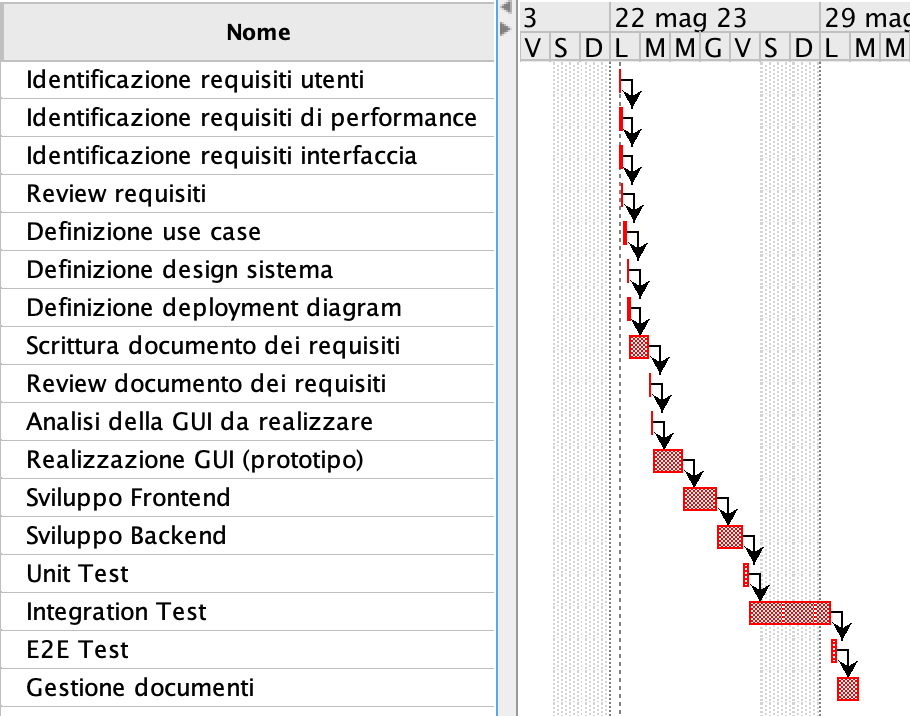
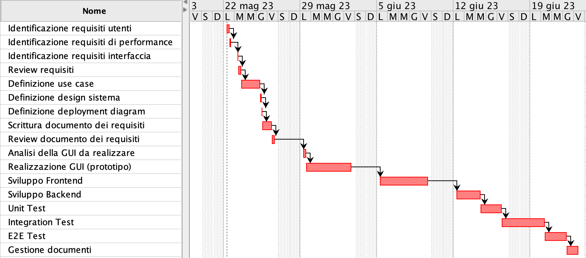

# Project Estimation - CURRENT
Date: 03/05/2024

Version: v1.2

# Estimation approach
Consider the EZElectronics  project in CURRENT version (as given by the teachers), assume that you are going to develop the project INDEPENDENT of the deadlines of the course, and from scratch
# Estimate by size
### 
|             | Estimate                        |             
| ----------- | ------------------------------- |  
| NC =  Estimated number of classes to be developed   |    3                   |             
| A = Estimated average size per class, in LOC       |             500              | 
| S = Estimated size of project, in LOC (= NC * A) | 1500 |
| E = Estimated effort, in person hours (here use productivity 10 LOC per person hour)  |                150ph                      |   
| C = Estimated cost, in euro (here use 1 person hour cost = 30 euro) | 4500euro | 
| Estimated calendar time, in calendar weeks (Assume team of 4 people, 8 hours per day, 5 days per week ) |       1 week             |               

# Estimate by product decomposition
### 
|         component name    | Estimated effort (person hours)   |             
| ----------- | ------------------------------- | 
|Requirement document    | 30 |
| GUI prototype | 20 |
|Design document | 20 |
|Code | 45 |
| Unit tests |25 |
| API tests | 15 |
| Management documents  | 5 |

# Estimate by activity decomposition
### 
|         Activity name    | Estimated effort (person hours)   |             
| ----------- | ------------------------------- | 
| Identificazione requisiti utenti    |         5 |
| Identificazione requisiti di performance | 3    |
| Identificazione requisiti interfaccia | 2       |
| Review dei requisiti                 | 5        |
| Definizione degli use case           | 10       |
| Definizione del design del sistema   | 3        |
| Definizione del deployment diagram   | 2        |
| Scrittura documento dei requisiti    | 5        |
| Review documento dei requisiti       | 5        |
| Analisi della GUI da realizzare       | 5        |
| Realizzazione GUI (prototipo)  | 35       |
| Sviluppo Frontend               | 40       |
| Sviluppo Backend                | 20       |
| Unit Test               | 15       |
| Integration Test               | 15       |
| E2E Test               | 15       |
| Gestione documenti         | 10        |

#### Gantt chart

*Nota 1: le barre corrispondono alle ph stimate per attività divise per il numero di persone nel team (4), poiché si suppone che ogni attività sia svolta parallelamente da tutti i componenti del gruppo.*

*Nota 2: in questo caso, le barre corrispondono alle ph stimate per ogni attività, supponendo che ogni attività sia svolta da una singola persona per una maggior chiarezza.*

# Summary

Report here the results of the three estimation approaches. The  estimates may differ. Discuss here the possible reasons for the difference

|             | Estimated effort                        |   Estimated duration |          
| ----------- | ------------------------------- | ---------------|
| estimate by size | 150ph  |  0,94 week(s) |
| estimate by product decomposition | 160ph |   1 week(s) |
| estimate by activity decomposition | 195ph |  1.22 week(s) |

Le linee di codice dipendono dal linguaggio con cui si programma e da quanto il programmatore scrive il codice compatto. 
Facendo una stima secondo decomposizione per prodotti si ha una stima inferiore rispetto a quella per attività in quanto facendo una stima per attività, si va più nel dettaglio e si analizzano in maniera più approfondita le varie attività da svolgere per ottenere il prodotto, rendendosi quindi conto di ulteriori aspetti.

