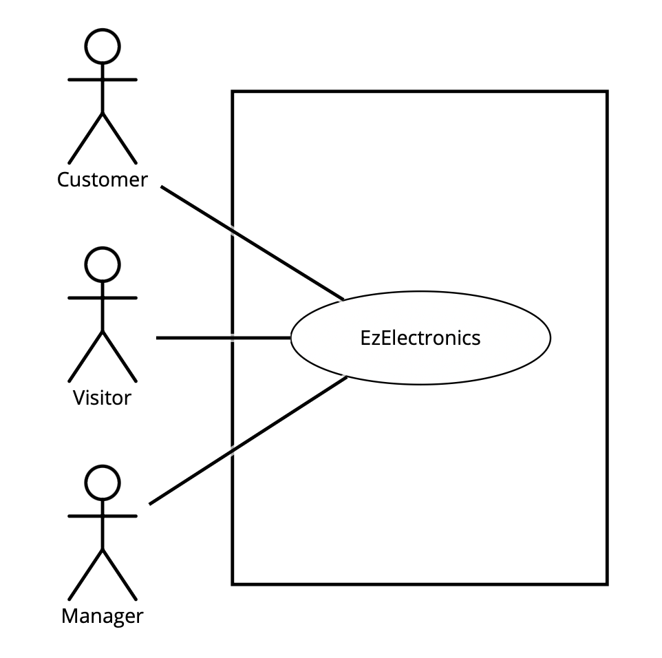
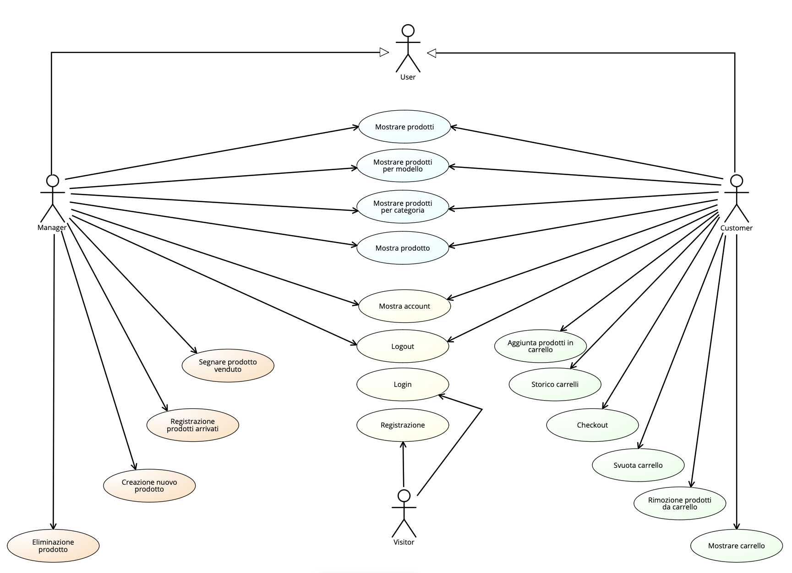
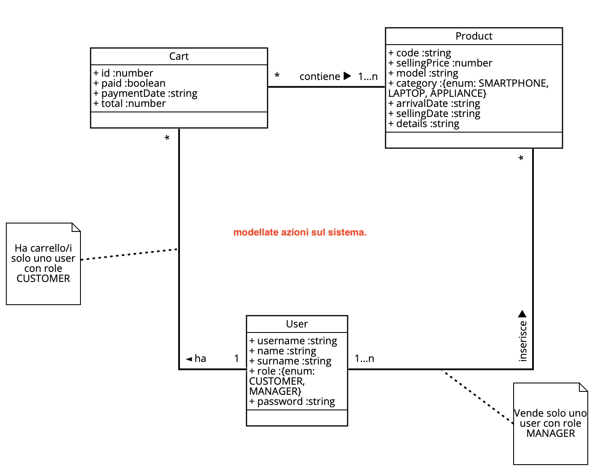
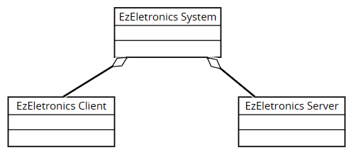
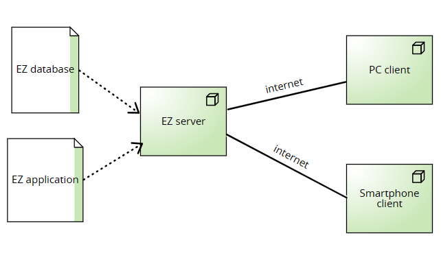

# Requirements Document - current EZElectronics

Date: 23/04/2024

Version: V1 - description of EZElectronics in CURRENT form (as received by teachers)

| Version number | Change |
| :------------: | :----: |
|       1.1        |    Inseriemento stakeholder e stories    |
|       1.2        |    Inserimento requisiti funzionali    |
|       1.3        |    Inserimento requisiti non funzionali    |
|       1.4        |    Inserimento context diagram    |
|       1.5        |    Inserimento use-cases 1-10   |
|       1.6        |    Inserimento use-cases 11-18   |
|       1.7        |    Revisione use-cases    |
|       1.8        |    inserimento glossario  |
|       1.9        |    inserimento system design e deployment diagram  |
|       1.10        |    Revisione finale  |

# Contents

- [Requirements Document - current EZElectronics](#requirements-document---current-ezelectronics)
- [Contents](#contents)
- [Informal description](#informal-description)
- [Stakeholders](#stakeholders)
- [Context Diagram and interfaces](#context-diagram-and-interfaces)
  - [Context Diagram](#context-diagram)
  - [Interfaces](#interfaces)
- [Stories and personas](#stories-and-personas)
- [Functional and non functional requirements](#functional-and-non-functional-requirements)
  - [Functional Requirements](#functional-requirements)
  - [Non Functional Requirements](#non-functional-requirements)
- [Table of rights](#table-of-rights) 
- [Use case diagram and use cases](#use-case-diagram-and-use-cases)
  - [Use case diagram](#use-case-diagram)
    - [Use case 1, UC1](#use-case-1-login-uc1)
      - [Scenario 1.1](#scenario-11)
      - [Scenario 1.2](#scenario-12)
      - [Scenario 1.3](#scenario-13)
      - [Scenario 1.4](#scenario-14)
    - [Use case 2, UC2](#use-case-2-logout-uc2)
      - [Scenario 1.1](#scenario-21)
      - [Scenario 1.2](#scenario-22)
    - [Use case 3, UC3](#use-case-3-registrazione-uc3)
      - [Scenario 3.1](#scenario-31)
      - [Scenario 3.2](#scenario-32)
    - [Use case 4, UC4](#use-case-4-creazione-nuovo-prodotto-uc4)
      - [Scenario 4.1](#scenario-41)
      - [Scenario 4.2](#scenario-42)
      - [Scenario 4.3](#scenario-43)
      - [Scenario 4.4](#scenario-44)
      - [Scenario 4.5](#scenario-45)
      - [Scenario 4.6](#scenario-46)
    - [Use case 5, UC5](#use-case-5-registrazione-prodotti-arrivati-uc5)
      - [Scenario 5.1](#scenario-51)
      - [Scenario 5.2](#scenario-52)
      - [Scenario 5.3](#scenario-53)
      - [Scenario 5.4](#scenario-54)
      - [Scenario 5.5](#scenario-55)
      - [Scenario 5.6](#scenario-56)
      - [Scenario 5.7](#scenario-57)
      - [Scenario 5.8](#scenario-58)
    - [Use case 6, UC6](#use-case-6-segnare-prodotto-venduto-uc6)
      - [Scenario 6.1](#scenario-61)
      - [Scenario 6.2](#scenario-62)
      - [Scenario 6.3](#scenario-63)
      - [Scenario 6.4](#scenario-64)
      - [Scenario 6.5](#scenario-65)
      - [Scenario 6.6](#scenario-66)
    - [Use case 7, UC7](#use-case-7-mostrare-prodotti-uc7)
      - [Scenario 7.1](#scenario-71)
      - [Scenario 7.2](#scenario-72)
      - [Scenario 7.3](#scenario-73)
      - [Scenario 7.4](#scenario-74)
    - [Use case 8, UC8](#use-case-8-mostrare-prodotti-per-categoria-uc8)
      - [Scenario 8.1](#scenario-81)
      - [Scenario 8.2](#scenario-82)
      - [Scenario 8.3](#scenario-83)
      - [Scenario 8.4](#scenario-84)
      - [Scenario 8.5](#scenario-85)
      - [Scenario 8.6](#scenario-86)
      - [Scenario 8.7](#scenario-87)
    - [Use case 9, UC9](#use-case-9-mostrare-prodotti-per-modello-uc9)
      - [Scenario 9.1](#scenario-91)
      - [Scenario 9.2](#scenario-92)
      - [Scenario 9.3](#scenario-93)
      - [Scenario 9.4](#scenario-94)
      - [Scenario 9.5](#scenario-95)
      - [Scenario 9.6](#scenario-96)
      - [Scenario 9.7](#scenario-97)
    - [Use case 10, UC10](#use-case-10-eliminazione-prodotto-uc10)
      - [Scenario 10.1](#scenario-101)
      - [Scenario 10.2](#scenario-102)
    - [Use case 11, UC11](#use-case-11-mostrare-carrello-uc11)
      - [Scenario 11.1](#scenario-111)
    - [Use case 12, UC12](#use-case-12-aggiunta-prodotti-in-carrello-uc12)
      - [Scenario 12.1](#scenario-121)
      - [Scenario 12.2](#scenario-122)
      - [Scenario 12.3](#scenario-123)
      - [Scenario 12.4](#scenario-124)
    - [Use case 13, UC13](#use-case-13-rimozione-prodotti-da-carrello-uc13)
      - [Scenario 13.1](#scenario-131)
      - [Scenario 13.2](#scenario-132)
      - [Scenario 13.3](#scenario-132)
    - [Use case 14, UC14](#use-case-14-storico-carrelli-uc14)
      - [Scenario 14.1](#scenario-141)
    - [Use case 15, UC15](#use-case-15-svuota-carrello-uc15)
      - [Scenario 15.1](#scenario-151)
    - [Use case 16, UC16](#use-case-16-checkout-uc16)
      - [Scenario 16.1](#scenario-161)
      - [Scenario 16.2](#scenario-162)
    - [Use case 17, UC17](#use-case-17-mostra-prodotto-uc17)
      - [Scenario 17.1](#scenario-171)
      - [Scenario 17.2](#scenario-172)
    - [Use case 18, UC18](#use-case-18-mostra-account-uc18)
      - [Scenario 18.1](#scenario-181)
      - [Scenario 18.2](#scenario-182)
- [Glossary](#glossary)
- [System Design](#system-design)
- [Deployment Diagram](#deployment-diagram)

# Informal description

EZElectronics (read EaSy Electronics) is a software application designed to help managers of electronics stores to manage their products and offer them to customers through a dedicated website. Managers can assess the available products, record new ones, and confirm purchases. Customers can see available products, add them to a cart and see the history of their past purchases.

# Stakeholders

| Stakeholder name | Description |
| :--------------: | :---------: |
| Customer |      User con attributo role Customer autenticato  |
| Manager |      User con attributo role Manager autenticato        |
| Visitor | Utente che apre il sito senza essere loggato |

# Context Diagram and interfaces

## Context Diagram

## Interfaces

|   Actor   | Logical Interface | Physical Interface |
| :-------: | :---------------: | :----------------: |
| Customer  |         GUI       |     Smartphone/PC  |
| Manager   |         GUI       |     Smartphone/PC  |
| Visitor   |         GUI       |     Smartphone/PC  |

# Stories and personas

### MANAGER

__Persona 1:__
Mario, 60 anni, è un manager con poche competenze informatiche. Deve gestire i prodotti e offrirli ai clienti attraverso il sito dedicato.
  - Story: Mario registra e mette in vendita attraverso il sito dedicato i nuovi prodotti arrivati 

__Persona 2:__
Erika, 30 anni, è una manager, con ampie competenze informatiche. Deve gestire i prodotti e offrirli ai clienti attraverso il sito dedicato.
  - Story: Erika utilizza il sito dedicato per verificare i prodotti non ancora venduti.

### CUSTOMER

__Persona 3:__
Tina, 50 anni senza figli, è una donna con poche competenze tecnologiche. Ricerca per lo più di dispositivi semplici e non è molto interessata alle caratteristiche specifiche dei prodotti e le loro prestazioni. Necessita di un sito dedicato quanto più semplice possibile.
  - Story: Tina vuole acquistare un nuovo smartphone, entra nel sito, sceglie il modello che le interessa e lo aggiunge al suo carrello.

__Persona 4:__
Giovanni, 22 anni, con ampie competenze informatiche. Necessita spesso di nuovi prodotti ed è molto interessato alla carattesristiche specifiche del prodotto. Inoltre è interessato allo storico degli acquisti.
  - Story: Giovanni vuole risalire all'ultimo modello di PC che ha acquistato per un dipendente per poterlo acquistare anche per un neo-assunto, per cui accede allo storico dei suoi ordini e trova il codice identificativo del notebook in questione.

### VISITOR

__Persona 5:__
Mirko, 18 anni, ha ampie competenze informatiche e non è registrato sul sito web.
  - Story: Mirko vuole registrarsi sul sito web in modo tale da poter accedere e usare il sito per effettuare degli acquisti.

__Persona 6:__
Luigi, 35 anni, ha un account sul sito web e vuole accedere al sito.
  - Story: Luigi vuole registrarsi sul sito web in modo tale da poter mettere in vendita i propri prodotti.

# Functional and non functional requirements

## Functional Requirements

|  ID   | Description |
| :---:  | :-----: |
|  __FR1__  | __Gestione Carrello__          | 
| FR1.1 | Customer deve poter recuperare un proprio carrello |
| FR1.2 | Customer deve poter aggiungere un prodotto al proprio carrello attuale |
| FR1.3 | Customer deve poter effettuare il checkout del carrello attuale |
| FR1.4 | Customer deve poter recuperare tutti i carrelli associati ad acquisti effettuati in precedenza |
| FR1.5 | Customer deve poter rimuovere uno specifico prodotto dal carrello attuale dell'utente |
| FR1.6 | Customer deve poter cancellare il carrello corrente. |
| __FR2__ | __Gestione Account__      |
| FR2.1 | Un visitor deve potersi registrare | 
| FR2.2 | Un visitor deve poter effettuare il login      |
| FR2.3 | Un utente loggato deve poter effettuare il logout     |
| FR2.4 | Un User deve poter vedere le proprie informazioni |
| __FR3__  | __Gestione Prodotti__        |
| FR3.1 | Manager deve poter aggiungere un nuovo prodotto |
| FR3.2 | Manager deve poter registrare l'arrivo di prodotti dello stesso modello |
| FR3.3 | Manager deve poter segnare che il prodotto è stato venduto |
| FR3.4 | User deve poter ottenere la lista dei prodotti nel database con la possibilità di filtrare per venduti o non venduti|
| FR3.5 | User deve poter ottenere informazioni sul singolo prodotto |
| FR3.6 | User deve poter otttenere una lista di prodotti appartenenti alla stessa categoria con la possibilità di filtrare per venduti o non venduti|
| FR3.7 | User deve poter otttenere una lista di prodotti appartenenti allo stesso modello con la possibilità di filtrare per venduti o non venduti |
| FR3.8 | Manager deve poter cancellare un prodotto dal database |

## Non Functional Requirements

|   ID    | Type (efficiency, reliability, ..) | Description | Refers to |
| :-----: | :--------------------------------: | :---------: | :-------: |
|  NFR1   |  Efficienza  |       La piattaforma deve avere tempi di risposta di qualche decimo di secondo, escludendo problemi di rete    |     Tutti FR      |
|  NFR2   |  Usabilità |  Il Customer non deve avere bisogno di training, mentre il Manager deve avere un massimo training time di 20 minuti.          |     Tutti FR      |
|  NFR3   |  Affidabilità  |     L'uptime deve essere minimo pari al 98%      |     Tutti FR      |
|  NFR4   |  Correttezza  |      La piattaforma deve riscontrare massimo 3 segnalazioni di errori all'anno     |    Tutti FR        |
|  NFR5   |  Portabilità  |      La piattaforma deve essere responsive e funzionare sia su PC che su Mobile     |     Tutti FR      |

# Table of Rights

|| Visitor | Customer | Manager |
| :-: | :-----: | :-----: | :-----: | 
| FR 1.1 | |x| |
| FR 1.2 | |x| |
| FR 1.3 | |x| |
| FR 1.4 | |x| |
| FR 1.5 | |x| |
| FR 1.6 | |x| |
| FR 2.1 |x| | |
| FR 2.2 |x| | |
| FR 2.3 | |x|x|
| FR 3.1 | | |x|
| FR 3.2 | | |x|
| FR 3.3 | | |x|
| FR 3.4 | |x|x|
| FR 3.5 | |x|x|
| FR 3.6 | |x|x|
| FR 3.7 | |x|x|
| FR 3.8 | | |x|

# Use case diagram and use cases

## Use case 

### Use case 1, Login (UC1)
| Actors Involved        | Visitor |
| ------------- |:-------------:| 
|  Precondition     | Visitor non ancora loggato |
|  Post condition     | User loggato |
|  Nominal Scenario     | Scenario 1.1 |
|  Variants     | None |
|  Exceptions     | Scenario 1.2, 1.3, 1.4|

#### Scenario 1.1 

| Scenario 1.1 | Login |
| ------------- |:-------------:| 
|  Precondition     | Visitor non ancora loggato ma registrato |
|  Post condition     | User loggato |
| Step#        | Descrizione  |
|  1     | Sistema: Chiede username, password |  
|  2     | User: Fornisce username, password. |
|  3     | Sistema: Legge username, password. Controlla se visitor è loggato, visitor non è loggato. |
|  4	 | Sistema: Cerca l'user attraverso username. |
|  5	 | Sistema: confronta la password associata all'utente con quella fornita, c'è corrispondenza, user è autorizzato e loggato |

#### Scenario 1.2

| Scenario 1.2 | Password errata |
| ------------- |:-------------:| 
|  Precondition     | Visitor non loggato ma registrato |
|  Post condition     | User non loggato |
| Step#        | Descrizione  |
|  1     | Sistema: Chiede username, password |  
|  2     | User: Fornisce username, password. |
|  3     | Sistema: Legge username, password. Controlla se visitor è loggato, visitor non è loggato. |
|  4	 | Sistema: Cerca l'user attraverso username. |
|  5	 | Sistema: confronta la password associata all'utente con quella fornita, non c'è corrispondenza, user non è autorizzato|

#### Scenario 1.3

| Scenario 1.3 | Visitor non registrato |
| ------------- |:-------------:| 
|  Precondition     | Visitor non loggato, non registrato |
|  Post condition     | Visitor non loggato |
| Step#        | Descrizione  |
|  1     | Sistema: Chiede username, password |  
|  2     | User: Fornisce username, password. |
|  3     | Sistema: Legge username, password. Controlla se visitor loggato, visitor non è loggato. |
|  4	 | Sistema: Dato username, trova User. User non trovato. User non autorizzato. |

#### Scenario 1.4

| Scenario 1.4 | User già loggato |
| ------------- |:-------------:| 
|  Precondition     | User loggato, user registrato |
|  Post condition     | User loggato |
| Step#        | Descrizione  |
|  1     | Sistema: Chiede username, password |  
|  2     | User: Fornisce username, password. |
|  3     | Sistema: Legge username, password. Controlla se user loggato, user è loggato. |

### Use case 2, Logout (UC2)

| Actors Involved        | User |
| ------------- |:-------------:| 
|  Precondition     | User è loggato |
|  Post condition     | User non è loggato |
|  Nominal Scenario     | Scenario 2.1 |
|  Variants     |  |
|  Exceptions     | Scenario 2.2 |

#### Scenario 2.1 

| Scenario 2.1 | Logout utente loggato |
| ------------- |:-------------:| 
|  Precondition     | User loggato |
|  Post condition     | User non loggato |
| Step#        | Descrizione  |
|  1     | Utente: Chiede di effettuare logout |
|  2     | Sistema: Cerca user, verifica se loggato, user loggato.
|  3	   | Sistema: invalida la sessione corrente del dispositivo da cui l'utente è loggato|

#### Scenario 2.2

| Scenario 2.2 | Logout utente non loggato|
| ------------- |:-------------:| 
|  Precondition     | User non loggato |
|  Post condition     | User non loggato |
| Step#        | Descrizione  |
|  1     | Utente: Chiede di effettuare logout |
|  2     | Sistema: Cerca user, verifica se loggato, user non loggato.|

### Use case 3, Registrazione (UC3)

| Actors Involved        | Visitor |
| ------------- |:-------------:| 
|  Precondition     | Visitor non ha un account |
|  Post condition     | User registrato |
|  Nominal Scenario     | Scenario 3.1 |
|  Variants     | Nessuna |
|  Exceptions     | Scenario 3.2, 3.3 |

#### Scenario 3.1 

| Scenario 3.1 | Registrazione |
| ------------- |:-------------:| 
|  Precondition     | Visitor non ha un account |
|  Post condition     | User registrato |
| Step#        | Descrizione  |  
|  1     | Visitor: Richiesta di registrazione  |
|  2     | Sistema:  Chiede username, name, surname, role e password |
|  3     | Visitor: Fornisce username, name, surname, role e password |
|  4     | Sistema: Legge username, name, surname, role e password. |
|  5     | Sistema: Controlla che i campi forniti non siano vuoti, non sono vuoti |
|  6     | Sistema: Controlla che l'username fornito da Visitor non sia associato a un account già esistente. L'username non è ancora stato usato|
|  7     | Sistema: Crea un nuovo User account e registra le sue informazioni  |

#### Scenario 3.2 

| Scenario 3.2 |  Username già presente |
| ------------- |:-------------:| 
|  Precondition     | Visitor vuole registrarsi, username già in db |
|  Post condition     | Registrazione fallita |
| Step#        | Descrizione  |
|  1     | User: Richiesta di registrazione  |
|  2     | Sistema:  Chiede username, name, surname, role e password |
|  3     |  Visitor: Fornisce username, name, surname, role e password |
|  4     | Sistema: Legge username, name, surname, role e password |
|  5     | Sistema: Controlla che i campi forniti non siano vuoti, non sono vuoti |
|  6     | Sistema: Controlla che l'username fornito da Visitor non sia associato a un account già esistente. L'username è già associato ad un account|
|  7     | Sistema: Mostra messaggio di errore 409  |

#### Scenario 3.3 

| Scenario 3.3 | Registrazione, campi vuoti |
| ------------- |:-------------:| 
|  Precondition     | Visitor non ha un account |
|  Post condition     | User non registrato |
| Step#        | Descrizione  |  
|  1     | Visitor: Richiesta di registrazione  |
|  2     | Sistema:  Chiede username, name, surname, role e password |
|  3     | Visitor: Fornisce username, name, surname, role e password |
|  4     | Sistema: Legge username, name, surname, role e password. |
|  5     | Sistema: Controlla che i campi forniti non siano vuoti, sono vuoti |

### Use case 4, Creazione nuovo prodotto (UC4)
| Actors Involved        | Manager |
| ------------- |:-------------:| 
|  Precondition     | Manager loggato, prodotto non esistente |
|  Post condition     | Prodotto inserito |
|  Nominal Scenario     | Scenario 4.1,  4.3|
|  Variants     | Nessuna |
|  Exceptions     |  Scenario 4.2, 4.4, 4.5, 4.6 |

#### Scenario 4.1 
| Scenario 4.1 | Creazione nuovo prodotto senza specificare arrivalDate|
| ------------- |:-------------:| 
|  Precondition     | Prodotto non esistente |
|  Post condition     |  Prodotto inserito |
| Step#        | Descrizione  |  
|  1     | Manager: Richiede l'inserimento di un nuovo prodotto |
|  2     | Sistema: Chiede code, sellingPrice, model, category, details, arrivalDate |
|  3     | Manager: Fornisce code, sellingPrice, model, category, details|
|  4     | Sistema: Verifica se code, sellingPrice, model e category non siano vuoti. Non sono vuoti|
|  5     | Sistema: Verifica se i campi forniti siano del formato corretto e abbiano valori consentititi. Lo sono|
|  6     |   Sistema: Verifica che code non sia già presente nel DB, non è presente | 
|  7     | Sistema: Verifica se arrivalDate sia stato inserito. Non è stato inserito|
|  8     | Sistema: Inserisce come arrivalDate la data odierna |
|  9     | Sistema: Inserisce il nuovo prodotto nel database|

#### Scenario 4.2
| Scenario 4.2 | Creazione nuovo prodotto con arrivalDate errata |
| ------------- |:-------------:| 
|  Precondition     | Prodotto non esistente |
|  Post condition     |  Prodotto non inserito |
| Step#        | Descrizione  |  
|  1     | Manager: Richiede l'inserimento di un nuovo prodotto |
|  2     | Sistema: Chiede code, sellingPrice, model, category, details, arrivalDate |
|  3     | Manager: Fornisce code, sellingPrice, model, category, details, arrivalDate |
|  4     | Sistema: Verifica che code, sellingPrice, model e category non siano vuoti. Non sono vuoti|
|  5     | Sistema: Verifica che i campi forniti siano del formato corretto e abbiano valori consentiti. Lo sono.|
|  6     |   Sistema: Verifica che code non sia già presente nel DB, non è presente |
|  7     | Sistema: Verifica che arrivalDate sia stato inserito. E' stato inserito |
|  8     | Sistema: Verifica se arrivalDate non sia dopo la data odierna. ArrivalDate è dopo la data odierna|
|  9     | Sistema: Ritorna messaggio di errore |

#### Scenario 4.3

| Scenario 4.3 | Creazione nuovo prodotto con arrivalDate corretta|
| ------------- |:-------------:| 
|  Precondition     | Prodotto non esistente |
|  Post condition     |  Prodotto inserito |
| Step#        | Descrizione  |  
|  1     | Manager: Richiede l'inserimento di un nuovo prodotto |
|  2     | Sistema: Chiede code, sellingPrice, model, category, details, arrivalDate |
|  3     | Manager: Fornisce code, sellingPrice, model, category, details, arrivalDate |
|  4     | Sistema: Verifica che code, sellingPrice, model e category non siano vuoti. Non sono vuoti|
|  5     | Sistema: Verifica che i campi forniti siano del formato corretto e abbiano valori consentiti. Lo sono.|
|  6     |   Sistema: Verifica che code non sia già presente nel DB, non è presente | 
|  7     | Sistema: Verifica che arrivalDate sia stato inserito. E' stato inserito |
|  8     | Sistema: Verifica che arrivalDate non sia dopo la data odierna. ArrivalDate è prima o corrispondente al giorno odierno|
|  9     | Sistema: Inserisce il nuovo prodotto nel database |

#### Scenario 4.4

| Scenario 4.4 | Creazione nuovo prodotto, campo obbligatorio vuoto|
| ------------- |:-------------:| 
|  Precondition     | Prodotto non esistente |
|  Post condition     |  Prodotto non inserito |
| Step#        | Descrizione  |  
|  1     | Manager: Richiede l'inserimento di un nuovo prodotto |
|  2     | Sistema: Chiede code, sellingPrice, model, category, details, arrivalDate |
|  3     | Manager: Fornisce code, sellingPrice, model, category, details, (arrivalDate)|
|  4     | Sistema: Verifica che code, sellingPrice, model e category non siano vuoti. Almeno un campo è vuoto|

#### Scenario 4.5

| Scenario 4.5 | Creazione nuovo prodotto, formato errato |
| ------------- |:-------------:| 
|  Precondition     | Prodotto non esistente |
|  Post condition     |  Prodotto non inserito |
| Step#        | Descrizione  |  
|  1     | Manager: Richiede l'inserimento di un nuovo prodotto |
|  2     | Sistema: Chiede code, sellingPrice, model, category, details, arrivalDate |
|  3     | Manager: Fornisce code, sellingPrice, model, category, details, (arrivalDate)|
|  4     | Sistema: Verifica che code, sellingPrice, model e category non siano vuoti. Nessun campo è vuoto|
|  5     | Sistema: Verifica che i campi forniti siano del formato corretto e abbiano valore consentiti. Almeno uno nonlo è.|

#### Scenario 4.6 
| Scenario 4.6 | Creazione nuovo prodotto specificando code già presente|
| ------------- |:-------------:| 
|  Precondition     | Prodotto non esistente |
|  Post condition     |  Prodotto non inserito |
| Step#        | Descrizione  |  
|  1     | Manager: Richiede l'inserimento di un nuovo prodotto |
|  2     | Sistema: Chiede code, sellingPrice, model, category, details, arrivalDate |
|  3     | Manager: Fornisce code, sellingPrice, model, category, details|
|  4     | Sistema: Verifica se code, sellingPrice, model e category non siano vuoti. Non sono vuoti|
|  5     | Sistema: Verifica se i campi forniti siano del formato corretto e abbiano valori consentiti. Sono del formato corretto|
|  6     |   Sistema: Verifica che code non sia già presente nel DB,  è presente | 
|  7     | Sistema: Mostra messaggio di errore 409 |

### Use case 5, Registrazione prodotti arrivati (UC5)
| Actors Involved        | Manager | 
| ------------- |:-------------:| 
|  Precondition     |  Manager è loggato  |
|  Post condition     | Prodotto registrato come arrivato  |
|  Nominal Scenario     | Scenario 5.1, 5.2 |
|  Variants     | Nessuna |
|  Exceptions     | Scenario 5.3, 5.4, 5.5, 5.6, 5.7, 5.8 |

#### Scenario 5.1 

| Scenario 5.1 | Registrazione arrivo prodotto, data assente |
| ------------- |:-------------:| 
|  Precondition     | Manager loggato |
|  Post condition     | Prodotto registrato come arrivato |
| Step#        | Descrizione  |  
|  1     | Manager: Richiede registrazione arrivo prodotto |
|  2     | Sistema: Richiede model, category, deatils, quantity, arrivalDate, sellingPrice|
|  3     | Manager: Inserisce model, cateogory, deatils, quantity, arrivalDate, sellingPrice|
|  4     | Sistema: Legge model, cateogory, deatils, quantity, arrivalDate, sellingPrice|
|  5     | Sistema: Verifica se model, category, quantity, sellingPrice non siano vuoti. Non sono vuoti|
|  6     | Sistema: Verifica se i campi forniti siano del formato corretto. Sono del formato corretto|
|  7    | Sistema: Verifica se category sia un valore tra "Smartphone", "Laptop" e "Appliance", lo è. |
|  8     | Sistema: Verifica se quantity e selling price siano maggiori di 0, sono maggiori di 0. |
|  9     | Sistema: Verifica se arrivalDate sia stato inserito. Non è stato inserito|
|  10     | Sistema: Inserisce come arrivalDate la data odierna |
|  11     | Sistema: Inserisce il nuovo prodotto nel database|

#### Scenario 5.2

| Scenario 5.2 | Registrazione arrivo prodotto, data presente |
| ------------- |:-------------:| 
|  Precondition     | Manager loggato |
|  Post condition     | Prodotto registrato come arrivato |
| Step#        | Descrizione  |  
|  1     | Manager: Richiede registrazione arrivo prodotto |
|  2     | Sistema: Richiede model, cateogory, deatils, quantity, arrivalDate, sellingPrice|
|  3     | Manager: Inserisce model, cateogory, deatils, quantity, arrivalDate, sellingPrice|
|  4     | Sistema: Legge model, cateogory, deatils, quantity, arrivalDate, sellingPrice|
|  5     | Sistema: Verifica se model, category, quantity, sellingPrice non siano vuoti. Non sono vuoti|
|  6     | Sistema: Verifica se i campi forniti siano del formato corretto. Sono del formato corretto|
|  7     | Sistema: Verifica se category sia un valore tra "Smartphone", "Laptop" e "Appliance", lo è. |
|  8     | Sistema: Verifica se quantity e selling price siano maggiori di 0, sono maggiori di 0. |
|  9     | Sistema: Verifica se arrivalDate sia stato inserito. E' stato inserito|
|  10     | Sistema: Verifica il formato di arrival date. E' corretto. |
|  11     | Sistema: Verifica se arrival date è prima di data odierna. E' prima di data odierna. |
|  12     | Sistema: Inserisce il nuovo prodotto nel database|

#### Scenario 5.3

| Scenario 5.3 | Registrazione arrivo prodotto, data presente formato errato|
| ------------- |:-------------:| 
|  Precondition     | Manager loggato |
|  Post condition     | Prodotto non registrato come arrivato |
| Step#        | Descrizione  |  
|  1     | Manager: Richiede registrazione arrivo prodotto |
|  2     | Sistema: Richiede model, cateogory, deatils, quantity, arrivalDate, sellingPrice|
|  3     | Manager: Inserisce model, cateogory, deatils, quantity, arrivalDate, sellingPrice|
|  4     | Sistema: Legge model, cateogory, deatils, quantity, arrivalDate, sellingPrice|
|  5     | Sistema: Verifica se model, category, quantity, sellingPrice non siano vuoti. Non sono vuoti|
|  6     | Sistema: Verifica se i campi forniti siano del formato corretto. Sono del formato corretto|
|  7     | Sistema: Verifica se category sia un valore tra "Smartphone", "Laptop" e "Appliance", lo è. |
|  8     | Sistema: Verifica se quantity e selling price siano maggiori di 0, sono maggiori di 0. |
|  9     | Sistema: Verifica se arrivalDate sia stato inserito. E' stato inserito|
|  10     | Sistema: Verifica il formato di arrival date. Non è corretto. |

#### Scenario 5.4

| Scenario 5.4 | Registrazione arrivo prodotto, data dopo data odierna |
| ------------- |:-------------:| 
|  Precondition     | Manager loggato |
|  Post condition     | Prodotto non registrato come arrivato |
| Step#        | Descrizione  |  
|  1     | Manager: Richiede registrazione arrivo prodotto |
|  2     | Sistema: Richiede model, cateogory, deatils, quantity, arrivalDate, sellingPrice|
|  3     | Manager: Inserisce model, cateogory, deatils, quantity, arrivalDate, sellingPrice|
|  4     | Sistema: Legge model, cateogory, deatils, quantity, arrivalDate, sellingPrice|
|  5     | Sistema: Verifica se model, category, quantity, sellingPrice non siano vuoti. Non sono vuoti|
|  6     | Sistema: Verifica se i campi forniti siano del formato corretto. Sono del formato corretto|
|  7     | Sistema: Verifica se category sia un valore tra "Smartphone", "Laptop" e "Appliance", lo è. |
|  8     | Sistema: Verifica se quantity e selling price siano maggiori di 0, sono maggiori di 0. |
|  9     | Sistema: Verifica se arrivalDate sia stato inserito. E' stato inserito|
|  10     | Sistema: Verifica il formato di arrival date. E' corretto. |
|  11    | Sistema: Verifica se arrival date è prima di data odierna. E' dopo data odierna. |
|  12    | Sistema: Ritorna un messaggio di errore. |

#### Scenario 5.5

| Scenario 5.5 | Registrazione arrivo prodotto, campo obbligatorio vuoto |
| ------------- |:-------------:| 
|  Precondition     | Manager loggato |
|  Post condition     | Prodotto non registrato come arrivato |
| Step#        | Descrizione  |  
|  1     | Manager: Richiede registrazione arrivo prodotto |
|  2     | Sistema: Richiede model, cateogory, deatils, quantity, arrivalDate, sellingPrice|
|  3     | Manager: Inserisce model, cateogory, deatils, quantity, arrivalDate, sellingPrice|
|  4     | Sistema: Legge model, cateogory, deatils, quantity, arrivalDate, sellingPrice|
|  5     | Sistema: Verifica se model, category, quantity, sellingPrice non siano vuoti. Almeno uno è vuoto|

#### Scenario 5.6

| Scenario 5.6 | Registrazione arrivo prodotto, formato errato |
| ------------- |:-------------:| 
|  Precondition     | Manager loggato |
|  Post condition     | Prodotto non registrato come arrivato |
| Step#        | Descrizione  |  
|  1     | Manager: Richiede registrazione arrivo prodotto |
|  2     | Sistema: Richiede model, cateogory, deatils, quantity, arrivalDate, sellingPrice|
|  3     | Manager: Inserisce model, cateogory, deatils, quantity, arrivalDate, sellingPrice|
|  4     | Sistema: Legge model, cateogory, deatils, quantity, arrivalDate, sellingPrice|
|  5     | Sistema: Verifica se model, category, quantity, sellingPrice non siano vuoti. Nessun campo è vuoto.
|  6     | Sistema: Verifica se i campi forniti siano del formato corretto. Almeno uno non è del formato corretto|

#### Scenario 5.7 

| Scenario 5.7 | Registrazione arrivo prodotto, category errato |
| ------------- |:-------------:| 
|  Precondition     | Manager loggato |
|  Post condition     | Prodotto registrato come arrivato |
| Step#        | Descrizione  |  
|  1     | Manager: Richiede registrazione arrivo prodotto |
|  2     | Sistema: Richiede model, cateogory, deatils, quantity, arrivalDate, sellingPrice|
|  3     | Manager: Inserisce model, cateogory, deatils, quantity, arrivalDate, sellingPrice|
|  4     | Sistema: Legge model, cateogory, deatils, quantity, arrivalDate, sellingPrice|
|  5     | Sistema: Verifica se model, category, quantity, sellingPrice non siano vuoti. Non sono vuoti|
|  6     | Sistema: Verifica se i campi forniti siano del formato corretto. Sono del formato corretto|
|  7    | Sistema: Verifica se category sia un valore tra "Smartphone", "Laptop" e "Appliance", non è un valore tra "Smartphone", "Laptop" e "Appliance". |

#### Scenario 5.8 

| Scenario 5.8 | Registrazione arrivo prodotto, quantity o sellingPRice errato |
| ------------- |:-------------:| 
|  Precondition     | Manager loggato |
|  Post condition     | Prodotto registrato come arrivato |
| Step#        | Descrizione  |  
|  1     | Manager: Richiede registrazione arrivo prodotto |
|  2     | Sistema: Richiede model, cateogory, deatils, quantity, arrivalDate, sellingPrice|
|  3     | Manager: Inserisce model, cateogory, deatils, quantity, arrivalDate, sellingPrice|
|  4     | Sistema: Legge model, cateogory, deatils, quantity, arrivalDate, sellingPrice|
|  5     | Sistema: Verifica se model, category, quantity, sellingPrice non siano vuoti. Non sono vuoti|
|  6     | Sistema: Verifica se i campi forniti siano del formato corretto. Sono del formato corretto|
|  7     | Sistema: Verifica se category sia un valore tra "Smartphone", "Laptop" e "Appliance", è un valore tra "Smartphone", "Laptop" e "Appliance". |
|  8     | Sistema: Verifica se quantity e selling price siano maggiori di 0, Almeno uno non è maggiore di 0. |

### Use case 6, Segnare prodotto venduto (UC6)
| Actors Involved        | Manager |
| ------------- |:-------------:| 
|  Precondition     | Manager loggato  |
|  Post condition     | Prodotto segnato come venduto |
|  Nominal Scenario     | Scenario 6.1, 6.2 |
|  Variants     | Nessuna |
|  Exceptions     | Scenario 6.3, 6.4, 6.5, 6.6 |

#### Scenario 6.1 

| Scenario 6.1 |  Prodotto venduto |
| ------------- |:-------------: |
|  Precondition     | Manager loggato |
|  Post condition     | Prodotto segnato come venduto |
| Step#        | Descrizione  |  
|  1     | Manager: Richiesta di segnare il prodotto come venduto, fornisce code e sellingDate|
|  2     | Sistema: Legge code e sellingDate |
|  3     | Sistema: Verifica se code esistente in DB, esiste |
|  4     | Sistema: Legge sellingDate associata a code da DB, sellingDate è null |
|  5     |  Sistema: controlla se sellingDate fornita da manager è vuota, non è vuota |
|  6     |  Sistema: controlla se sellingDate fornita da manager è valida, sellingDate valida |
|  7     | Sistema: Prodotto segnato come venduto, aggiorna la sellingDate nel DB. |

#### Scenario 6.2

| Scenario 6.2 |   Prodotto venduto, sellingDate non specificata |
| ------------- |:-------------:| 
|  Precondition     | Manager loggato |
|  Post condition     | Prodotto segnato come venduto |
| Step#        | Descrizione  |  
|  1     | Manager: Richiesta di segnare il prodotto come venduto, fornisce code e sellingDate |
|  2     | Sistema: Legge code e sellingDate |
|  3     | Sistema: Verifica se code esistente in DB, esiste |
|  4     | Sistema: Legge sellingDate associata a code da DB, sellingDate è null |
|  5     | Sistema: controlla se sellingDate fornita da manager è vuota, è vuota |
|  6     | Sistema: Inserisce in sellingDate la data corrente. |
|  7    | Sistema: Prodotto segnato come venduto, salva la sellingDate della data corrente nel DB. |

#### Scenario 6.3

| Scenario 6.3  | Code non esistente |
| ------------- |:-------------:| 
|  Precondition     | Manager loggato |
|  Post condition     | Prodotto non segnato come venduto |
| Step#        | Descrizione  |  
|  1     | Manager: Richiesta di segnare il prodotto come venduto, fornisce code e sellingDate |
|  2     | Sistema: Legge code e sellingDate |
|  3     | Sistema: Verifica se code esistente in DB, non esiste |
|  4     | Sistema: Ritorna messaggio di errore (ERROR 404). |

#### Scenario 6.4

| Scenario 6.4  | SellingDate successiva a data corrente |
| ------------- |:-------------:| 
|  Precondition     | Manager loggato |
|  Post condition     | Prodotto non segnato come venduto |
| Step#        | Descrizione  |  
|  1     | Manager: Richiesta di segnare il prodotto come venduto, fornisce codice prodotto e data della vendita |
|  2     | Sistema: Legge code e sellingDate |
|  3     | Sistema: Verifica se code esistente in DB, esiste |
|  4     | Sistema: Legge sellingDate associata a code da DB, sellingDate è null |
|  5     |  Sistema: controlla se sellingDate fornita da manager è vuota, non è vuota |
|  6     |  Sistema: controlla se sellingDate fornita da manager è prima di data corrente, sellingDate è dopo data corrente |
|  7     | Sistema: Ritorna messaggio di errore. |

#### Scenario 6.5

| Scenario 6.5  | SellingDate precedente ad arrivalDate |
| ------------- |:-------------:| 
|  Precondition     | Manager loggato |
|  Post condition     | Prodotto non segnato come venduto |
| Step#        | Descrizione  |  
|  1     | Manager: Richiesta di segnare il prodotto come venduto, fornisce codice prodotto e data della vendita |
|  2     | Sistema: Legge code e sellingDate |
|  3     | Sistema: Verifica se code esistente in DB, esiste |
|  4     | Sistema: Legge sellingDate associata a code da DB, sellingDate è null |
|  5     | Sistema: controlla se sellingDate fornita da manager è vuota, non è vuota |
|  6     | Sistema: controlla se sellingDate fornita da manager è precedente ad arrivalDate, sellingDate è precedente ad arrivalDate |
|  7     | Sistema: Ritorna messaggio di errore. |

#### Scenario 6.6

| Scenario 6.6 | Prodotto già venduto |
| ------------- |:-------------:| 
|  Precondition     | Manager loggato |
|  Post condition     | Prodotto già segnato come venduto |
| Step#        | Descrizione  |  
|  1     | Manager: Richiesta di segnare il prodotto come venduto, fornisce code e sellingDate|
|  2     | Sistema: Legge code e sellingDate |
|  3     | Sistema: Verifica se code esistente in DB, esiste |
|  4     | Sistema: Legge sellingDate associata a code da DB, sellingDate non è null |
|  5     | Sistema: Ritorna messaggio di errore. |

### Use case 7, Mostrare prodotti (UC7)
| Actors Involved        | User |
| ------------- |:-------------:| 
|  Precondition     | User è loggato |
|  Post condition     | Products richiesti mostrati |
|  Nominal Scenario     | Scenario 7.1, 7.2, 7.3 |
|  Variants     | Nessuna |
|  Exceptions     | Scenario 7.4 |

#### Scenario 7.1 

| Scenario 7.1 | Mostrare tutti i prodotti venduti |
| ------------- |:-------------:| 
|  Precondition     | User è loggato |
|  Post condition     | Mostra lista con i prodotti richiesti |
| Step#        | Descrizione  |  
|  1     | User: Richiesta di mostrare i prodotti venduti |
|  2     | Sistema: Verifica contenuto del parametro sold, sold contiene `yes`|
|  3     | Sistema: Mostra i prodotti venduti |

#### Scenario 7.2 

| Scenario 7.2 | Mostrare tutti i prodotti non ancora venduti |
| ------------- |:-------------:| 
|  Precondition     | User è loggato |
|  Post condition     | Mostra lista di tutti i prodotti non ancora venduti |
| Step#        | Descrizione  |  
|  1     | User: Richiesta di mostrare i prodotti non venduti |
|  2     | Sistema: Verifica contenuto del parametro sold, sold contiene `no`|
|  3     | Sistema: Mostra i prodotti non ancora venduti |

#### Scenario 7.3 

| Scenario 7.3 | Mostrare tutti i prodotti |
| ------------- |:-------------:| 
|  Precondition     | User è loggato |
|  Post condition     | Mostra lista di tutti i prodotti |
| Step#        | Descrizione  |  
|  1     | User: Richiesta di mostrare tutti i prodotti |
|  2     | Sistema: Verifica contenuto del parametro sold, sold è vuoto |
|  3     | Sistema: Mostra tutti i prodotti|

#### Scenario 7.4 

| Scenario 7.4 |Parametro sold errato |
| ------------- |:-------------:| 
|  Precondition     | User è loggato |
|  Post condition     | Prodotti non mostrati |
| Step#        | Descrizione  |  
|  1     | User: Richiesta di mostrare tutti i prodotti |
|  2     | Sistema: Verifica contenuto del parametro sold, sold contiene un valore non previsto|

### Use case 8, Mostrare prodotti per categoria (UC8)
| Actors Involved        | User |
| ------------- |:-------------:| 
|  Precondition     | User è loggato |
|  Post condition     | Mostra lista con i prodotti richiesti |
|  Nominal Scenario     | Scenario 8.1, 8.2, 8.3 |
|  Variants     | Nessuna |
|  Exceptions     | Scenario 8.4, 8.5, 8.6, 8.7 |

#### Scenario 8.1 

| Scenario 8.1 | Mostrare tutti i prodotti venduti per categoria, categoria ok |
| ------------- |:-------------:| 
|  Precondition     | User è loggato |
|  Post condition     | Mostra Lista con i prodotti richiesti |
| Step#        | Descrizione  |  
|  1     | User: Richiesta di mostrare i prodotti venduti |
|  2     | Sistema: Verifica contenuto del parametro sold, sold contiene `yes`|
|  3     | Sistema: Verifica se category sia un valore tra "Smartphone", "Laptop" e "Appliance", lo è. |
|  4     | Sistema: Mostra i prodotti venduti per categoria richiesta |

#### Scenario 8.2 

| Scenario 8.2 | Mostrare tutti i prodotti non ancora venduti per categoria, categoria ok |
| ------------- |:-------------:| 
|  Precondition     | User è loggato |
|  Post condition     | Mostra lista di tutti i prodotti non ancora venduti |
| Step#        | Descrizione  |  
|  1     | User: Richiesta di mostrare i prodotti non venduti |
|  2     | Sistema: Verifica contenuto del parametro sold, sold contiene `no`|
|  3     | Sistema: Verifica se category sia un valore tra "Smartphone", "Laptop" e "Appliance", lo è. |
|  4     | Sistema: Mostra i prodotti non ancora venduti per categoria richiesta |

#### Scenario 8.3 

| Scenario 8.3 | Mostrare tutti i prodotti per categoria, categoria ok |
| ------------- |:-------------:| 
|  Precondition     | User è loggato |
|  Post condition     | Mostra lista di tutti i prodotti della categoria richiesta|
| Step#        | Descrizione  |  
|  1     | User: Richiesta di mostrare tutti i prodotti |
|  2     | Sistema: Verifica contenuto del parametro sold, sold è vuoto |
|  3     | Sistema: Verifica se category sia un valore tra "Smartphone", "Laptop" e "Appliance", lo è. |
|  4     | Sistema: Mostra tutti i prodotti per categoria richiesta |

#### Scenario 8.4 

| Scenario 8.4 |Parametro sold errato |
| ------------- |:-------------:| 
|  Precondition     | User è loggato |
|  Post condition     | Prodotti non mostrati |
| Step#        | Descrizione  |  
|  1     | User: Richiesta di mostrare tutti i prodotti |
|  2     | Sistema: Verifica contenuto del parametro sold, sold contiene un valore non previsto|

#### Scenario 8.5 
| Scenario 8.5 | Mostrare tutti i prodotti venduti per categoria, categoria non ok |
| ------------- |:-------------:| 
|  Precondition     | User è loggato |
|  Post condition     | Prodotti non mostrati |
| Step#        | Descrizione  |  
|  1     | User: Richiesta di mostrare i prodotti venduti |
|  2     | Sistema: Verifica contenuto del parametro sold, sold contiene `yes`|
|  3     | Sistema: Verifica se category sia un valore tra "Smartphone", "Laptop" e "Appliance", non lo è. |

#### Scenario 8.6 

| Scenario 8.6 | Mostrare tutti i prodotti non ancora venduti per categoria, categoria non ok |
| ------------- |:-------------:| 
|  Precondition     | User è loggato |
|  Post condition     | Mostra lista di tutti i prodotti non ancora venduti |
| Step#        | Descrizione  Prodotti non mostrati|  
|  1     | User: Richiesta di mostrare i prodotti non venduti |
|  2     | Sistema: Verifica contenuto del parametro sold, sold contiene `no`|
|  3     | Sistema: Verifica se category sia un valore tra "Smartphone", "Laptop" e "Appliance", non lo è. |

#### Scenario 8.7 

| Scenario 8.7 | Mostrare tutti i prodotti per categoria, categoria non ok |
| ------------- |:-------------:| 
|  Precondition     | User è loggato |
|  Post condition     | Prodotti non mostrati |
| Step#        | Descrizione  |  
|  1     | User: Richiesta di mostrare tutti i prodotti |
|  2     | Sistema: Verifica contenuto del parametro sold, sold è vuoto |
|  3     | Sistema: Verifica se category sia un valore tra "Smartphone", "Laptop" e "Appliance", non lo è. |

### Use case 9, Mostrare prodotti per modello (UC9)
| Actors Involved        | User |
| ------------- |:-------------:| 
|  Precondition     | User è loggato |
|  Post condition     | Products richiesti mostrati |
|  Nominal Scenario     | Scenario 9.1, 9.2, 9.3 |
|  Variants     | Nessuna |
|  Exceptions     | Scenario 9.4, 9.5, 9.6, 9.7 |

#### Scenario 9.1 

| Scenario 9.1 | Mostrare tutti i prodotti venduti, modello ok |
| ------------- |:-------------:| 
|  Precondition     | User è loggato |
|  Post condition     | Mostra lista con i prodotti richiesti |
| Step#        | Descrizione  |  
|  1     | User: Richiesta di mostrare i prodotti venduti ||
|  2     | Sistema: Verifica contenuto del parametro sold, sold contiene `yes`|
|  3     | Sistema: Verifica che il campo model non sia vuoto, non è vuoto |
|  4     | Sistema: Verifica che il campo model sia una stringa, è una stringa |
|  5     | Sistema: mostra i prodotti filtrati per modello |

#### Scenario 9.2 

| Scenario 9.2 | Mostrare tutti i prodotti non ancora venduti , modello ok|
| ------------- |:-------------:| 
|  Precondition     | User è loggato |
|  Post condition     | Mostra lista di tutti i prodotti non ancora venduti |
| Step#        | Descrizione  |  
|  1     | User: Richiesta di mostrare i prodotti non venduti |
|  2     | Sistema: Verifica contenuto del parametro sold, sold contiene `no`|
|  3     | Sistema: Verifica che il campo model non sia vuoto, non è vuoto |
|  4     | Sistema: Verifica che il campo model sia una stringa, è una stringa |
|  5     | Sistema: mostra i prodotti filtrati per modello |

#### Scenario 9.3 

| Scenario 9.3 | Mostrare tutti i prodotti, modello ok|
| ------------- |:-------------:| 
|  Precondition     | User è loggato |
|  Post condition     | Mostra lista di tutti i prodotti |
| Step#        | Descrizione  |  
|  1     | User: Richiesta di mostrare tutti i prodotti |
|  2     | Sistema: Verifica contenuto del parametro sold, sold è vuoto |
|  3     | Sistema: Verifica che il campo model non sia vuoto, non è vuoto |
|  4     | Sistema: Verifica che il campo model sia una stringa, è una stringa |
|  5     | Sistema: mostra i prodotti filtrati per modello |

#### Scenario 9.4 

| Scenario 9.4 | Parametro sold errato |
| ------------- |:-------------:| 
|  Precondition     | User è loggato |
|  Post condition     | Prodotti non mostrati |
| Step#        | Descrizione  |  
|  1     | User: Richiesta di mostrare tutti i prodotti |
|  2     | Sistema: Verifica contenuto del parametro sold, sold contiene un valore non previsto|

#### Scenario 9.5 
| Scenario 9.5 | Mostrare tutti i prodotti venduti, campo model errato/vuoto |
| ------------- |:-------------:| 
|  Precondition     | User è loggato |
|  Post condition     | Mostra lista con i prodotti richiesti |
| Step#        | Descrizione  |  
|  1     | User: Richiesta di mostrare i prodotti venduti ||
|  2     | Sistema: Verifica contenuto del parametro sold, sold contiene `yes`|
|  3     | Sistema: Verifica che il campo model sia una stringa non vuota, non lo è |

#### Scenario 9.6 

| Scenario 9.6 | Mostrare tutti i prodotti non ancora venduti, campo model errato/vuoto|
| ------------- |:-------------:| 
|  Precondition     | User è loggato |
|  Post condition     | Mostra lista di tutti i prodotti non ancora venduti |
| Step#        | Descrizione  |  
|  1     | User: Richiesta di mostrare i prodotti non venduti |
|  2     | Sistema: Verifica contenuto del parametro sold, sold contiene `no`|
|  3     | Sistema:  Verifica che il campo model sia una stringa non vuota, non lo è|

#### Scenario 9.7 

| Scenario 9.7 | Mostrare tutti i prodotti, campo model errato/vuoto|
| ------------- |:-------------:| 
|  Precondition     | User è loggato |
|  Post condition     | Mostra lista di tutti i prodotti |
| Step#        | Descrizione  |  
|  1     | User: Richiesta di mostrare tutti i prodotti |
|  2     | Sistema: Verifica contenuto del parametro sold, sold è vuoto |
|  3     | Sistema: Verifica che il campo model sia una stringa non vuota, non lo è |

### Use case 10, Eliminazione prodotto (UC10)
| Actors Involved        |  Manager |
| ------------- |:-------------:| 
|  Precondition     | Manager è loggato |
|  Post condition     | Prodotto eliminato |
|  Nominal Scenario     | Scenario 10.1 |
|  Variants     | Nessuna |
|  Exceptions     | Scenario 10.2 |

#### Scenario 10.1 

| Scenario 10.1 | Eliminazione prodotto  |
| ------------- |:-------------:| 
|  Precondition     | Manager è loggato |
|  Post condition     | Prodotto eliminato |
| Step#        | Descrizione  |  
|  1     | Manager: Richiesta di cancellazione prodotto, fornisce code prodotto da eliminare |
|  2     | Sistema: Legge code, verifica sia esistente, code esistente |
|  3     | Sistema: Elimina prodotto identificato da code. |

#### Scenario 10.2 

| Scenario 10.2 | Eliminazione prodotto non esistente|
| ------------- |:-------------:| 
|  Precondition     | Manager è loggato |
|  Post condition     | Prodotto non eliminato |
| Step#        | Descrizione  |  
|  1     | Manager: Richiesta di cancellazione prodotto, fornisce code del prodotto |
|  2     | Sistema: Legge code, verifica sia esistente, code non esistente |
|  4     | Sistema: Mostra messaggio di errore 404. |

### Use case 11, Mostrare carrello (UC11)

| Actors Involved        | Customer |
| ------------- |:-------------:| 
|  Precondition     | Customer loggato |
|  Post condition     | Mostra il carrello associato|
|  Nominal Scenario     | Scenario 11.1 |
|  Variants     | Nessuna |
|  Exceptions     |  Nessuna |

#### Scenario 11.1 

| Scenario 11.1 | Mostra carrello corrente |
| ------------- |:-------------:| 
|  Precondition     |  Customer loggato |
|  Post condition     | Mostra il carrello corrente |
| Step#        | Descrizione  |  
|  1     | Customer: Richiede la visualizzazione del carrello |
|  2     | Sistema: mostra il carrello  |

### Use case 12, Aggiunta prodotti in carrello (UC12)

| Actors Involved        | Customer |
| ------------- |:-------------:| 
|  Precondition     | Customer loggato |
|  Post condition     | Prodotto aggiunto dal carrello corrente|
|  Nominal Scenario     | Scenario 12.1 |
|  Variants     | Nessuna |
|  Exceptions     | 12.2, 12.3, 12.4|

#### Scenario 12.1 

| Scenario 12.1 | Prodotto aggiunto al carrello corrente |
| ------------- |:-------------:| 
|  Precondition     |  Customer loggato |
|  Post condition     | Prodotto aggiunto al carrello corrente |
| Step#        | Descrizione  |  
|  1     | Customer: Richiede inserimento di un prodotto al carrello |
|  2     | Sistema:  Verifica che productId corrisponda a un prodotto esistente: il prodotto esiste |
|  3     | Sistema: Verifica che productId non corrisponda a un prodotto presente in un altro carrello: non è in un altro carrello  |
|  4     | Sistema: Verifica che productId non corrisponda a un prodotto già venduto: non è ancora stato venduto  |
|  5     | Sistema: Aggiunge il prodotto al carrello |

#### Scenario 12.2 

| Scenario 12.2 | Prodotto non aggiunto perché inesistente |
| ------------- |:-------------:| 
|  Precondition     |  Customer loggato |
|  Post condition     | Prodotto non aggiunto al carrello corrente |
| Step#        | Descrizione  |  
|  1     | Customer: Richiede inserimento di un prodotto al carrello |
|  2     | Sistema:  Verifica che productId corrisponda a un prodotto esistente: il prodotto non esiste |
|  3      | Sistema: Mostra un messaggio di errore|

#### Scenario 12.3 

| Scenario 12.3 | Prodotto non aggiunto perchè già presente in un carrello |
| ------------- |:-------------:| 
|  Precondition     |  Customer loggato |
|  Post condition     | Prodotto non aggiunto al carrello corrente |
| Step#        | Descrizione  |  
|  1     | Customer: Richiede inserimento di un prodotto al carrello |
|  2     | Sistema:  Verifica che productId corrisponda a un prodotto esistente: il prodotto esiste |
|  3     | Sistema: Verifica che productId non corrisponda a un prodotto presente in un  carrello: è in un altro carrello  |
| 4      | Sistema: Mostra un messaggio di errore|

#### Scenario 12.4 

| Scenario 12.4 | Prodotto non aggiunto perchè già venduto |
| ------------- |:-------------:| 
|  Precondition     |  Customer loggato |
|  Post condition     | Prodotto non aggiunto al carrello corrente |
| Step#        | Descrizione  |  
|  1     | Customer: Richiede inserimento di un prodotto al carrello |
|  2     | Sistema:  Verifica che productId corrisponda a un prodotto esistente: il prodotto esiste |
|  3     | Sistema: Verifica che productId non corrisponda a un prodotto presente in un altro carrello: non è in un altro carrello  |
|  4     | Sistema: Verifica che productId non corrisponda a un prodotto già venduto: è stato venduto  |
| 5      | Sistema: Mostra un messaggio di errore|

### Use case 13, rimozione prodotti da carrello (UC13)

| Actors Involved        | Customer |
| ------------- |:-------------:| 
|  Precondition     | Customer loggato |
|  Post condition     | Prodotto rimosso dal carrello corrente|
|  Nominal Scenario     | Scenario 13.1|
|  Variants     | Nessuna |
|  Exceptions     | Scenario 13.2, 13.3 |

#### Scenario 13.1 

| Scenario 13.1 | Prodotto rimosso dal carrello corrente |
| ------------- |:-------------:| 
|  Precondition     |  Customer loggato |
|  Post condition     | Prodotto rimosso dal carrello corrente |
| Step#        | Descrizione  |  
|  1     | Customer: Richiede rimozione di un prodotto dal carrello |
|  2     | Sistema:  Verifica che productId corrisponda a un prodotto esistente: il prodotto esiste |
|  3     | Sistema: Verifica che Customer abbia un carrello corrente. Ha un carrello |
|  4     | Sistema:  Verifica che productId corrisponda a un prodotto presente in carrello: il prodotto è presente |
|  5     | Sistema: Verifica che productId non corrisponda a un prodotto già venduto: non è ancora stato venduto  |
| 6      | Sistema: Rimuove il prodotto al carrello|

#### Scenario 13.2 

| Scenario 13.2 | Prodotto non rimosso perchè inesistente |
| ------------- |:-------------:| 
|  Precondition     |  Customer loggato |
|  Post condition     | Prodotto non rimosso dal carrello corrente |
| Step#        | Descrizione  |  
|  1     | Customer: Richiede rimozione di un prodotto dal carrello |
|  2     | Sistema:  Verifica che productId corrisponda a un prodotto esistente: il prodotto non esiste |
|  3     | Sistema: Mostra un messaggio di errore 404|

#### Scenario 13.3 

| Scenario 13.3 | Prodotto non rimosso perchè non presente in carrello |
| ------------- |:-------------:| 
|  Precondition     |  Customer loggato |
|  Post condition     | Prodotto non rimosso dal carrello corrente |
| Step#        | Descrizione  |  
|  1     | Customer: Richiede rimozione di un prodotto dal carrello |
|  2     | Sistema:  Verifica che productId corrisponda a un prodotto esistente: il prodotto esiste |
|  3     | Sistema: Verifica che l'utente abbia un carrello corrente. Ha un carrello |
|  4     | Sistema:  Verifica che productId corrisponda a un prodotto presente in carrello: il prodotto non è presente |
|  5     | Sistema: Mostra un messaggio di errore 404|

### Use case 14, Storico carrelli (UC14)

| Actors Involved        | Customer |
| ------------- |:-------------:| 
|  Precondition     | Customer loggato |
|  Post condition     | Il sistema mostra lo storico dei carrelli|
|  Nominal Scenario     | Scenario 14.1 |
|  Variants     | Nessuna |
|  Exceptions     | Nessuna |

#### Scenario 14.1 

| Scenario 14.1 | Mostrare lo storico dei carrelli precedenti |
| ------------- |:-------------:| 
|  Precondition     |  Customer loggato |
|  Post condition     |  Il sistema mostra lo storico dei carrelli |
| Step#        | Descrizione  |  
|  1     | Customer: Richiede lo storico dei carrelli precedenti |
|  2     | Sistema: Restituisce l'elenco dei carrelli con checkout effettuato (paid: `true` e paymentDate non nulla) |

### Use case 15, Svuota carrello (UC15)

| Actors Involved        | Customer |
| ------------- |:-------------:| 
|  Precondition     | Customer loggato |
|  Post condition     | Carrello corrente svuotato|
|  Nominal Scenario     | Scenario 15.1 |
|  Variants     | Nessuna |
|  Exceptions     | Nessuna |

#### Scenario 15.1 

| Scenario 15.1 | Carrello corrente svuotato |
| ------------- |:-------------:| 
|  Precondition     |  Customer loggato |
|  Post condition     |  Carrello corrente svuotato |
| Step#        | Descrizione  |  
|  1     | Customer: Richiede eliminazione del carrello corrente |
|  2     | Sistema: Verifica che Customer abbia un carrello corrente (paid: `false`) associato non vuoto: ha un carrello associato non vuoto |
| 3      | Sistema: Svuota il carrello corrente |

### Use case 16, Checkout (UC16)

| Actors Involved        | Customer |
| ------------- |:-------------:| 
|  Precondition     | Customer loggato |
|  Post condition     | Checkout del carrello dell'utente effettuato|
|  Nominal Scenario     | Scenario 16.1 |
|  Variants     | Nessuna |
|  Exceptions     | Scenario 16.2 |

#### Scenario 16.1 

| Scenario 16.1 | Checkout effettuato |
| ------------- |:-------------:| 
|  Precondition     |  Customer loggato |
|  Post condition     |  Checkout del carrello dell'utente effettuato |
| Step#        | Descrizione  |  
|  1     | Customer: Richiede di effettuare il checkout |
|  2     | Sistema: Verifica che Customer abbia un carrello corrente associato non vuoto: ha un carrello (paid: false) associato non vuoto |
| 3      | Sistema: calcola il totale da pagare e salva la data corrente come data di checkout |

#### Scenario 16.2 

| Scenario 16.2 | Checkout non effettuato per carrello vuoto |
| ------------- |:-------------:| 
|  Precondition     |  Customer loggato |
|  Post condition     |  Checkout non effettuato |
| Step#        | Descrizione  |  
|  1     | Customer: Richiede di effettuare checkout  |
|  2     | Sistema: Verifica che Customer abbia un carrello corrente associato non vuoto: ha un carrello associato (paid: false), ma è vuoto |
| 3      | Sistema: mostra un messaggio di errore 404|

### Use case 17, Mostra Prodotto (UC17)

| Actors Involved        | User |
| ------------- |:-------------:| 
|  Precondition     | User loggato |
|  Post condition     | Prodotto mostrato |
|  Nominal Scenario     | Scenario 17.1 |
|  Variants     | Nessuna |
|  Exceptions     | Scenario 17.2 |

#### Scenario 17.1 

| Scenario 17.1 | Mostra prodotto |
| ------------- |:-------------:| 
|  Precondition     |  User loggato |
|  Post condition     | Prodotto mostrato  |
| Step#        | Descrizione  |  
|  1     | Customer: Richiede di mostrare un prodotto fornendo il campo code |
|  2     | Sistema: Verifica che code corrisponda a un prodotto esistente nel database, esiste |
|  3     | Sistema: Mostra il prodotto al User |

#### Scenario 17.2 

| Scenario 17.2 | Mostra prodotto, codice non esiste |
| ------------- |:-------------:| 
|  Precondition     |  User loggato |
|  Post condition     | Prodotto non mostrato  |
| Step#        | Descrizione  |  
|  1     | Customer: Richiede di mostrare un prodotto fornendo il campo code |
|  2     | Sistema: Verifica che code corrisponda a un prodotto esistente nel database, non esiste |
|  3     | Sistema: Mostra un messaggio di errore (404) |

### Use case 18, Mostra Account (UC18)

| Actors Involved        | User |
| ------------- |:-------------:| 
|  Precondition     | User loggato |
|  Post condition     | User visualizza il proprio account |
|  Nominal Scenario     | Scenario 18.1 |
|  Variants     | Nessuna |
|  Exceptions     | Nessuna |

#### Scenario 18.1 

| Scenario 18.1 | Mostra account |
| ------------- |:-------------:| 
|  Precondition     |  User loggato |
|  Post condition     |  User visualizza il proprio account |
| Step#        | Descrizione  |  
|  1     | Customer: Richiede di visualizzare i dati del proprio account |
|  2     | Sistema: Mostra l'account di User |

# Glossary

 **Cart**: rappresenta un carrello, ovvero un elenco di prodotti associato ad un utente. 
  Se l'attributo paid è `false` e l'attributo paymentDate è nullo rappresenta il carrello attuale (checkout ancora da effettuare), altrimenti, con paid a `true` e paymentDate popolata, un carrello con checkout già effettutato in precedenza. 
  L'insieme dei cart associati ad uno user con checkout effettuato costituisce il suo storico dei suoi ordini.
  Solo un utente di tipo `Customer` può avere un carrello, che ciene considerato esistente anche se è vuoto (ad esempio, dopo aver rimosso tutti i prodotto precedentemente inseriti, il carrello esiste ancora ma viene considerato come vuoto).

**Product**: rappresenta un prodotto presente sulla piattaforma. Viene considerato disponibile se  l'attributo arrivalDate è settato ad un valore precedente o uguale alla data odierna, e l'attributo sellingDate è nullo; se quest'ultimo è popolato, il prodotto è considerato come non disponibile.

**User**: generico utente loggato 

**Manager**: User con attributo role `Manager` 

**Customer**: User con attributo role `Customer`

**Visitor**: Utente non loggato, che può solo registrarsi alla piattaforma o loggarsi se ha già un account

**Checkout**: Processo che permette di considerare "pagato" il carrello corrente, salvando la data odiena come data di pagamento (tra virgolette perché non c'è un servizio o un'api per il pagamento vero e proprio, verrà aggiunto un servizio esterno nel v2).

# System Design

# Deployment Diagram

