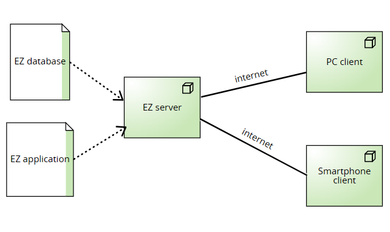

# Requirements Document - future EZElectronics

Date: 05/05/2024

Version: V2.9 - description of EZElectronics in FUTURE form (as proposed by the team)

| Version number | Change |
| :------------: | :----: |
|       2.1        |    Inseriemento stakeholder e stories    |
|       2.2        |    Inserimento requisiti funzionali    |
|       2.3        |    Inserimento requisiti non funzionali    |
|       2.4        |    Inserimento context diagram    |
|       2.5        |    Inserimento use-cases 1-10   |
|       2.5        |    Inserimento use-cases 10-18   |
|       2.6        |    Inserimento use-cases 18-26    |
|       2.7        |    Revisione use-cases    |
|       2.8        |    inserimento glossario  |
|       2.8        |    inserimento system design e deployment diagram  |
|       2.9        |    Revisione finale  |

# Contents

- [Requirements Document - future EZElectronics](#requirements-document---future-ezelectronics)
- [Contents](#contents)
- [Informal description](#informal-description)
- [Stakeholders](#stakeholders)
- [Context Diagram and interfaces](#context-diagram-and-interfaces)
  - [Context Diagram](#context-diagram)
  - [Interfaces](#interfaces)
- [Stories and personas](#stories-and-personas)
- [Functional and non functional requirements](#functional-and-non-functional-requirements)
  - [Functional Requirements](#functional-requirements)
  - [Non Functional Requirements](#non-functional-requirements)
- [Table of rights](#table-of-rights)
- [Use case diagram and use cases](#use-case-diagram-and-use-cases)
  - [Use case diagram](#use-case-diagram)
    - [Use case 1, UC1](#use-case-1-login-uc1)
      - [Scenario 1.1](#scenario-11)
      - [Scenario 1.2](#scenario-12)
      - [Scenario 1.3](#scenario-13)
      - [Scenario 1.4](#scenario-14)
    - [Use case 2, UC2](#use-case-2-logout-uc2)
      - [Scenario 2.1](#scenario-21)
      - [Scenario 2.2](#scenario-22)
    - [Use case 3, UC3](#use-case-3-registrazione-uc3)
      - [Scenario 3.1](#scenario-31)
      - [Scenario 3.2](#scenario-32)
      - [Scenario 3.3](#scenario-33)
      - [Scenario 3.4](#scenario-34)
    - [Use case 4, UC4](#use-case-4-aggiunta-prodotto-uc4)
      - [Scenario 4.1](#scenario-41)
      - [Scenario 4.2](#scenario-42)
      - [Scenario 4.3](#scenario-43)
      - [Scenario 4.4](#scenario-44)
      - [Scenario 4.5](#scenario-45)
    - [Use case 5, UC5](#use-case-5-inserimento-sconto-su-prodotto-uc5)
      - [Scenario 5.1](#scenario-51)
      - [Scenario 5.2](#scenario-52)
    - [Use case 6, UC6](#use-case-6-aggiornamento-informazioni-prodotto-uc6)
      - [Scenario 6.1](#scenario-61)
      - [Scenario 6.2](#scenario-62)
      - [Scenario 6.3](#scenario-63)
      - [Scenario 6.4](#scenario-64)
      - [Scenario 6.5](#scenario-65)
      - [Scenario 6.6](#scenario-66)
    - [Use case 7, UC7](#use-case-7-mostrare-prodotti-uc7)
      - [Scenario 7.1](#scenario-71)
      - [Scenario 7.2](#scenario-72)
      - [Scenario 7.3](#scenario-73)
      - [Scenario 7.4](#scenario-74)
    - [Use case 8, UC8](#use-case-8-mostrare-prodotti-per-categoria-uc8)
      - [Scenario 8.1](#scenario-81)
      - [Scenario 8.2](#scenario-82)
      - [Scenario 8.3](#scenario-83)
      - [Scenario 8.4](#scenario-84)
      - [Scenario 8.5](#scenario-85)
      - [Scenario 8.6](#scenario-86)
      - [Scenario 8.7](#scenario-87)
    - [Use case 9, UC9](#use-case-9-mostrare-prodotti-per-modello-uc9)
      - [Scenario 9.1](#scenario-91)
      - [Scenario 9.2](#scenario-92)
      - [Scenario 9.3](#scenario-93)
      - [Scenario 9.4](#scenario-94)
      - [Scenario 9.5](#scenario-95)
      - [Scenario 9.6](#scenario-96)
      - [Scenario 9.7](#scenario-97)
    - [Use case 10, UC10](#use-case-10-eliminazione-prodotto-uc10)
      - [Scenario 10.1](#scenario-101)
      - [Scenario 10.2](#scenario-102)
    - [Use case 11, UC11](#use-case-11-mostrare-carrello-uc11)
      - [Scenario 11.1](#scenario-111)
    - [Use case 12, UC12](#use-case-12-aggiunta-prodotti-in-carrello-uc12)
      - [Scenario 12.1](#scenario-121)
      - [Scenario 12.2](#scenario-122)
    - [Use case 13, UC13](#use-case-13-rimozione-prodotto-da-carrello-uc13)
      - [Scenario 13.1](#scenario-131)
      - [Scenario 13.2](#scenario-132)
      - [Scenario 13.3](#scenario-133)
     - [Use case 14, UC14](#use-case-14-storico-carrelli-uc14)
      - [Scenario 14.1](#scenario-141)
      - [Scenario 14.2](#scenario-142)
    - [Use case 15, UC15](#use-case-15-svuota-carrello-uc15)
      - [Scenario 15.1](#scenario-151)
    - [Use case 16, UC16](#use-case-16-checkout-uc16)
      - [Scenario 16.1](#scenario-161)
      - [Scenario 16.2](#scenario-162)
      - [Scenario 16.3](#scenario-163)
      - [Scenario 16.4](#scenario-164)
    - [Use case 17, UC17](#use-case-17-abilitazione-manager-uc17)
      - [Scenario 17.1](#scenario-171)
      - [Scenario 17.2](#scenario-172)
    - [Use case 18, UC18](#use-case-18-eliminazione-user-account-uc18)
      - [Scenario 18.1](#scenario-181)
      - [Scenario 18.2](#scenario-182)
    - [Use case 19, UC19](#use-case-19-effettuare-una-segnalazione-da-parte-di-user-uc19)
      - [Scenario 19.1](#scenario-191)
      - [Scenario 19.2](#scenario-192)
    - [Use case 20, UC20](#use-case-20-annullamento-ordine-uc20)
      - [Scenario 20.1](#scenario-201)
      - [Scenario 20.2](#scenario-202)
      - [Scenario 20.3](#scenario-203)
    - [Use case 21, UC21](#use-case-21-salvataggio-dati-pagamento-uc21)
      - [Scenario 21.1](#scenario-211)
      - [Scenario 21.2](#scenario-212)
    - [Use case 22, UC22](#use-case-22-valutazioni-uc22)
      - [Scenario 22.1](#scenario-221)
      - [Scenario 22.2](#scenario-222)
    - [Use case 23, UC23](#use-case-23-eliminazione-account-uc23)
      - [Scenario 23.1](#scenario-231)
    - [Use case 24, UC24](#use-case-24-mostra-account-uc24)
      - [Scenario 24.1](#scenario-241)
    - [Use case 25, UC25](#use-case-25-mostra-prodotto-uc25)
      - [Scenario 25.1](#scenario-251)
    - [Use case 26, UC26](#use-case-26-segnalazione-gestita-da-admin-uc26)
      - [Scenario 26.1](#scenario-261)
- [Glossary](#glossary)
- [System Design](#system-design)
- [Deployment Diagram](#deployment-diagram)

# Informal description

EZElectronics (read EaSy Electronics) is a software application designed to help managers of electronics stores to manage their products and offer them to customers through a dedicated website. Managers can assess the available products, record new ones, and confirm purchases. Customers can see available products, add them to a cart and see the history of their past purchases.

# Stakeholders

| Stakeholder name | Description |
| :--------------: | :---------: |
| Customer |      User con attributo role Customer autenticato  |
| Manager |      User con attributo role Manager autenticato        |
| Visitor | Utente che apre il sito senza essere loggato |
| Admin   |  Utente con privilegi superiori |
| Payment system  | Sistema esterno che permette di gestire i pagamenti online degli utenti |  

# Context Diagram and interfaces

## Context Diagram

## Interfaces

|   Actor   | Logical Interface | Physical Interface |
| :-------: | :---------------: | :----------------: |
| Customer |         GUI          |        Smartphone/PC           |
| Manager |          GUI       |          Smarphone/PC          |
| Visitor |         GUI  |  Smartphone/PC  |
| Admin  |         GUI    |  Smartphone/PC  |
| Payment service |       `https://github.com/satispay/gbusiness-api-php-sdk`         |          Internet          |

# Stories and personas

### MANAGER

__Persona1:__
Mario, 60 anni, è un manager, con poche competenze informatiche. Deve gestire i prodotti e offrirli ai clienti attraverso il sito dedicato.
  - Story: Mario mette in vendita attraverso il sito dedicato i nuovi prodotti 
  - Story: Mario modifica attraverso il sito dedicato le informazioni dei prodotti 

__Persona 2:__
Erica, 30 anni, è una manager, con ampie competenze informatiche. Deve gestire i prodotti e offrirli ai clienti attraverso il sito dedicato.
  - Story: Erica utilizza il sito dedicato per verificare i prodotti ancora disponibili.
  - Story: Erica utilizza il sito dedicato per aggiungere degli sconti.

### CUSTOMER

__Persona 3:__
Tina, 50 anni senza figli, è una donna con poche competenze tecnologiche. Ricerca per lo più di dispositivi semplici e non è molto interessata alle caratteristiche specifiche dei prodotti e le loro prestazioni. Necessita di un sito dedicato quanto più semplice possibile.
  - Story: Tina vuole acquistare un nuovo smartphone, entra nel sito, sceglie il modello che le interessa e lo aggiunge al suo carrello.
    - Story: Tina annullare un ordine fatto la sera precedente, entra nel sito, visualizza lo storico ordini e annulla l'ordine effettuato.

__Persona 4:__
Giovanni, 22 anni, con ampie competenze informatiche. Necessita spesso di nuovi prodotti ed è molto interessato alla carattesristiche specifiche del prodotto. Inoltre è interessato allo storico degli acquisti.
  - Story: Giovanni vuole risalire all'ultimo modello di PC che ha acquistato per un dipendente per poterlo acquistare anche per un neo-assunto, per cui accede allo storico dei suoi ordini e trova il codice identificativo del notebook in questione.
  - Story: Giovanni è molto felice del pc acquistato in passato e vuole lasciare una valutazione positiva, apre lo storico degli ordini e inserisce 5 stelle al pc.

### VISITOR

__Persona 5:__
Maria, 18 anni, ha ampie competenze informatiche e non è registrata sul sito web.
  - Story: Maria vuole registrarsi sul sito web in modo tale da poter accedere e usare il sito per effettuare degli acquisti.

__Persona 6:__
Luigi, 35 anni, è stato assunto come manager e non ha un account sul sito web.
  - Story: Luigi vuole registrarsi sul sito web in modo tale da poter mettere in vendita i prodotti.

### ADMIN
__Persona 7:__
Mirko, 30 anni, esperto in prodotti elettronici, si occupa di verificare le segnalazioni degli utenti.
  - Story: Mirko vuole accedere al sito web e verificare eventuali segnalazioni degli utenti.

__Persona 8:__
Francesca, 50 anni, amministra il sistema e gestisce i permessi dei vari account.
  - Story: Francesca entra sul suto web, legge le richieste degli utenti che vogliono essere Manager e li abilita.

# Functional and non functional requirements

## Functional Requirements
|  ID   |   Description |
| :---:| :-----: |
|  __FR1__  | __Gestione Carrello__ |          
| FR1.1 | Customer deve poter recuperare un proprio carrello |
| FR1.2 | Customer deve poter aggiungere un prodotto al proprio carrello attuale |
| FR1.3 | Customer deve poter effettuare il checkout del carrello attuale, visualizzando il costo totale |
| FR1.4 | Customer deve poter recuperare tutti i carrelli associati ad acquisti effettuati in precedenza |
| FR1.5 | Customer deve poter rimuovere uno specifico prodotto dal carrello attuale dell'utente |
| FR1.6 | Customer deve poter cancellare il carrello corrente |
| FR1.7 | Customer deve poter richiedere l'annullamento di un ordine |
| FR1.8 | Manager deve poter gestire la richiesta di annullamento di un ordine da parte di un Customer |
| __FR2__ | __Gestione Account__ |          
| FR2.1 | Un Visitor deve potersi registrare | 
| FR2.2 | Un User deve poter vedere le proprie informazioni |
| FR2.3 | Uno User deve poter cancellare il proprio account |
| FR2.4 | Un Admin deve poter cancellare l'account di un User |
| __FR3:__ | __Gestione Prodotti__ |     
| FR3.1 | Un Manager deve poter aggiungere un nuovo prodotto|
| FR3.2 | Un Manager deve poter aggiornare le informazioni di un prodotto |
| FR3.3 | Un User deve poter visualizzare la lista di tutti prodotti con la possibilità di filtrare per disponibilità|
| FR3.4 | Un user deve poter visualizzare un prodotto |
| FR3.5 | Un User deve poter visualizzare la lista dei prodotti filtrati per categoria con la possibilità di filtrare per disponibilità|
| FR3.6 | Un User deve poter visualizzare la lista dei prodotti filtrati per modello con la possibilità di filtrare per disponibilità|
| FR3.7 | Un Manager deve poter eliminare un prodotto|
| FR3.8 | Un Manager deve poter inserire uno sconto per un prodotto |
| FR3.9 | Un Customer deve poter inserire una valutazione per un prodotto |
|  __FR4__  | __Autenticazione__   | 
|  FR4.1  | Un Visitor deve poter effettuare il login     |
|  FR4.2  | Un User deve poter effettuare il logout dal sito  |
|  FR4.3  | Un Admin deve poter effettuare il logout dal sito |
|  __FR5__ | __Gestione pagamenti__  | 
|  FR5.1  | Un Customer, dopo aver effettuato il checkout, deve essere reindirizzato al sito PayPal iniziando la transazione   |
|  FR5.2  | Un Customer deve poter salvare più account PayPal | 
|  __FR6__  | __Segnalazioni__  | 
|  FR6.1  |   Un User deve poter effettuare una segnalazione    |
|  FR6.2  |   Un Admin deve poter gestire una segnalazione    |
|  __FR7__ | __Abilitazione manager__  |  
|  FR7.1   |  Un Admin deve poter confermare ed abilitare un nuovo profilo di tipo `Manager` |

## Non Functional Requirements

|   ID    | Type (efficiency, reliability, ..) | Description | Refers to |
| :-----: | :--------------------------------: | :---------: | :-------: |
|  NFR1   |  Efficienza  |       La piattaforma deve avere tempi di risposta inferiore ai 0.5 secondi, escludendo problemi di rete    |     Tutti FR      |
|  NFR2   |  Usabilità |  Il Customer non deve avere bisogno di training, mentre un Manager o un Admin devono avere un massimo training time di 20 minuti.          |     Tutti FR      |
|  NFR3   |  Affidabilità  |     L'uptime deve essere minimo pari al 98%      |     Tutti FR      |
|  NFR4   |  Correttezza  |      La piattaforma deve riscontrare massimo 3 segnalazioni di errori all'anno     |    Tutti FR        |
|  NFR5   |  Correttezza  |      Tempo per gestione segnalazione < 5h      |      FR6     |
|  NFR6   |  Portabilità  |      La piattaforma deve essere responsive e funzionare sia su PC che su Mobile, usando i seguenti browser: Microsoft Edge, Google Chrome e Safari.     |   Tutti FR        |
| NFR7    |  Security     |      La piattaforma deve essere conforme alle norme del GDPR | FR4, FR5, FR&, FR7 |

# Table of rights
|| Visitor | Customer | Manager | Admin |
| :-: | :-----: | :-----: | :-----: |  :-----: | 
| FR 1.1 | |x| | |
| FR 1.2 | |x| | |
| FR 1.3 | |x| | |
| FR 1.4 | |x| | |
| FR 1.5 | |x| | |
| FR 1.6 | |x| | |
| FR 1.7 | |x| | |
| FR 1.8 | | |x| |
| FR 2.1 |x| | | |
| FR 2.2 | |x|x| |
| FR 2.3 | |x|x| |
| FR 2.4 | | | |x|
| FR 3.1 | | |x| |
| FR 3.2 | | |x| |
| FR 3.3 | |x|x| |
| FR 3.4 | |x|x| |
| FR 3.5 | |x|x| |
| FR 3.6 | |x|x| |
| FR 3.7 | | |x| |
| FR 3.8 | | |x| |
| FR 3.9 | |x| | |
| FR 4.1 |x| | | |
| FR 4.2 | |x|x| |
| FR 4.3 | | | |x|
| FR 5.1 | |x| | |
| FR 5.2 | |x| | |
| FR 6.1 | |x|x| |
| FR 6.2 | | | |x|
| FR 7.1 | | | |x|

# Use case diagram and use cases

## Use case diagram

### Use case 1, Login (UC1)
| Actors Involved        | Visitor |
| ------------- |:-------------:| 
|  Precondition     | Visitor non autenticato |
|  Post condition     | User loggato |
|  Nominal Scenario     | Scenario 1.1 |
|  Variants     | None |
|  Exceptions     | Scenario 1.2, 1.3, 1.4|

#### Scenario 1.1 

| Scenario 1.1 | Login con credenziali corrette |
| ------------- |:-------------:| 
|  Precondition     | Visitor non autenticato|
|  Post condition     | User loggato |
| Step#        | Descrizione  |
|  1     | Sistema: Chiede username, password |  
|  2     | Visitor: Fornisce username, password. |
|  3     | Sistema: Legge username, password. Controlla se già loggato, non è loggato. |
|  4	 | Sistema: Dato username, trova l'user. |
|  5	 | Sistema: Recupera password, confronta con quella inserita da utente. Password sono uguali, user è autorizzato e loggato|

#### Scenario 1.2

| Scenario 1.2 | Login con password errata |
| ------------- |:-------------:| 
|  Precondition     |Visitor non autenticato|
|  Post condition     | User non loggato |
| Step#        | Descrizione  |
|  1     | Sistema: Chiede username, password |  
|  2     | Visitor: Fornisce username, password. |
|  3     | Sistema: Legge username, password. Controlla se già loggato, non è loggato. |
|  4	 | Sistema: Dato username, trova l'user. |
|  5	 | Sistema: Recupera password, confronta con quella inserita da utente. Password non sono uguali, user non è autorizzato|
|  6   | Sistema: Mostra messaggio di errore. |

#### Scenario 1.3

| Scenario 1.3 | Login con credenziali inesistenti |
| ------------- |:-------------:| 
|  Precondition     | Visitor non autenticato |
|  Post condition     | Visitor non autenticato |
| Step#        | Descrizione  |
|  1     | Sistema: Chiede username, password |  
|  2     | Visitor: Fornisce username, password. |
|  3     | Sistema: Legge username, password. Controlla se già loggato, non è loggato. |
|  4	 | Sistema: Dato username, trova User. User non trovato. User non autorizzato. |
|  5   | Sistema: Mostra messaggio di errore. |

#### Scenario 1.4

| Scenario 1.4 | Login di utente già autenticao |
| ------------- |:-------------:| 
|  Precondition     | User autenticato e loggato |
|  Post condition     | User autenticato |
| Step#        | Descrizione  |
|  1     | Sistema: Chiede username, password |  
|  2     | User: Fornisce username, password. |
|  3     | Sistema: Legge username, password. Controlla se user loggato, user è loggato. |
|  4   | Sistema: Mostra messaggio di errore. |

### Use case 2, Logout (UC2)

| Actors Involved        | Manager, Customer, Admin (generalizzati come "Utente_loggato") |
| ------------- |:-------------:| 
|  Precondition     | L'utente è loggato |
|  Post condition     | L'utente non è loggato |
|  Nominal Scenario     | Scenario 2.1 |
|  Variants     |  |
|  Exceptions     | Nessuno |

#### Scenario 2.1 

| Scenario 2.1 | Logout utente loggato |
| ------------- |:-------------:| 
|  Precondition     | L'utente è loggato |
|  Post condition     | L'utente non è più autenticato, non ha accesso alla piattaforma |
| Step#        | Descrizione  |
|  1     | Utente_loggato: Chiede di effettuare logout |
|  2     | Sistema: Verifica che l'utente sia loggato, l'utente è loggato.
|  3	   | Sistema: invalida la sessione corrente del dispositivo da cui l'utente è loggato|

### Use case 3, Registrazione (UC3)

| Actors Involved        | Visitor |
| ------------- |:-------------:| 
|  Precondition     | Visitor non ha un account |
|  Post condition     | Account creato, User registrato |
|  Nominal Scenario     | Scenario 3.1, 3.2 |
|  Variants     | Nessuna |
|  Exceptions     | Scenario 3.3, 3.4 |

#### Scenario 3.1 

| Scenario 3.1 | Registrazione di User di tipo Customer |
| ------------- |:-------------:| 
|  Precondition     | Visitor non ha un account |
|  Post condition     | User registrato |
| Step#        | Descrizione  |  
|  1     | Sistema:  Chiede username, name, surname, role, password, email, (phoneNumber)  |
|  2     | Visitor: Fornisce username, name, surname, role, password, email, (phoneNumber)  |
|  3     | Sistema: Legge username, name, surname, role, password, email, (phoneNumber) |
|  4     | Sistema: Verifica che i campi obbligatori non siano vuoti, non sono vuoti |
|  5     | Sistema: Controlla che l'username fornito da User non sia associato a un account già esistente. L'username non è ancora stato usato|
|  6     | Sistema: Legge campo role, role è User|
|  7     | Sistema: Crea un nuovo Customer account e registra le sue informazioni  |

#### Scenario 3.2 

| Scenario 3.2 | Registrazione di User di tipo Manager |
| ------------- |:-------------:| 
|  Precondition     | Visitor non ha un account |
|  Post condition     | Richiesta di abilitazione inviata ad Admin |
| Step#        | Descrizione  |  
|  1     | Sistema:  Chiede username, name, surname, role, password, email, (phoneNumber)|
|  2     | Visitor: Fornisce username, name, surname, role, password, email, (phoneNumber)|
|  3     | Sistema: Legge username, name, surname, role, password, email, (phoneNumber) |
|  4     | Sistema: Verifica che i campi obbligatori non siano vuoti, non sono vuoti |
|  5     | Sistema: Controlla che l'username fornito da Visitor non sia associato a un account già esistente. L'username non è ancora stato usato|
|  6     | Sistema: Legge campo role, role è Manager|
|  7     | Sistema: invia richiesta di abilitazione ad Admin |

#### Scenario 3.3 

| Scenario 3.3 |  Registrazion con username già esistente |
| ------------- |:-------------:| 
|  Precondition     | Visitor vuole registrarsi, username già in db |
|  Post condition     | Registrazione fallita |
| Step#        | Descrizione  |
|  1     | Sistema:  Chiede username, name, surname, role e password, email, (phoneNumber)  |
|  2     |  Visitor: Fornisce username, name, surname, role e password, email, (phoneNumber)  |
|  3     | Sistema: Legge username, name, surname, role e password, email, (phoneNumber)  |
|  4     | Sistema: Verifica che i campi obbligatori non siano vuoti, non sono vuoti |
|  5     | Sistema:  Controlla che l'username fornito da Visitor non sia associato a un account già esistente. L'username è già utilizzato. |
|  6     | Sistema: Mostra un messaggio di errore 409      |

#### Scenario 3.4 

| Scenario 3.4 |  Registrazuine con campo obbligatorio vuoto |
| ------------- |:-------------:| 
|  Precondition     | Visitor vuole registrarsi |
|  Post condition     | Registrazione fallita |
| Step#        | Descrizione  |
|  1     | Visitor: Richiesta di registrazione  |
|  2     | Sistema:  Chiede username, name, surname, role e password, email, (phoneNumber)  |
|  3     | Visitor: Fornisce username, name, surname, role e password, email, (phoneNumber)  |
|  4     | Sistema: Legge username, name, surname, role e password, email, (phoneNumber)  |
|  5     | Sistema: Verifica che i campi obbligatori non siano vuoti, almeno uno è vuoto |
|  6     | Sistema: Mostra un messaggio di errore  |

### Use case 4, Aggiunta prodotto (UC4) 
| Actors Involved        | Manager |
| ------------- |:-------------:| 
|  Precondition     | Manager loggato |
|  Post condition     | Prodotto viene creato e inserito sul sito |
|  Nominal Scenario     | Scenario 4.1 |
|  Variants     | Nessuna |
|  Exceptions     |  Scenario 4.2, 4.3, 4.4, 4.5 |

#### Scenario 4.1 
| Scenario 4.1 | Aggiunta prodotto|
| ------------- |:-------------:| 
|  Precondition     | Prodotto non esistente |
|  Post condition     |  Prodotto inserito |
| Step#        | Descrizione  |  
|  1     | Manager: Richiede l'inserimento di un nuovo prodotto |
|  2     | Sistema: Chiede modelCode, sellingPrice, model, category, details, quantity |
|  3     | Manager: Fornisce modelCode, sellingPrice, model, category, details, quantity|
|  4     | Sistema: Verifica se modelCode, sellingPrice, model e category, quantity non siano vuoti. Non sono vuoti|
|  5     | Sistema: Verifica se i campi forniti siano del formato corretto. Sono del formato corretto|
|  6     | Sistema: Verifica se modelCode é già presente nel DB, non è presente | 
|  7     | Sistema: Verifica se quantity e selling price siano maggiori di 0, sono maggiori di 0. |
|  19    | Sistema: Inserisce il nuovo prodotto nel database |

#### Scenario 4.2
| Scenario 4.2 | Aggiunta prodotto con quantity/sellingPrice errata|
| ------------- |:-------------:| 
|  Precondition     | Prodotto non esistente |  
|  Post condition     |  Prodotto non inserito |
| Step#        | Descrizione  |  
|  1     | Manager: Richiede l'inserimento di un nuovo prodotto |
|  2     | Sistema: Chiede modelCode, sellingPrice, model, category, details, quantity |
|  3     | Manager: Fornisce modelCode, sellingPrice, model, category, details, quantity |
|  4     | Sistema: Verifica che modelCode, sellingPrice, model e category, quantity non siano vuoti. Non sono vuoti|
|  5     | Sistema: Verifica che i campi forniti siano del formato corretto. Sono del formato corretto|
|  6     | Sistema: Verifica che modelCode non sia già presente nel DB, non è presente |
|  7     | Sistema: Verifica se modelCode é già presente nel DB, non è presente | 
|  8     | Sistema: Verifica se quantity e selling price siano maggiori di 0, non sono maggiori di 0. |
|  9     | Sistema: Ritorna messaggio di errore |

#### Scenario 4.3

| Scenario 4.3 | Aggiunta prodotto, campo obbligatorio vuoto|
| ------------- |:-------------:| 
|  Precondition     | Prodotto non esistente |
|  Post condition     |  Prodotto non inserito |
| Step#        | Descrizione  |  
|  1     | Manager: Richiede l'inserimento di un nuovo prodotto |
|  2     | Sistema: Chiede modelCode, sellingPrice, model, category, details, quantity |
|  3     | Manager: Fornisce modelCode, sellingPrice, model, category, details, quantity|
|  4     | Sistema: Verifica che modelCode, sellingPrice, model e category, quantity non siano vuoti. Almeno un campo è vuoto|
|  5     | Sistema: Mostra messaggio di errore. |

#### Scenario 4.4

| Scenario 4.4 | Aggiunta prodotto, formato errato |
| ------------- |:-------------:| 
|  Precondition     | Prodotto non esistente |
|  Post condition     |  Prodotto non inserito |
| Step#        | Descrizione  |  
|  1     | Manager: Richiede l'inserimento di un nuovo prodotto |
|  2     | Sistema: Chiede modelCode, sellingPrice, model, category, details, quantity |
|  3     | Manager: Fornisce modelCode, sellingPrice, model, category, details, quantity|
|  4     | Sistema: Verifica che modelCode, sellingPrice, model e category, quantity non siano vuoti. Nessun campo è vuoto|
|  5     | Sistema: Verifica che i campi forniti siano del formato corretto. Almeno uno non è del formato corretto|
|  6     | Sistema: Mostra messaggio di errore. |

#### Scenario 4.5 
| Scenario 4.5 | Aggiunta prodotto specificando code già presente|
| ------------- |:-------------:| 
|  Precondition     | Prodotto esistente |
|  Post condition     |  Quantità prodotto aggiornata |
| Step#        | Descrizione  |  
|  1     | Manager: Richiede l'inserimento di un nuovo prodotto |
|  2     | Sistema: Chiede modelCode, sellingPrice, model, category, details, quantity |
|  3     | Manager: Fornisce modelCode, sellingPrice, model, category, details, quantity|
|  4     | Sistema: Verifica se modelCode, sellingPrice, model e category, quantity non siano vuoti. Non sono vuoti|
|  5     | Sistema: Verifica se i campi forniti siano del formato corretto. Sono del formato corretto|
|  6     | Sistema: Verifica se modelCode non è già presente nel DB,  è presente | 
|  7     | Sistema: Mostra messaggio di errore 409 |

### Use case 5, Inserimento sconto su prodotto (UC5)
| Actors Involved        | Manager |
| ------------- |:-------------:| 
|  Precondition     | Manager è loggato |
|  Post condition     | Prodotto ha uno sconto |
|  Nominal Scenario     | Scenario 5.1 |
|  Variants     | Nessuna |
|  Exceptions     | Scenario 5.2, Scenario 5.3 |

#### Scenario 5.1 

| Scenario 5.1 | Inserimento sconto con successo |
| ------------- |:-------------:| 
|  Precondition     | Manager è loggato, prodotto esistente |
|  Post condition     | Sconto aggiunto al prodotto |
| Step#        | Descrizione  |  
|  1     | Manager: Richiesta inserire uno sconto per un modelCode |
|  2     | Sistema: Verifica se il modelCode richiesto esiste, esiste|
|  2     | Sistema: Richiede percentuale di sconto|
|  2     | Manager: Inserisce percentuale di costo e conferma|
|  3     | Sistema: Inserisce lo sconto al modelCode richiesto |

#### Scenario 5.2 

| Scenario 5.2 | Inserimento sconto, prodotto non esistente|
| ------------- |:-------------:| 
|  Precondition     | Manager è loggato, prodotto non esistente |
|  Post condition     | Sconto non aggiunto al prodotto, messaggio di errore|
| Step#        | Descrizione  |  
| Step#        | Descrizione  |  
|  1     | Manager: Richiesta inserire uno sconto per un modelCode |
|  2     | Sistema: Verifica se il modelCode richiesto esiste, non esiste|
|  3     | Sistema: Mostra un messaggio di errore |

#### Scenario 5.3 

| Scenario 5.3 | Inserimento sconto annullato|
| ------------- |:-------------:| 
|  Precondition     | Manager è loggato, prodotto non esistente |
|  Post condition     | Sconto non aggiunto al prodotto, torna a pagina precedente |
| Step#        | Descrizione  |  
| Step#        | Descrizione  |  
|  1     | Manager: Richiesta inserire uno sconto per un modelCode |
|  2     | Sistema: Verifica se il modelCode richiesto esiste, esiste|
|  2     | Sistema: Richiede percentuale di sconto|
|  2     | Manager: Annulla richiesta|
|  3     | Sistema: Torna a pagina precedente |

### Use case 6, Aggiornamento informazioni prodotto (UC6) 

| Actors Involved        | Manager |
| ------------- |:-------------:| 
|  Precondition     | Prodotto da aggiornare, Manager loggato |
|  Post condition     | Aggiornamento effettuato |
|  Nominal Scenario     | Scenario 6.1 |
|  Variants     | Nessuna |
|  Exceptions     |  Scenario 6.2, 6.3, 6.4, 6.5, 6.6 |

#### Scenario 6.1 
| Scenario 6.1 | Aggiornamento prodotto effettuato|
| ------------- |:-------------:| 
|  Precondition     | Prodotto da aggiornare |
|  Post condition     | Aggiornamento effettuato |
| Step#        | Descrizione  |  
|  1     | Manager: Richiede l'aggiornamento di un prodotto già esistente |
|  2     | Sistema: Chiede modelCode, e almeno un campo tra sellingPrice, model, category, details, quantity |
|  3     | Manager: Fornisce modelCode e almeno un campo tra sellingPrice, model, category, details, quantity|
|  4     | Sistema: Verifica se modelCode, sellingPrice, model, category e quantity non siano vuoti. Non sono vuoti|
|  5     | Sistema: Verifica se i campi forniti siano del formato corretto. Sono del formato corretto|
|  6     | Sistema: Verifica che modelCode sia già presente nel DB, è presente | 
|  7     | Sistema: Verifica se sellingPrice (se fornito), sia maggiore di 0, è maggiore di 0. |
|  8     | Sistema: Verifica che il campo quantity (se fornito) sia maggiore di 0, è maggiore di 0 |
|  9     | Sistema: Verifica che il campo category, (se fornito) sia maggiore di 0, è maggiore di 0 |
|  10    | Sistema: Aggiorna i dati del prodotto nel database |

#### Scenario 6.2

| Scenario 6.2 | Aggiornamento non effettuato, formato errato |
| ------------- |:-------------:| 
|  Precondition     | Prodotto da aggiornare |
|  Post condition     |  Aggiornamento non effettuato, messaggio di errore |
| Step#        | Descrizione  |  
|  1     | Manager: Richiede l'aggiornamento di un prodotto già esistente |
|  2     | Sistema: Chiede modelCode, e almeno un campo tra sellingPrice, model, category, details, quantity |
|  3     | Manager: Fornisce modelCode e almeno un campo tra sellingPrice, model, category, details, quantity|
|  4     | Sistema: Verifica che modelCode, sellingPrice, model e category, quantity non siano vuoti. Nessun campo è vuoto|
|  5     | Sistema: Verifica che i campi forniti siano del formato corretto. Almeno uno non è del formato corretto|
|  6     | Sistema: Mostra messaggio di errore. |

#### Scenario 6.3
| Scenario 6.3 | Aggiornamento non effettuato, modelCode inesistente|
| ------------- |:-------------:| 
|  Precondition     | Prodotto da aggiornare |
|  Post condition     |  Aggiornamento non effettuato, messaggio di errore |
| Step#        | Descrizione  |  
|  1     | Manager: Richiede l'aggiornamento di un prodotto già esistente | 
|  2     | Sistema: Chiede modelCode, e almeno un campo tra sellingPrice, model, category, details, quantity |
|  3     | Manager: Fornisce modelCode e almeno un campo tra sellingPrice, model, category, details, quantity|
|  4     | Sistema: Verifica che modelCode, sellingPrice, model e category e quantity non siano vuoti. Non sono vuoti|
|  5     | Sistema: Verifica che i campi forniti siano del formato corretto. Sono del formato corretto|
|  6     | Sistema: Verifica che il campo modelCode sia già presente nel DB, non è presente | 
|  7     | Sistema: Ritorna messaggio di errore |

#### Scenario 6.4
| Scenario 6.4 | Aggiornamento non effettuato, sellingPrice errata|
| ------------- |:-------------:| 
|  Precondition     | Prodotto da aggiornare |
|  Post condition     | Aggiornamento non effettuato, messaggio di errore  |
| Step#        | Descrizione  |  
|  1     | Manager: Richiede l'aggiornamento di un prodotto già esistente |
|  2     | Sistema: Chiede modelCode, e almeno un campo tra sellingPrice, model, category, details, quantity |
|  3     | Manager: Fornisce modelCode e almeno un campo tra sellingPrice, model, category, details, quantity|
|  4     | Sistema: Verifica che modelCode, sellingPrice, model e category e quantity non siano vuoti. Non sono vuoti|
|  5     | Sistema: Verifica che i campi forniti siano del formato corretto. Sono del formato corretto|
|  6     | Sistema: Verifica che modelCode sia già presente nel DB, è presente | 
|  7     | Sistema: Verifica che il sellingPrice fornito sia maggiore di 0, non è maggiore di 0. |
|  8     | Sistema: Ritorna messaggio di errore |

#### Scenario 6.5 
| Scenario 6.5 | Aggiornamento non effettuato, quantity errata |
| ------------- |:-------------:| 
|  Precondition     | Prodotto da aggiornare |
|  Post condition     |  Aggiornamento non effettuato, messaggio di errore|
| Step#        | Descrizione  |  
|  1     | Manager: Richiede l'aggiornamento di un prodotto già esistente |
|  2     | Sistema: Chiede modelCode, e almeno un campo tra sellingPrice, model, category, details, quantity |
|  3     | Manager: Fornisce modelCode e almeno un campo tra sellingPrice, model, category, details, quantity|
|  4     | Sistema: Verifica se modelCode, sellingPrice, model e category non siano vuoti. Non sono vuoti|
|  5     | Sistema: Verifica se i campi forniti siano del formato corretto. Sono del formato corretto|
|  6     | Sistema: Verifica che modelCode sia già presente nel DB, è presente | 
|  7     | Sistema: Verifica che il sellingPrice (se fornito) sia maggiore di 0, è maggiore di 0. |
|  8     | Sistema: verifica che il campo quantity sia maggiore di 0, non è maggiore di 0 |
|  9     | Sistema: Ritorna messaggio di errore |

#### Scenario 6.6 
| Scenario 6.6 | Aggiornamento non effettuato, category errata |
| ------------- |:-------------:| 
|  Precondition     | Prodotto da aggiornare |
|  Post condition     |  Aggiornamento non effettuato, messaggio di errore |
| Step#        | Descrizione  |  
|  1     | Manager: Richiede l'aggiornamento di un prodotto già esistente |
|  2     | Sistema: Chiede modelCode, e almeno un campo tra sellingPrice, model, category, details, quantity |
|  3     | Manager: Fornisce modelCode e almeno un campo tra sellingPrice, model, category, details, quantity|
|  4     | Sistema: Verifica se modelCode, sellingPrice, model e category non siano vuoti. Non sono vuoti|
|  5     | Sistema: Verifica se i campi forniti siano del formato corretto. Sono del formato corretto|
|  6     | Sistema: Verifica che modelCode sia già presente nel DB, è presente | 
|  7     | Sistema: Verifica che il sellingPrice (se fornito) sia maggiore di 0, è maggiore di 0 |
|  8     | Sistema: verifica che il campo quantity (se fornito) sia maggiore di 0, è maggiore di 0 |
|  9     | Sistema: verifica che il campo category fornito corrisponda a uno tra "Smartphone", "Laptop"o "Appliance", non corrisponde |
|  10     | Sistema: Ritorna messaggio di errore |

### Use case 7, Mostrare prodotti (UC7)
| Actors Involved        | Manager, Customer (generalizzati come "User") |
| ------------- |:-------------:| 
|  Precondition     | User è loggato |
|  Post condition     | Products richiesti mostrati |
|  Nominal Scenario     | Scenario 7.1, 7.2, 7.3 |
|  Variants     | Nessuna |
|  Exceptions     | Scenario 7.4 |

#### Scenario 7.1 

| Scenario 7.1 | Mostrare tutti i prodotti non disponibili |
| ------------- |:-------------:| 
|  Precondition     | User è loggato |
|  Post condition     | Mostra lista di tutti i prodotti non disponibili |
| Step#        | Descrizione  |  
|  1     | User: Richiesta di mostrare i prodotti non disponibili |
|  2     | Sistema: Verifica contenuto del parametro sold, sold contiene `yes`|
|  3     | Sistema: Mostra i prodotti non disponibili|

#### Scenario 7.2 

| Scenario 7.2 | Mostrare tutti i prodotti ancora disponibili |
| ------------- |:-------------:| 
|  Precondition     | User è loggato |
|  Post condition     | Mostra lista di tutti i prodotti disponibili|
| Step#        | Descrizione  |  
|  1     | User: Richiesta di mostrare i prodotti disponibili |
|  2     | Sistema: Verifica contenuto del parametro sold, sold contiene `no`|
|  3     | Sistema: Mostra i prodotti disponibili |

#### Scenario 7.3 

| Scenario 7.3 | Mostrare tutti i prodotti |
| ------------- |:-------------:| 
|  Precondition     | User è loggato |
|  Post condition     | Mostra lista di tutti i prodotti |
| Step#        | Descrizione  |  
|  1     | User: Richiesta di mostrare tutti i prodotti |
|  2     | Sistema: Verifica contenuto del parametro sold, sold è vuoto |
|  3     | Sistema: Mostra tutti i prodotti|

#### Scenario 7.4 

| Scenario 7.4 |Parametro sold errato |
| ------------- |:-------------:| 
|  Precondition     | User è loggato |
|  Post condition     | Prodotti non mostrati |
| Step#        | Descrizione  |  
|  1     | User: Richiesta di mostrare tutti i prodotti |
|  2     | Sistema: Verifica contenuto del parametro sold, sold contiene un valore non previsto|
|  3     | Sistema: Mostra un messaggio di errore|

### Use case 8, Mostrare prodotti per categoria (UC8)
| Actors Involved        | Manager, Customer (generalizzati come "User") |
| ------------- |:-------------:| 
|  Precondition     | User è loggato |
|  Post condition     | Mostra lista con i prodotti richiesti |
|  Nominal Scenario     | Scenario 8.1, 8.2, 8.3 |
|  Variants     | Nessuna |
|  Exceptions     | Scenario 8.4, 8.5, 8.6, 8.7 |

#### Scenario 8.1 

| Scenario 8.1 | Mostrare tutti i prodotti non disponibili, categoria ok |
| ------------- |:-------------:| 
|  Precondition     | User è loggato |
|  Post condition     | Mostra Lista con i prodotti richiesti |
| Step#        | Descrizione  |  
|  1     | User: Richiesta di mostrare i prodotti non disponibili |
|  2     | Sistema: Verifica contenuto del parametro sold, sold contiene `yes`|
|  3     | Sistema: Verifica se category sia un valore tra "Smartphone", "Laptop" e "Appliance", lo è. |
|  4     | Sistema: Mostra i prodotti non disponibili per categoria richiesta |

#### Scenario 8.2 

| Scenario 8.2 | Mostrare tutti i prodotti ancora disponibili, categoria ok |
| ------------- |:-------------:| 
|  Precondition     | User è loggato |
|  Post condition     | Mostra lista di tutti i prodotti richiesti |
| Step#        | Descrizione  |  
|  1     | User: Richiesta di mostrare i prodotti disponibili |
|  2     | Sistema: Verifica contenuto del parametro sold, sold contiene `no`|
|  3     | Sistema: Verifica se category sia un valore tra "Smartphone", "Laptop" e "Appliance", lo è. |
|  4     | Sistema: Mostra i prodotti disponibili per categoria richiesta |

#### Scenario 8.3 

| Scenario 8.3 | Mostrare tutti i prodotti, categoria ok |
| ------------- |:-------------:| 
|  Precondition     | User è loggato |
|  Post condition     | Mostra lista di tutti i prodotti della categoria richiesta|
| Step#        | Descrizione  |  
|  1     | User: Richiesta di mostrare tutti i prodotti |
|  2     | Sistema: Verifica contenuto del parametro sold, sold è vuoto |
|  3     | Sistema: Verifica se category sia un valore tra "Smartphone", "Laptop" e "Appliance", lo è. |
|  4     | Sistema: Mostra tutti i prodotti per categoria richiesta |

#### Scenario 8.4 

| Scenario 8.4 |Parametro sold errato |
| ------------- |:-------------:| 
|  Precondition     | User è loggato |
|  Post condition     | Prodotti non mostrati |
| Step#        | Descrizione  |  
|  1     | User: Richiesta di mostrare tutti i prodotti |
|  2     | Sistema: Verifica contenuto del parametro sold, sold contiene un valore non previsto|
|  3     | Sistema: Mostra messaggio di errore |

#### Scenario 8.5 
| Scenario 8.5 | Mostrare tutti i prodotti non disponibili, campo category errato |
| ------------- |:-------------:| 
|  Precondition     | User è loggato |
|  Post condition     | Prodotti non mostrati |
| Step#        | Descrizione  |  
|  1     | User: Richiesta di mostrare i prodotti non disponibili |
|  2     | Sistema: Verifica contenuto del parametro sold, sold contiene `yes`|
|  3     | Sistema: Verifica se category sia un valore tra "Smartphone", "Laptop" e "Appliance", non lo è. |
|  4     | Sistema: Mostra messaggio di errore |

#### Scenario 8.6 

| Scenario 8.6 | Mostrare tutti i prodotti ancora disponibili, campo category errato |
| ------------- |:-------------:| 
|  Precondition     | User è loggato |
|  Post condition     | Prodotti non mostrati |
| Step#        | Descrizione  |  
|  1     | User: Richiesta di mostrare i prodotti disponibili |
|  2     | Sistema: Verifica contenuto del parametro sold, sold contiene `no`|
|  3     | Sistema: Verifica se category sia un valore tra "Smartphone", "Laptop" e "Appliance", non lo è. |
|  4     | Sistema: Mostra messaggio di errore |

#### Scenario 8.7 

| Scenario 8.7 | Mostrare tutti i prodotti, campo category errato |
| ------------- |:-------------:| 
|  Precondition     | User è loggato |
|  Post condition     | Prodotti non mostrati |
| Step#        | Descrizione  |  
|  1     | User: Richiesta di mostrare tutti i prodotti |
|  2     | Sistema: Verifica contenuto del parametro sold, sold è vuoto |
|  3     | Sistema: Verifica se category sia un valore tra "Smartphone", "Laptop" e "Appliance", non lo è. |
|  4     | Sistema: Mostra messaggio di errore |

### Use case 9, Mostrare prodotti per modello (UC9)
| Actors Involved        | Manager, Customer (generalizzati come "User") |
| ------------- |:-------------:| 
|  Precondition     | User è loggato |
|  Post condition     | Products richiesti mostrati |
|  Nominal Scenario     | Scenario 9.1, 9.2, 9.3 |
|  Variants     | Nessuna |
|  Exceptions     | Scenario 9.4, 9.5, 9.6, 9.7 |

#### Scenario 9.1 

| Scenario 9.1 | Mostrare tutti i prodotti non disponibili, modello ok |
| ------------- |:-------------:| 
|  Precondition     | User è loggato |
|  Post condition     | Mostra lista di tutti i prodotti non disponibili |
| Step#        | Descrizione  |  
|  1     | User: Richiesta di mostrare i prodotti non disponibili |
|  2     | Sistema: Verifica contenuto del parametro sold, sold contiene `yes`|
|  3     | Sistema: Verifica che il campo model non sia vuoto, non è vuoto |
|  4     | Sistema: Verifica che il campo model sia una stringa, è una stringa |
|  5     | Sistema: mostra i prodotti filtrati per modello |

#### Scenario 9.2 

| Scenario 9.2 | Mostrare tutti i prodotti ancora disponibili , modello ok|
| ------------- |:-------------:| 
|  Precondition     | User è loggato |
|  Post condition     | Mostra lista di tutti i prodotti ancora disponibili |
| Step#        | Descrizione  |  
|  1     | User: Richiesta di mostrare i prodotti disponibili |
|  2     | Sistema: Verifica contenuto del parametro sold, sold contiene `no`|
|  3     | Sistema: Verifica che il campo model non sia vuoto, non è vuoto |
|  4     | Sistema: Verifica che il campo model sia una stringa, è una stringa |
|  5     | Sistema: mostra i prodotti filtrati per modello |

#### Scenario 9.3 

| Scenario 9.3 | Mostrare tutti i prodotti, modello ok|
| ------------- |:-------------:| 
|  Precondition     | User è loggato |
|  Post condition     | Mostra lista di tutti i prodotti |
| Step#        | Descrizione  |  
|  1     | User: Richiesta di mostrare tutti i prodotti |
|  2     | Sistema: Verifica contenuto del parametro sold, sold è vuoto |
|  3     | Sistema: Verifica che il campo model non sia vuoto, non è vuoto |
|  4     | Sistema: Verifica che il campo model sia una stringa, è una stringa |
|  5     | Sistema: mostra i prodotti filtrati per modello |

#### Scenario 9.4 

| Scenario 9.4 | Parametro sold errato |
| ------------- |:-------------:| 
|  Precondition     | User è loggato |
|  Post condition     | Prodotti non mostrati |
| Step#        | Descrizione  |  
|  1     | User: Richiesta di mostrare tutti i prodotti |
|  2     | Sistema: Verifica contenuto del parametro sold, sold contiene un valore non previsto|
|  3     | Sistema: Mostra messaggio di errore |

#### Scenario 9.5 
| Scenario 9.5 | Mostrare tutti i prodotti non disponibili, campo model errato/vuoto |
| ------------- |:-------------:| 
|  Precondition     | User è loggato |
|  Post condition     | Prodotti non mostrati |
| Step#        | Descrizione  |  
|  1     | User: Richiesta di mostrare i prodotti non disponibili |
|  2     | Sistema: Verifica contenuto del parametro sold, sold contiene `yes`|
|  3     | Sistema: Verifica che il campo model sia una stringa non vuota, non lo è |
|  4     | Sistema: Mostra messaggio di errore |

#### Scenario 9.6 

| Scenario 9.6 | Mostrare tutti i prodotti disponibili, campo model errato/vuoto|
| ------------- |:-------------:| 
|  Precondition     | User è loggato |
|  Post condition     | Prodotti non mostrati |
| Step#        | Descrizione  |  
|  1     | User: Richiesta di mostrare i prodotti disponibili |
|  2     | Sistema: Verifica contenuto del parametro sold, sold contiene `no`|
|  3     | Sistema:  Verifica che il campo model sia una stringa non vuota, non lo è|
|  4     | Sistema: Mostra messaggio di errore |

#### Scenario 9.7 

| Scenario 9.7 | Mostrare tutti i prodotti, campo model errato/vuoto|
| ------------- |:-------------:| 
|  Precondition     | User è loggato |
|  Post condition     | Prodotti non mostrati |
| Step#        | Descrizione  |  
|  1     | User: Richiesta di mostrare tutti i prodotti |
|  2     | Sistema: Verifica contenuto del parametro sold, sold è vuoto |
|  3     | Sistema: Verifica che il campo model sia una stringa non vuota, non lo è |
|  4     | Sistema: Mostra messaggio di errore |

### Use case 10, Eliminazione prodotto (UC10) 
| Actors Involved        |  Manager |
| ------------- |:-------------:| 
|  Precondition     | Manager è loggato |
|  Post condition     | Prodotto eliminato |
|  Nominal Scenario     | Scenario 10.1 |
|  Variants     | Nessuna |
|  Exceptions     | Scenario 10.2, 10.3 |

#### Scenario 10.1 

| Scenario 10.1 | Eliminazione prodotto con successo |
| ------------- |:-------------:| 
|  Precondition     | Manager è loggato |
|  Post condition     | Prodotto eliminato |
| Step#        | Descrizione  |  
|  1     | Manager: Richiesta di cancellazione prodotto, selezionando modelCode del prodotto da eliminare |
|  2     | Sistema: Legge modelCode, verifica sia esistente, modelCode esistente |
|  3     | Sistema: Richiede conferma eliminazione |
|  4     | Manager: Conferma eliminazione |
|  5     | Sistema: Elimina prodotto identificato da modelCode. |

#### Scenario 10.2 

| Scenario 10.2 | Eliminazione prodotto non esistente|
| ------------- |:-------------:| 
|  Precondition     | Manager è loggato |
|  Post condition     | Prodotto non eliminato |
| Step#        | Descrizione  |  
|  1     | Manager: Richiesta di cancellazione prodotto, selezionando modelCode del prodotto |
|  2     | Sistema: Legge modelCode, verifica sia esistente, modelCode non esistente |
|  4     | Sistema: Mostra messaggio di errore 404. |

#### Scenario 10.3 

| Scenario 10.3 | Eliminazione prodotto annullata  |
| ------------- |:-------------:| 
|  Precondition     | Manager è loggato |
|  Post condition     | Prodotto non eliminato |
| Step#        | Descrizione  |  
|  1     | Manager: Richiesta di cancellazione prodotto, selezionando modelCode del prodotto da eliminare |
|  2     | Sistema: Legge modelCode, verifica sia esistente, modelCode esistente |
|  3     | Sistema: Richiede conferma eliminazione |
|  4     | Manager: Non conferma eliminazione |
|  5     | Sistema: Torna a pagina precedente. |

### Use case 11, Mostrare carrello (UC11)

| Actors Involved        | Customer |
| ------------- |:-------------:| 
|  Precondition     | Customer loggato |
|  Post condition     | Mostra il carrello associato|
|  Nominal Scenario     | Scenario 11.1 |
|  Variants     | Nessuna |
|  Exceptions     |  Scenario 11.2 |

#### Scenario 11.1 

| Scenario 11.1 | Mostra carrello corrente |
| ------------- |:-------------:| 
|  Precondition     |  Customer loggato |
|  Post condition     | Mostra il carrello corrente |
| Step#        | Descrizione  |  
|  1     | Customer: Richiede la visualizzazione del carrello |
|  2     | Sistema: mostra il carrello, con i prodotti presenti  |

#### Scenario 11.1 

| Scenario 11.1 | Mostra carrello corrente vuoto|
| ------------- |:-------------:| 
|  Precondition     |  Customer loggato |
|  Post condition     | Mostra il carrello corrente |
| Step#        | Descrizione  |  
|  1     | Customer: Richiede la visualizzazione del carrello |
|  2     | Sistema: mostra il carrello, con avviso di carrello vuoto  |

### Use case 12, Aggiunta prodotti in carrello (UC12)

| Actors Involved        | Customer |
| ------------- |:-------------:| 
|  Precondition     | Customer loggato |
|  Post condition     | Prodotto aggiunto al carrello corrente|
|  Nominal Scenario     | Scenario 12.1 |
|  Variants     | Nessuna |
|  Exceptions     | 12.2, 12.3, 12.4|

#### Scenario 12.1 

| Scenario 12.1 | Prodotto aggiunto al carrello corrente |
| ------------- |:-------------:| 
|  Precondition     |  Customer loggato |
|  Post condition     | Prodotto aggiunto al carrello corrente |
| Step#        | Descrizione  |  
|  1     | Customer: Richiede inserimento di un prodotto al carrello |
|  2     | Sistema: Verifica che esista quel modelCode, esiste |
|  3     | Sistema: Verifica che il campo quantity associato al prodotto con campo modelCode sia maggiore di 0, quantity: 0 |
|  4     | Sistema: Aggiunge il prodotto al carrello e informa utente |

#### Scenario 12.2 

| Scenario 12.2 | Prodotto non aggiunto perché non disponibile  |
| ------------- |:-------------:| 
|  Precondition     |  Customer loggato |
|  Post condition     | Prodotto non aggiunto al carrello corrente |
| Step#        | Descrizione  |  
|  1     | Customer: Richiede inserimento di un prodotto al carrello |
|  2     | Sistema: Verifica che esista quel modelCode, esiste |
|  3     | Sistema: Verifica che il campo quantity associato al prodotto con campo modelCode sia maggiore di 0, quantity: 0 |
|  4     | Sistema: Mostra un messaggio di errore|

### Use case 13, Rimozione prodotto da carrello (UC13)

| Actors Involved        | Customer |
| ------------- |:-------------:| 
|  Precondition     | Customer loggato |
|  Post condition     | Prodotto rimosso dal carrello corrente|
|  Nominal Scenario     | Scenario 13.1|
|  Variants     | Nessuna |
|  Exceptions     | Scenario 13.2, 13.3, 13.4 |

#### Scenario 13.1 

| Scenario 13.1 | Prodotto rimosso dal carrello corrente |
| ------------- |:-------------:| 
|  Precondition     |  Customer loggato |
|  Post condition     | Prodotto rimosso dal carrello corrente |
| Step#        | Descrizione  |  
|  1     | Customer: Richiede rimozione di un prodotto dal carrello |
|  2     | Sistema:  Verifica che modelCode corrisponda a un prodotto esistente: il prodotto esiste |
|  3     | Sistema: Verifica che Customer abbia un carrello corrente. Ha un carrello |
|  4     | Sistema: Verifica che sia disponibile almeno un prodotto di quella categoria e modello: il prodotto è disponibile |
|  5     | Sistema: Rimuove il prodotto al carrello|

#### Scenario 13.2 

| Scenario 13.2 | Prodotto non rimosso perchè inesistente |
| ------------- |:-------------:| 
|  Precondition     |  Customer loggato |
|  Post condition     | Prodotto non rimosso dal carrello corrente |
| Step#        | Descrizione  |  
|  1     | Customer: Richiede rimozione di un prodotto dal carrello |
|  2     | Sistema:  Verifica che modelCode corrisponda a un prodotto esistente: il prodotto non esiste |
| 3      | Sistema: Mostra un messaggio di errore 404|

#### Scenario 13.3 

| Scenario 13.3 | Prodotto non rimosso perchè non presente in carrello |
| ------------- |:-------------:| 
|  Precondition     |  Customer loggato |
|  Post condition     | Prodotto non rimosso dal carrello corrente |
| Step#        | Descrizione  |  
|  1     | Customer: Richiede rimozione di un prodotto dal carrello |
|  2     | Sistema: Verifica che modelCode corrisponda a un prodotto esistente: il prodotto esiste |
|  3     | Sistema: Verifica che l'utente abbia un carrello corrente. Ha un carrello |
|  4     | Sistema: Verifica che modelCode corrisponda a un prodotto presente in carrello: il prodotto non è presente |
|  5     | Sistema: Mostra un messaggio di errore 404|

### Use case 14, Storico carrelli (UC14) 

| Actors Involved        | Customer |
| ------------- |:-------------:| 
|  Precondition     | Customer loggato |
|  Post condition     | Il sistema mostra lo storico dei carrelli|
|  Nominal Scenario     | Scenario 14.1 |
|  Variants     | Nessuna |
|  Exceptions     | Scenario 14.2 |

#### Scenario 14.1 

| Scenario 14.1 | Mostrare lo storico dei carrelli precedenti |
| ------------- |:-------------:| 
|  Precondition     |  Customer loggato |
|  Post condition     |  Il sistema mostra lo storico dei carrelli |
| Step#        | Descrizione  |  
|  1     | Customer: Richiede lo storico dei carrelli precedenti |
|  2     | Sistema: Restituisce l'elenco dei carrelli con checkout effettuato (paid: `true` e paymentDate non nulla) |

#### Scenario 14.2 

| Scenario 14.2 | Mostrare lo storico dei carrelli precedenti, lista vuota |
| ------------- |:-------------:| 
|  Precondition     |  Customer loggato |
|  Post condition     |  Il sistema mostra messaggio, non ci sono carrelli precedenti |
| Step#        | Descrizione  |  
|  1     | Customer: Richiede lo storico dei carrelli precedenti |
|  2     | Sistema: Mostra un messaggio che informa l'utente che non ci sono carrelli precedenti (lista vuota) |

### Use case 15, Svuota carrello (UC15)

| Actors Involved        | Customer |
| ------------- |:-------------:| 
|  Precondition     | Customer loggato, ha un carrello con prodotti al suo interno |
|  Post condition     | Carrello corrente svuotato|
|  Nominal Scenario     | Scenario 15.1 |
|  Variants     | Nessuna |
|  Exceptions     | Nessuna |

#### Scenario 15.1 

| Scenario 15.1 | Carrello corrente svuotato |
| ------------- |:-------------:| 
|  Precondition     |  Customer loggato, carrello con prodotti presenti |
|  Post condition     |  Carrello corrente vuoto |
| Step#        | Descrizione  |  
|  1     | Customer: Richiede di svuotare il carrello corrente |
|  2     | Sistema: Verifica che Customer abbia un carrello corrente associato non vuoto: ha un carrello associato non vuoto |
| 3      | Sistema: Svuota il carrello corrente, rimuovendo tutti i prodotti |
| 3      | Sistema: Mostra messaggio di carrello vuoto |

### Use case 16, Checkout (UC16)

| Actors Involved        | Customer |
| ------------- |:-------------:| 
|  Precondition     | Customer loggato |
|  Post condition     | Checkout del carrello dell'utente effettuato |
|  Nominal Scenario     | Scenario 16.1 |
|  Variants     | Nessuna |
|  Exceptions     | Scenario 16.2, 16.3, 16.4 |

#### Scenario 16.1

| Scenario 16.1 | Checkout effettuato |
| ------------- |:-------------:| 
|  Precondition     |  Customer loggato |
|  Post condition     |  Checkout del carrello dell'utente effettuato |
| Step#        | Descrizione  |  
|  1     | Customer: Richiede di effettuare il checkout |
|  2     | Sistema: Verifica che Customer abbia un carrello corrente associato non vuoto: ha un carrello associato non vuoto |
| 3      | Sistema: verifica che i prodotti presenti nel carrello abbiano tutti quantity maggiore di 0: tutti i prodotti sono disponibili |
| 4      | Sistema: calcola il totale da pagare e rimanda al metodo di pagamento, rimanendo in attesa dell'esito |
| 5      | Sistema: riceve conferma di pagamento, decrementa quantità dei prodotti, salva la data corrente in paymentDate e setta paid a `true` |

#### Scenario 16.2 

| Scenario 16.2 | Checkout non effettuato per prodotto/i non disponibile/i|
| ------------- |:-------------:| 
|  Precondition     |  Customer loggato |
|  Post condition     | Checkout non effettuato  |
| Step#        | Descrizione  |  
|  1     | Customer: Richiede di effettuare il checkout |
|  2     | Sistema: Verifica che Customer abbia un carrello corrente associato non vuoto: ha un carrello associato non vuoto |
| 3      | Sistema: verifica che i prodotti presenti nel carrello abbiano tutti quantity maggiore di 0: uno o più prodotti non sono disponibili |
| 4      | Sistema: mostra messaggio di errore 409 |

#### Scenario 16.3 

| Scenario 16.3 | Checkout non effettuato per carrello vuoto |
| ------------- |:-------------:| 
|  Precondition     |  Customer loggato |
|  Post condition     |  Checkout non effettuato |
| Step#        | Descrizione  |  
|  1     | Customer: Richiede di effettuare checkout  |
|  2     | Sistema: Verifica che Customer abbia un carrello corrente associato non vuoto: ha un carrello associato, ma è vuoto |
|  3     | Sistema: mostra un messaggio di errore 404 |

#### Scenario 16.4
| Scenario 16.4 | Checkout non effettuato per problema di pagamento |
| ------------- |:-------------:| 
|  Precondition     |  Customer loggato |
|  Post condition     |  Checkout del carrello dell'utente effettuato |
| Step#        | Descrizione  |  
|  1     | Customer: Richiede di effettuare il checkout |
|  2     | Sistema: Verifica che Customer abbia un carrello corrente associato non vuoto: ha un carrello associato non vuoto |
|  3     | Sistema: verifica che i prodotti presenti nel carrello abbiano tutti quantity maggiore di 0: ok |
|  4     | Sistema: calcola il totale da pagare e rimanda al metodo di pagamento, rimanendo in attesa dell'esito |
|  5     | Sistema: riceve errore di pagamento, restituisce errore 402 |

### Use case 17, Abilitazione Manager (UC17)

| Actors Involved        | Admin |
| ------------- |:-------------:| 
|  Precondition     | Admin autenticato, Visitor in attesa di conferma di registrazione come Manager |
|  Post condition     | Account Manager autorizzato e creato|
|  Nominal Scenario     | Scenario 17.1 |
|  Variants     | Nessuna |
|  Exceptions     | Scenario 17.2 |

#### Scenario 17.1 

| Scenario 17.1 |  Account Manager autorizzato e creato |
| ------------- |:-------------:| 
|  Precondition     |  Admin autenticato, Visitor in attesa di conferma di registrazione come Manager|
|  Post condition     |  Account Manager autorizzato e creato |
| Step#        | Descrizione  |  
|  1     | Admin: Valuta la richiesta del Visitor che richiede la registrazione come Manager |
|  2     | Admin: Autorizza la registrazione del Visitor come Manager  |

#### Scenario 17.2 

| Scenario 17.2 | Account Manager non autorizzato, non creato |
| ------------- |:-------------:| 
|  Precondition     |  Admin autenticato, Visitor in attesa di conferma di registrazione come Manager |
|  Post condition     |  Account Manager non autorizzato e non creato |
| Step#        | Descrizione  |  
|  1     | Admin: Valuta la richiesta del Visitor che richiede la registrazione come Manager |
|  2     | Admin: Non autorizza la registrazione del Visitor come Manager  |

### Use case 18, Eliminazione User Account da parte di Admin (UC18)

| Actors Involved        | Admin |
| ------------- |:-------------:| 
|  Precondition     | Admin loggato |
|  Post condition     | Account dell'User eliminato |
|  Nominal Scenario     | Scenario 18.1 |
|  Variants     | Nessuna |
|  Exceptions     | Scenario 18.2 |

#### Scenario 18.1 

| Scenario 18.1 |  Eliminazione di account User correttamente effettuata |
| ------------- |:-------------:| 
|  Precondition     | Account User abilitato |
|  Post condition     | Account User eliminato |
| Step#        | Descrizione  |  
|  1     | Admin: inserisce lo username dello User di cui eliminare l'account|
|  2     | Sistema: Verifica che l'account associato allo username fornito da Admin esista, esiste|
|  3     | Sistema: Elimina l'account dello User |
|  3     | Sistema: Mostra messaggio di avvenuta eliminazione |

#### Scenario 18.2 

| Scenario 18.2 | Eliminazione non effettuata in quanto account non eistente|
| ------------- |:-------------:| 
|  Precondition     |  Admin loggato |
|  Post condition     |  Messaggio di errore mostrato ad admin |
| Step#        | Descrizione  |  
|  1     | Admin: inserisce lo username dello User di cui eliminare l'account|
|  2     | Sistema: Verifica che l'account associato allo username fornito da Admin esista, non esiste|
|  3     | Sistema: Mostra messaggio di errore ad admin|

### Use case 19, Effettuare una segnalazione da parte di User (UC19)
| Actors Involved  | User | 
| ------------- |:-------------:| 
|  Precondition     | User loggato |
|  Post condition     | Segnalazione effettuata |
|  Nominal Scenario     | 19.1 |
|  Variants     | - |
|  Exceptions     | 19.2 |

#### Scenario 19.1
| Scenario 19.1 |  Segnalazione effettuata |
| ------------- |:-------------:| 
|  Precondition     | User loggato |
|  Post condition     | Segnalazione effettuata |
| Step#        | Descrizione  |  
|  1     | User: Richiede di inviare una segnalazione |
|  2     | User: Inserisce la segnalazione come campo testuale e un titolo |
|  3     | Sistema: Verifica che i campi non siano vuoti, non sono vuoti |
|  4     | Sistema: Invia segnalazione ad Admin|

#### Scenario 19.2

| Scenario 19.2 |  Segnalazione non effettuata, campo di testo vuoto |
| ------------- |:-------------:| 
|  Precondition     | User loggato |
|  Post condition     | Segnalazione non effettuata |
| Step#        | Descrizione  |  
|  1     | User: Richiede di inviare una segnalazione |
|  2     |  User: Inserisce la segnalazione come campo testuale e un titolo |
|  3     | Sistema: Verifica che i campi non siano vuoti, almeno uno è vuoto |
|  4     | Sistema: mostra messaggio di errore |

### Use case 20, Annullamento ordine (UC20)
| Actors Involved  | Customer | 
| ------------- |:-------------:| 
|  Precondition     | Richiesta di annullamento ordine |
|  Post condition     | Ordine annullato |
|  Nominal Scenario     | Scenario 20.1 |
|  Variants     | - |
|  Exceptions     | Scenario 20.2, 20.3 |

#### Scenario 20.1
| Scenario 20.1 |  Ordine effettuato, richiesta di annullamento entro 2gg lavorativi |
| ------------- |:-------------:| 
|  Precondition     | Richiesta di annullamento, entro tempo limite |
|  Post condition     | Ordine annullato e rimborso effettuato |
| Step#        | Descrizione  |  
|  1     | Customer: Manda una richiesta di annullamento di un ordine |
|  2     | Sistema: Verifica che il checkout e il pagamento siano andati a buon fine, sono andati a buon fine |
|  3     | Sistema: Verifica che l'ordine effettuato non sia antecedente a due giorni lavorativi, non lo è |
|  4     | Sistema: Provvede ad annullare l'ordine e a rimborsare il Customer |

#### Scenario 20.2
| Scenario 20.2 |  Ordine effettuato, richiesta di annullamento oltre i 2gg lavorativi |
| ------------- |:-------------:| 
|  Precondition     | Richiesta di annullamento, oltre tempo limite |
|  Post condition     | Ordine non annullato e rimborso non effettuato |
| Step#        | Descrizione  |  
|  1     | Customer: manda una richiesta di annullamento di un ordine |
|  2     | Sistema: Verifica che il checkout e il pagamento siano andati a buon fine, sono andati a buon fine |
|  3     | Sistema: Verifica che l'ordine effettuato non sia antecedente a due giorni lavorativi, lo è |
|  4     | Sistema: Respinge la richiesta di rimborso e Mostra un messaggio di errore al Customer|

#### Scenario 20.3
| Scenario 20.2 |  Ordine non effettuato, richiesta di annullamento |
| ------------- |:-------------:| 
|  Precondition     | Richiesta di annullamento |
|  Post condition     | Ordine fallito e rimborso non effettuato |
| Step#        | Descrizione  |  
|  1     | Customer: Manda una richiesta di annullamento di un ordine |
|  2     | Sistema: Verifica che il checkout e il pagamento siano andati a buon fine, non sono andati a buon fine |
|  3     | Sistema: Respinge la richiesta di rimborso e Mostra un messaggio di errore al Customer |

### Use case 21, Salvataggio dati pagamento (UC21) 

| Actors Involved        | Customer |
| ------------- |:-------------:| 
|  Precondition     | Customer è loggato |
|  Post condition     | Dati pagamento memorizzati  |
|  Nominal Scenario     | Scenario 21.1 |
|  Variants     | Nessuna |
|  Exceptions     | Scenario 21.2 |

#### Scenario 21.1 

| Scenario 21.1 |  Dati pagamento salvati con successo |
| ------------- |:-------------:| 
|  Precondition     | Customer è loggato |
|  Post condition     | Dati pagamento memorizzati |
| Step#        | Descrizione  |  
|  1     | Customer: Visualizza le proprie informazioni e chiede di poter inserire i propri dati di pagamento |
|  2     | Sistema: Chiede al Customer di inserire la mail paypal |
|  3     | Customer: Fornisce l'email del proprio account paypal|
|  4     | Sistema: Verifica che la mail fornita dal Customer esista, esiste |
|  5     | Sistema: Salva il nuovo dato di pagamento (mail) inserito |

#### Scenario 21.2

| Scenario 21.2 |  Dati pagamento non salvati |
| ------------- |:-------------:| 
|  Precondition     | Customer è loggato |
|  Post condition     | Dati pagamento non memorizzati |
| Step#        | Descrizione  |  
|  1     | Customer: Visualizza le proprie informazioni e chiede di poter inserire dei nuovi dati di pagamento (mail paypal) |
|  2     | Sistema: Chiede al Customer di inserire una mail paypal |
|  3     | Customer: Fornisce l'email del proprio account paypal|
|  4     | Sistema: Verifica che la mail fornita dal Customer esista, non esiste |
|  5     | Sistema: Lascia invariato il campo mailPayPal di User|

### Use case 22, Valutazioni (UC22)
| Actors Involved        | Customer |
| ------------- |:-------------:| 
|  Precondition     | Customer è loggato, prodotto acquistato da Customer |
|  Post condition     | Il prodotto  è valutato |
|  Nominal Scenario     | Scenario 22.1, 22.2 |
|  Variants     | Nessuna |
|  Exceptions     | Scenario 22.3 |

#### Scenario 22.1 

| Scenario 22.1 | Valutazione di prodotto non valutato |
| ------------- |:-------------:| 
|  Precondition     | Customer è loggato, prodotto acquistato da Customer |
|  Post condition     |  Il prodotto acquistato da Customer è valutato |
| Step#        | Descrizione  |  
|  1     | Customer: valuta un prodotto acquistato da lui con un valore tra 1 e 5|
|  2     | Sistema: Verifica che Customer abbia acquistato il prodotto, lo ha acquistato |
|  2     | Sistema: Verifica che Customer non abbia già valutato il prodotto, non è stato valutato |
|  3     | Sistema: registra la valutazione per quel prodotto |

#### Scenario 22.2 

| Scenario 22.2 | Valutazione di prodotto già valutato |
| ------------- |:-------------:| 
|  Precondition     | Customer è loggato, prodotto acquistato da Customer |
|  Post condition     | Il prodotto acquistato da Customer non è valutato |
| Step#        | Descrizione  |  
|  1     | Customer: valuta un prodotto acquistato da lui con un valore tra 1 e 5 |
|  2     | Sistema: Verifica che Customer abbia acquistato il prodotto, lo ha acquistato |
|  2     | Sistema: Verifica che Customer non abbia già valutato il prodotto, è già stato valutato |
|  3     | Sistema: non registra la nuova valutazione, modifica valutazione precedente  |

#### Scenario 22.3 

| Scenario 22.3 | Valutazione di prodotto non acquistato |
| ------------- |:-------------:| 
|  Precondition     | Customer è loggato, prodotto acquistato da Customer |
|  Post condition     | Il prodotto acquistato da Customer non è valutato |
| Step#        | Descrizione  |  
|  1     | Customer: valuta un prodotto acquistato da lui con un valore tra 1 e 5 |
|  2     | Sistema: Verifica che Customer non abbia già valutato il prodotto, è già stato valutato |
|  3     | Sistema: non registra la nuova valutazione, mostra messaggio di errore|

### Use case 23, Eliminazione proprio account (UC23) 

| Actors Involved        | User |
| ------------- |:-------------:| 
|  Precondition     | User ha un account registrato ed è loggato|
|  Post condition     | Account dell'User è eliminato |
|  Nominal Scenario     | Scenario 23.1 |
|  Variants     | Nessuna |
|  Exceptions     | Scenario 23.2 |

#### Scenario 23.1 

| Scenario 23.1 |  User elimina il proprio account, eliminazione confermata |
| ------------- |:-------------:| 
|  Precondition     | User ha un account registrato  |
|  Post condition     | Account dell'User è eliminato |
| Step#        | Descrizione  |  
|  1    | User: Chiede l'eliminazione del proprio account |
|  2    | Sistema: Chiede all'User una conferma di eliminazione |
|  3    | User: Conferma eliminazione |
|  4    | Sistema: Elimina l'account dell'User, User non è più connesso |

#### Scenario 23.2 

| Scenario 23.2 |  User elimina il proprio account, eliminazione annullata |
| ------------- |:-------------:| 
|  Precondition     | User ha un account registrato  |
|  Post condition     | User elimina il proprio account |
| Step#        | Descrizione  |  
|  1    | User: Chiede l'eliminazione del proprio account |
|  2    | Sistema: Chiede all'User una conferma di eliminazione |
|  3    | User: Annulla eliminazione |
|  4    | Sistema: Mostra profilo User |

### Use case 24, Mostra Account (UC24)

| Actors Involved        | Manager,Customer (generalizzati come "User") |
| ------------- |:-------------:| 
|  Precondition     | User loggato |
|  Post condition     | User visualizza il proprio account |
|  Nominal Scenario     | Scenario 24.1 |
|  Variants     | Nessuna |
|  Exceptions     | Nessuna |

#### Scenario 24.1 

| Scenario 24.1 | Mostra account |
| ------------- |:-------------:| 
|  Precondition     |  User loggato |
|  Post condition     |  User visualizza il proprio account |
| Step#        | Descrizione  |  
|  1     | User: Richiede di visualizzare i dati del proprio account |
|  2     | Sistema: Mostra una schermata con le inforomazione dell'account di User che ne fa richiesta|

### Use case 25, Mostra Prodotto (UC25)

| Actors Involved        | Customer, Manager (generalizzato come "User") |
| ------------- |:-------------:| 
|  Precondition     | User loggato |
|  Post condition     | Prodotto mostrato |
|  Nominal Scenario     | Scenario 25.1 |
|  Variants     | Nessuna |
|  Exceptions     | Nessuna |

#### Scenario 25.1 

| Scenario 25.1 | Mostra prodotto |
| ------------- |:-------------:| 
|  Precondition     |  User loggato |
|  Post condition     | Prodotto mostrato  |
| Step#        | Descrizione  |  
|  1     | Customer: Richiede di mostrare un prodotto |
|  2     | Sistema: Recupera codice associato al prodotto e le sue informazioni|
|  3     | Sistema: Mostra il prodotto ad User |

### Use case 26, Gestione Segnalazione Admin (UC26)

| Actors Involved        | Admin |
| ------------- |:-------------:| 
|  Precondition     | Admin loggato |
|  Post condition     | Segnalazione segnata come vista |
|  Nominal Scenario     | Scenario 26.1 |
|  Variants     | Nessuna |
|  Exceptions     | Scenario 26.2 |

#### Scenario 26.1 

| Scenario 26.1 | Segnalazione gestita |
| ------------- |:-------------:| 
|  Precondition     |  Admin loggato |
|  Post condition     | Segnalazione risolta |
| Step#        | Descrizione  |  
|  1     | Admin: Visualizza la segnalazione |
|  2     | Admin: Verifica la validità della segnalazione, è valida |
|  3     | Admin: Risolve la segnalazione e la segna come vista|
|  4     | Sistema: Segna segnalazione come risolta |

#### Scenario 26.2 

| Scenario 26.2 | Segnalazione non gestita |
| ------------- |:-------------:| 
|  Precondition     |  Admin loggato |
|  Post condition     | Segnalazione non risolta |
| Step#        | Descrizione  |  
|  1     | Admin: Visualizza la segnalazione |
|  2     | Admin: Verifica la validità della segnalazione, è valida |
|  3     | Admin: Non risolve la segnalazione, la lascia invariata|

# Glossary

 **Cart**: rappresenta un carrello, ovvero un elenco di prodotti associato ad un utente.
  Se l'attributo paid è `false` e l'attributo paymentDate è nullo rappresenta il carrello attuale (checkout ancora da effettuare), altrimenti, con paid a `true` e paymentDate popolata, un carrello con checkout già effettutato in precedenza. 
  L'insieme dei cart associati ad uno user con checkout effettuato costituisce il suo storico dei suoi ordini.
  Solo un utente di tipo `Customer` può avere un carrello.

**Product**: rappresenta l'insieme di dispositivi, di un determinato modello, presenti sulla piattaforma. È identificato dal modelCode, e viene considerato disponibile se l'attributo quantity è maggiore di 0. La quantità viene incrementata da un `Manager` quando nuovi dispositivi arrivano in magazzino, e viene decrementata automaticamente dal sistema in caso di vendita conclusa con successo.
Un prodotto viene considerato inesistente quando il suo modelCode non è presente nel database.

**Utente_loggato**: Qualsiasi utente loggato sul sito, comprende Manager, Customer e Admin

**User**: utente loggato sul sito con ruolo Manager o Customer

**Manager**: User con attributo role `Manager` 

**Customer**: User con attributo role `Customer`

**Visitor**: Utente non loggato, che può registrarsi alla piattaforma o loggarsi se ha già un account. Nel caso non sia registrato, può comunque navigare sul sito e vedere i prodotti ma non può aggiungere al carrello

**Admin**: utente con privilegi superiori. Gestisce segnalazioni su prodotti e utenti; abilita user che infase di registrazione effettuano richiesta come `Manager`.

**Segnalazione**: utente può effettuare segnalazioni riguardanti prodotti errati o sistema malfunzionante.

**Valutazione**: punteggio, o valutazione, che un Customer può assegnare ad un prodotto acquistato. È un valore numerico, compreso tra 1 e 5. La media delle valutazioni viene visualizzata tra i dettagli di un prodotto, in modo da aiutare e guidare nell'acquisto eventuali futuri Customer interessati.

**Dati Pagamento**: mail dell'account Paypal che si vuole associare al proprio profilo. Un utente può avere più account Paypal associati al proprio profilo

# System Design

# Deployment Diagram

