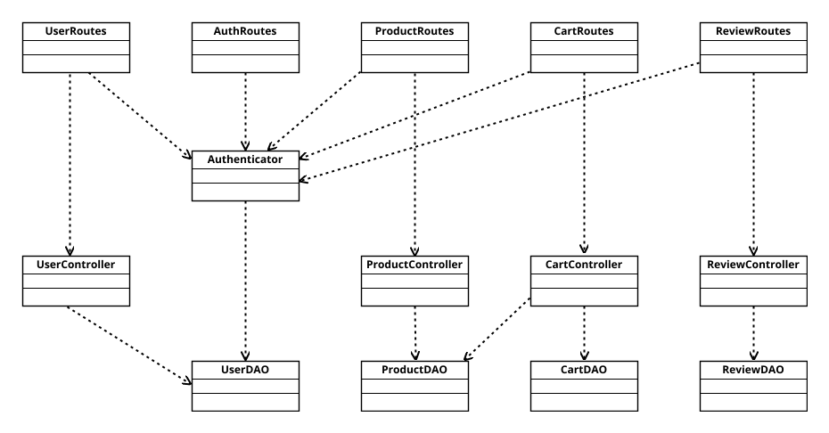
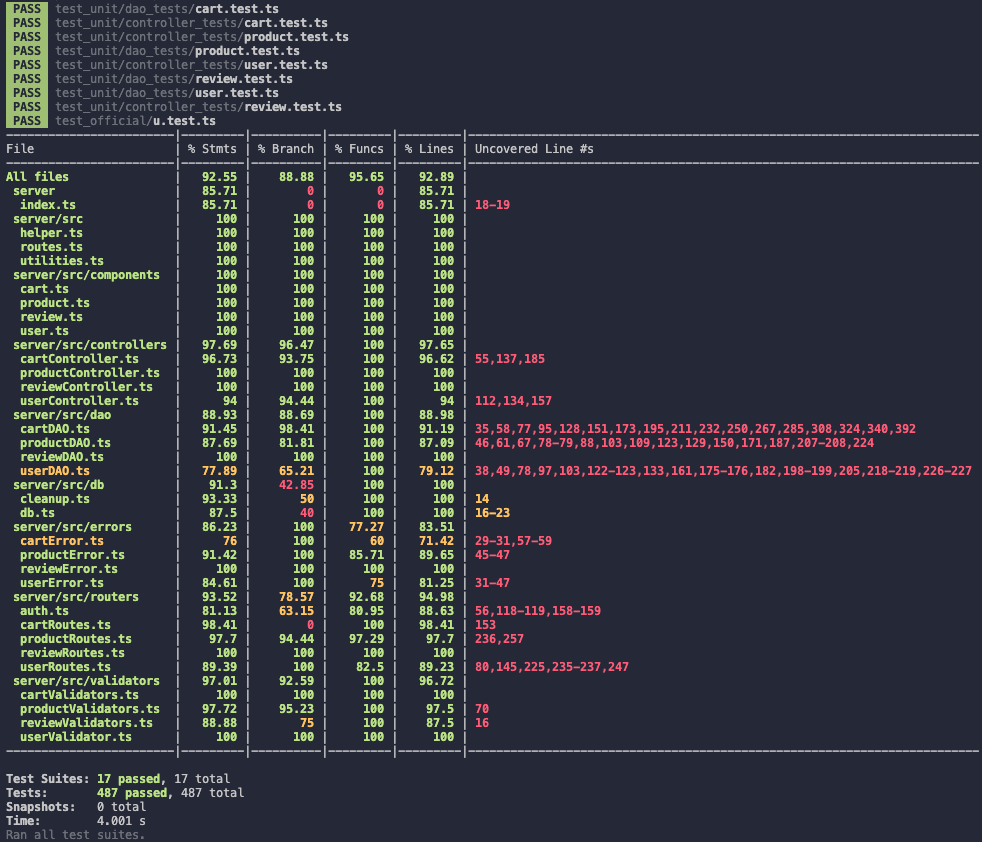

# Test Report

<The goal of this document is to explain how the application was tested, detailing how the test cases were defined and what they cover>

# Contents

- [Test Report](#test-report)
- [Contents](#contents)
- [Dependency graph](#dependency-graph)
- [Integration approach](#integration-approach)
- [Tests](#tests)
- [Coverage](#coverage)
  - [Coverage of FR](#coverage-of-fr)
  - [Coverage white box](#coverage-white-box)

# Dependency graph

  

# Integration approach
  La sequenza di integration utilizzata è quella della big bang integration.
  __Product:__
    - step1: dao product testing
    - step2: controller product testing
    - step3: route product testing
    - step4: product integration testing
  __User:__
    - step1: dao user testing
    - step2: controller user testing
    - step3: route user testing
    - step4: user integration testing
  __Cart:__
    - step1: dao cart testing
    - step2: controller cart testing
    - step3: route cart testing
    - step4: cart integration testing
  __Review:__
    - step1: dao review testing
    - step2: controller review testing
    - step3: route review testing
    - step4: review integration testing

# Tests

<in the table below list the test cases defined For each test report the object tested, the test level (API, integration, unit) and the technique used to define the test case (BB/ eq partitioning, BB/ boundary, WB/ statement coverage, etc)> <split the table if needed>

|       Test case name       |     Object(s) tested      |   Test level   |        Technique used         |
| :------------------------: | :-----------------------: | :------------: | :---------------------------: |   
| **Carts** |  |     |  |           
| It should return a cart if a matching cart is /statement coveragefound | CartDAO | Unit | WB / statement coverage |
| It should return an empty cart if no matching cart is found | CartDAO | Unit | WB / statement coverage |
| It should reject with an error if the database query fails | CartDAO | Unit | WB / statement coverage |
| It should resolve with an array of Cart objects when carts are found | CartDAO | Unit | WB / statement coverage |
| It should resolve with error CartNotFoundError when no carts are found | CartDAO | Unit | WB / statement coverage |
| It should reject with an error when the database query fails | CartDAO | Unit | WB / statement coverage |
| should resolve with the cart ID when a cart is found | CartDAO | Unit | WB / statement coverage |
| should resolve with undefined when no cart is found | CartDAO | Unit | WB / statement coverage |
| should reject with an error when the database query fails | CartDAO | Unit | WB / statement coverage |
| It should resolve with an array of cart IDs when carts are found | CartDAO | Unit | WB / statement coverage |
| It should resolve with an empty array when no carts are found | CartDAO | Unit | WB / statement coverage |
| It should reject with an error when the database query fails | CartDAO | Unit | WB / statement coverage |
| It should resolve with an array of Cart objects when carts are found | CartDAO | Unit | WB / statement coverage |
| It should resolve with an empty array when no carts are found | CartDAO | Unit | WB / statement coverage |
| It should reject with an error when the database query fails | CartDAO | Unit | WB / statement coverage |
| It should resolve with an array of cart IDs when carts are found | CartDAO | Unit | WB / statement coverage |
| It should resolve with an empty array when no carts are found | CartDAO | Unit | WB / statement coverage |
| It should reject with an error when the database query fails | CartDAO | Unit | WB / statement coverage |
| It should resolve with an array of ProductInCart associated with the products in the cart | CartDAO | Unit | WB / statement coverage |
| It should resolve with an array empty of ProductInCart when no products are in the cart | CartDAO | Unit | WB / statement coverage |
| It should reject with an error when the database query fails | CartDAO | Unit | WB / statement coverage |
| It should resolve with true when carts are deleted | CartDAO | Unit | WB / statement coverage |
| It should resolve with false when no carts are deleted | CartDAO | Unit | WB / statement coverage |
| It should reject with an error when the database query fails | CartDAO | Unit | WB / statement coverage |
| It should resolve with true when the cart is successfully cleared | CartDAO | Unit | WB / statement coverage |
| It should reject with CartNotFoundError when the cart is not found | CartDAO | Unit | WB / statement coverage |
| It should reject with an error when the database query fails | CartDAO | Unit | WB / statement coverage |
| It should resolve when products are successfully deleted from the cart | CartDAO | Unit | WB / statement coverage |
| It should reject with an error when the database query fails | CartDAO | Unit | WB / statement coverage |
| should delete the product from the cart when b is 1 | CartDAO | Unit | WB / statement coverage |
| It should decrement the product quantity in the cart when b is more than 1 | CartDAO | Unit | WB / statement coverage |
| It should reject with an error when the database query fails | CartDAO | Unit | WB / statement coverage |
| should resolve with the selling price when the product exists | CartDAO | Unit | WB / statement coverage |
| It should reject with ProductNotFoundError when the product does not exist | CartDAO | Unit | WB / statement coverage |
| It should reject with an error when there is a database error | CartDAO | Unit | WB / statement coverage |
| It should resolve with the quantity when the product is already in the cart | CartDAO | Unit | WB / statement coverage |
| It should resolve with null when the product is not in the cart | CartDAO | Unit | WB / statement coverage |
| It should reject with an error when there is a database error | CartDAO | Unit | WB / statement coverage |
| It should resolve with false when the cart is not empty | CartDAO | Unit | WB / statement coverage |
| It should resolve with true when the cart is empty | CartDAO | Unit | WB / statement coverage |
| It should reject with an error when there is a database error | CartDAO | Unit | WB / statement coverage |
| It should insert a new product into the cart when bool is false | CartDAO | Unit | WB / statement coverage |
| It should update the quantity of the existing product in the cart when bool is true | CartDAO | Unit | WB / statement coverage |
| It should reject with an error when there is a database error | CartDAO | Unit | WB / statement coverage |
| It should resolve without error when a new cart is successfully created | CartDAO | Unit | WB / statement coverage |
| It should reject with an error when there is a database error | CartDAO | Unit | WB / statement coverage |
| It should resolve without error when the total is successfully updated | CartDAO | Unit | WB / statement coverage |
| It should reject with an error when there is a database error | CartDAO | Unit | WB / statement coverage |
| It should resolve with an array of stock differences when quantities are sufficient | CartDAO | Unit | WB / statement coverage |
| should reject with EmptyProductStockError when a product is out of stock | CartDAO | Unit | WB / statement coverage |
| It should reject with LowProductStockError when stock is lower than requested quantity | CartDAO | Unit | WB / statement coverage |
| It should reject with an error when there is a database error | CartDAO | Unit | WB / statement coverage |
| It should resolve without error when the cart is successfully set as paid | CartDAO | Unit | WB / statement coverage |
| should reject with an error when there is a database error | CartDAO | Unit | WB / statement coverage |   
| It should add product to cart and update total if product exists and there is enough stock | CartController | Unit | WB / statement coverage |
| It should create new cart if user does not have a cart | CartController | Unit | WB / statement coverage |
| It should reject with ProductNotFoundError if product does not exist | CartController | Unit | WB / statement coverage |
| It should reject with EmptyProductStockError if product is out of stock | CartController | Unit | WB / statement coverage |
| should retrieve the cart with products if the cart total is not zero | CartController | Unit | WB / statement coverage |
| It should retrieve the cart without products if the cart total is zero | CartController | Unit | WB / statement coverage |
| It should reject if there is an error retrieving the cart | CartController | Unit | WB / statement coverage |
| It should successfully checkout cart with products and update quantities | CartController | Unit | WB / statement coverage |
| It should reject with CartNotFoundError if cart does not exist | CartController | Unit | WB / statement coverage |
| It should reject with EmptyCartError if cart total is zero | CartController | Unit | WB / statement coverage |
| It should reject with error if there is an issue during checkout | CartController | Unit | WB / statement coverage |
| It should return paid carts with products for a user | CartController | Unit | WB / statement coverage |
| It should reject with an error if fetching customer carts fails | CartController | Unit | WB / statement coverage |
| It should resolve true when the product is successfully removed from the cart | CartController | Unit | WB / statement coverage |
| It should reject with ProductNotFoundError if the product does not exist | CartController | Unit | WB / statement coverage |
| It should reject with CartNotFoundError if the cart does not exist | CartController | Unit | WB / statement coverage |
| It should reject with EmptyCartError if the cart is empty | CartController | Unit | WB / statement coverage |
| It should reject with ProductNotInCartError if the product is not in the cart | CartController | Unit | WB / statement coverage |
| It should resolve to true if clearing the cart is successful | CartController | Unit | WB / statement coverage |
| It should reject with an error if fetching the cart id fails | CartController | Unit | WB / statement coverage |
| It should reject with an error if deleting products from cart fails | CartController | Unit | WB / statement coverage |
| It should reject with an error if clearing the cart fails | CartController | Unit | WB / statement coverage |
| It should resolve to true if deleting all carts is successful | CartController | Unit | WB / statement coverage |
| It should resolve to false if no carts were deleted | CartController | Unit | WB / statement coverage |
| It should reject with an error if deleting all carts fails | CartController | Unit | WB / statement coverage |
| It should resolve with a list of carts with products | CartController | Unit | WB / statement coverage |
| It should reject with an error if fetching carts fails | CartController | Unit | WB / statement coverage |
| It should reject with an error if fetching cart IDs fails | CartController | Unit | WB / statement coverage |
| It should reject with an error if fetching products in cart fails | CartController | Unit | WB / statement coverage |   
| It should return 200, the cart for the logged-in user | cartRoutes: GET /carts | Unit | WB / statement coverage |
| It should return 503, Internal server error | cartRoutes: GET /carts | Unit | WB / statement coverage |
| It should return 200, add product to cart for the logged-in user | cartRoutes: POST /carts | Unit | WB / statement coverage |
| It should return 404, product not found | cartRoutes: POST /carts | Unit | WB / statement coverage |
| It should return 409, product whose available quantity is 0 | cartRoutes: POST /carts | Unit | WB / statement coverage |
| It should return 503, Internal server error | cartRoutes: POST /carts | Unit | WB / statement coverage |
| It should return 200, checkout the cart | cartRoutes: PATCH /carts | Unit | WB / statement coverage |
| It should return 404, no information about an unpaid cart | cartRoutes: PATCH /carts | Unit | WB / statement coverage |
| It should return 400, no information about an unpaid cart | cartRoutes: PATCH /carts | Unit | WB / statement coverage |
| It should return 409, there is at least one product in the cart whose available quantity in the stock is 0 | cartRoutes: PATCH /carts | Unit | WB / statement coverage |
| It should return 409, there is at least one product in the cart whose quantity is higher than the available quantity in the stock | cartRoutes: PATCH /carts | Unit | WB / statement coverage |
It should return 503, Internal server error| cartRoutes: PATCH /carts | Unit | WB / statement coverage |
| It should return 200 and a body response with array of carts that represents the history of past orders made by the currently logged in user | cartRoutes: GET carts/history |Unit | WB / statement coverage |
It should return 503, Internal server error | cartRoutes: GET carts/history |Unit | WB / statement coverage |
| It should return 200 and remove an instance of a product from the current cart | cartRoutes: DELETE carts/products/| Unit | WB / statement coverage |
| It should return 404, product is not in the cart | cartRoutes: DELETE carts/products/| Unit | WB / statement coverage |
| It should return 400, empty cart | cartRoutes: DELETE carts/products/| Unit | WB / statement coverage |
| It should return 404, no information about an unpaid cart | cartRoutes: DELETE carts/products/| Unit | WB / statement coverage |
| It should return 404, product not exist | cartRoutes: DELETE carts/products/| Unit | WB / statement coverage |
It should return 503, Internal server error | cartRoutes: DELETE carts/products/| Unit | WB / statement coverage |
| It should return 200 and delete all products in the current cart | cartRoutes: DELETE carts/current | Unit | WB / statement coverage |
| It should return 404, no information about an unpaid cart | cartRoutes: DELETE carts/current | Unit | WB / statement coverage |
It should return 503, Internal server error | cartRoutes: DELETE carts/current | Unit | WB / statement coverage |
| It should return 200 and delete all products in the current cart | cartRoutes: DELETE /carts | Unit | WB / statement coverage |
It should return 503, Internal server error  | cartRoutes: DELETE /carts | Unit | WB / statement coverage |
| It should return 200 and body response contains all carts of all users | cartRoutes: GET /carts/all | Unit | WB / statement coverage | 
| It should return 503, Internal server error  | cartRoutes: GET /carts/all | Unit | WB / statement coverage | 
| It should return 200 - Cart with products | GET /carts | Integration | BB/boundary |
| It should return 200 - Cart with no products | GET /carts | Integration | BB/boundary |
| It should return 401 - Manager not authorized | GET /carts | Integration | BB/boundary |
| It should return 401 - Admin not authorized | GET /carts | Integration | BB/boundary |
| It should return 401 - Not logged not authorized | GET /carts | Integration | BB/boundary |
| It should return 200 - Cart with products | POST /carts | Integration | BB/boundary |
| It should return 404 - The model not represent an existing product | POST /carts | Integration | BB/boundary |
| It should return 409 - The model represents a product whose available quantity is 0 | POST /carts | Integration | BB/boundary |
| It should return 422 - The model parameter can not be empty | POST /carts | Integration | BB/boundary |
| It should return 401 - Manager not authorized | POST /carts | Integration | BB/boundary |
| It should return 401 - Admin not authorized | POST /carts | Integration | BB/boundary |
| It should return 401 - Not logged not authorized | POST /carts | Integration | BB/boundary |
| It should return 200 - Cart paid | PATCH /carts | Integration | BB/boundary |
| It should return 404 - no information about an unpaid cart in the db | PATCH /carts | Integration | BB/boundary |
| It should return 400 - no information about an unpaid cart in the db | PATCH /carts | Integration | BB/boundary |
| It should return 409 - There is at least one product in the cart whose available quantity in the stock is 0 | PATCH /carts | Integration | BB/boundary |
| It should return 409 - There is at least one product in the cart whose quantity is higher than the available quantity in the stock | PATCH /carts | Integration | BB/boundary |
| It should return 401 - Manager not authorized | PATCH /carts | Integration | BB/boundary |
| It should return 401 - Admin not authorized | PATCH /carts | Integration | BB/boundary |
| It should return 401 - Not logged not authorized | PATCH /carts | Integration | BB/boundary |
| It should return 200 - All the carts paid in the response body | GET /carts/history | Integration | BB/boundary |
| It should return 401 - Manager not authorized | GET /carts/history | Integration | BB/boundary |
| It should return 401 - Admin not authorized | GET /carts/history | Integration | BB/boundary |
| It should return 401 - Not logged not authorized | GET /carts/history | Integration | BB/boundary |
| It should return 200 - Delete the product form the current cart | DELETE /carts/products/:model | Integration | BB/boundary |
| It should return 404 - model represents a product that is not in the cart | DELETE /carts/products/:model | Integration | BB/boundary |
| It should return 404 - cart with no products | DELETE /carts/products/:model | Integration | BB/boundary |
| It should return 404 - model does not represent an existing product | DELETE /carts/products/:model | Integration | BB/boundary |
| It should return 401 - Manager not authorized | DELETE /carts/products/:model | Integration | BB/boundary |
| It should return 401 - Admin not authorized | DELETE /carts/products/:model | Integration | BB/boundary |
| It should return 401 - Not logged not authorized | DELETE /carts/products/:model | Integration | BB/boundary |
| It should return 200 - Delete all the products from the cart | DELETE /carts/current | Integration | BB/boundary |
| It should return 404 - No information about unpaid cart | DELETE /carts/current | Integration | BB/boundary |
| It should return 401 - Manager not authorized | DELETE /carts/current | Integration | BB/boundary |
| It should return 401 - Admin not authorized | DELETE /carts/current | Integration | BB/boundary |
| It should return 401 - Not logged not authorized | DELETE /carts/current | Integration | BB/boundary |
| It should return 200 - Cart with products called by Manager | DELETE /carts/all | Integration | BB/boundary |
| It should return 200 - Cart with products called by Admin | DELETE /carts/all | Integration | BB/boundary |
| It should return 401 - Customer not authorized | DELETE /carts/all | Integration | BB/boundary |
| It should return 401 - Not logged not authorized | DELETE /carts/all | Integration | BB/boundary |
| It should return 200 - Cart with products called by Admin | GET /carts/all | Integration | BB/boundary |
| It should return 200 - Cart with products called by Manager | GET /carts/all | Integration | BB/boundary |
| It should return 401 - Customer not authorized | GET /carts/all | Integration | BB/boundary |
| It should return 401 - Not logged not authorized | GET /carts/all | Integration | BB/boundary |
| **Products** |  |     |  |           
| Insert new product succesfully | ProductController | Unit    | WB / statement coverage |
| reject in DAOgetProductByModel | ProductController | Unit    | WB / statement coverage |
| Insert new product - no date   | ProductController | Unit    | WB / statement coverage |
| Insert existing product        | ProductController | Unit    | WB / statement coverage |
| change product quantity-should change the quantity of a product successfully | ProductController | Unit    | WB / statement coverage |
| change product quantity-should throw DateError if the change date is after the current date | ProductController | Unit    | WB / statement coverage |
| change product quantity-should throw ProductNotFoundError if the product does not exist | ProductController | Unit    | WB / statement coverage |
| change product quantity-should throw ProposedDateTooEarlyError if the change date is before the product's arrivalDate | ProductController | Unit    | WB / statement coverage |
| should sell a product successfully | ProductController | Unit    | WB / statement coverage |
| sell error in dao.sellProduct | ProductController | Unit    | WB / statement coverage |
| sell error in dao.getProductByModel | ProductController | Unit    | WB / statement coverage |
| sell -should throw ProductNotFoundError if the product does not exist | ProductController | Unit    | WB / statement coverage |
| should throw ProposedDateTooEarlyError if the selling date is before the product's arrivalDate | ProductController | Unit    | WB / statement coverage |
| should throw LowProductStockError if the product has no available quantity | ProductController | Unit    | WB / statement coverage |
| sell product-should throw EmptyProductStockError if the product has no available quantity | ProductController | Unit    | WB / statement coverage |
| should return a list of all products | ProductController | Unit    | WB / statement coverage |
| error nella dao.getall products | ProductController | Unit    | WB / statement coverage |
| should return a list of all SMARTPHONE products | ProductController | Unit    | WB / statement coverage |
| get products error in get products by category | ProductController | Unit    | WB / statement coverage |
| should return the information of iPhone15 | ProductController | Unit    | WB / statement coverage |
| get-products -- should throw ProductNotFoundError if the product does not exist | ProductController | Unit    | WB / statement coverage |
| error in getAvailable - dao reject | ProductController | Unit    | WB / statement coverage |
| should return a list of all available products | ProductController | Unit    | WB / statement coverage |
| should return a list of all SMARTPHONE available products | ProductController | Unit    | WB / statement coverage |
| should return a list of all iPhone15 available products | ProductController | Unit    | WB / statement coverage |
| getAvailable products by model- error in db | ProductController | Unit    | WB / statement coverage |
| getAvailable products by category- error in db | ProductController | Unit    | WB / statement coverage |
| available -should throw ProductNotFoundError if the product does not exist | ProductController | Unit    | WB / statement coverage |
| should delete all products successfully | ProductController | Unit    | WB / statement coverage |
| delete all products- should throw an error if the deletion fails | ProductController | Unit    | WB / statement coverage |
| should delete a product successfully | ProductController | Unit    | WB / statement coverage |
| delete-should throw ProductNotFoundError if the product does not exist | ProductController | Unit    | WB / statement coverage |
| delete-should throw an error if the deletion fails | ProductController | Unit    | WB / statement coverage |
| delete-should throw an error if the getProductByModel fails | ProductController | Unit    | WB / statement coverage |
| deleteProduct - dovrebbe rifiutare con un errore del database | ProductDAO | Unit | WB/ statement coverage |
| sellProduct - dovrebbe risolvere con la nuova quantità | ProductDAO | Unit | WB/ statement coverage |
| sellProduct - dovrebbe rifiutare con un errore del database | ProductDAO | Unit | WB/ statement coverage |
| deleteProduct - dovrebbe risolvere con true se il prodotto è stato eliminato correttamente | ProductDAO | Unit | WB/ statement coverage |
| deleteProduct - dovrebbe rifiutare con un errore del database | ProductDAO | Unit | WB/ statement coverage |
| sellProduct - dovrebbe rifiutare con un errore del database | ProductDAO | Unit | WB/ statement coverage |
| getAvailableProductsByCategory - dovrebbe risolvere con un array di prodotti disponibili per una categoria specifica | ProductDAO | Unit | WB/ statement coverage |
| getAvailableProductsByCategory - dovrebbe rifiutare con un errore del database | ProductDAO | Unit | WB/ statement coverage |
| getAvailableProductsByModel - dovrebbe risolvere con un array di prodotti disponibili per un modello specifico | ProductDAO | Unit | WB/ statement coverage |
| getAvailableProductsByModel - dovrebbe rifiutare con un errore del database | ProductDAO | Unit | WB/ statement coverage |
| getAllAvailableProducts - dovrebbe rifiutare con un errore del database | ProductDAO | Unit | WB/ statement coverage |
| getProductsByCategory - dovrebbe risolvere con un array di prodotti per una categoria specifica | ProductDAO | Unit | WB/ statement coverage |
| getProductsByCategory - dovrebbe rifiutare con un errore del database | ProductDAO | Unit | WB/ statement coverage |
| getProductsByModel - dovrebbe risolvere con un array di prodotti per un modello specifico | ProductDAO | Unit | WB/ statement coverage |
| getProductsByModel - dovrebbe rifiutare con un errore del database | ProductDAO | Unit | WB/ statement coverage |
| getAllProducts - array di prodotti | ProductDAO | Unit | WB/ statement coverage |
| getAllProducts - errore del database | ProductDAO | Unit | WB/ statement coverage |
| updateProductQuantity - nuova quantità | ProductDAO | Unit | WB/ statement coverage |
| updateProductQuantity - errore del database | ProductDAO | Unit | WB/ statement coverage |
| getProductByModel - prodotto trovato | ProductDAO | Unit | WB/ statement coverage |
| getProductByModel - prodotto non trovato | ProductDAO | Unit | WB/ statement coverage |
| getProductByModel - errore del database | ProductDAO | Unit | WB/ statement coverage |
| registerProduct - registrazione corretta | ProductDAO | Unit | WB/ statement coverage |
| registerProduct - errore del database | ProductDAO | Unit | WB/ statement coverage |
| POST /products - Success | ProductController | Unit | WB/ statement coverage |
| POST /products - Invalid arrivalDate | ProductController | Unit | WB / statement coverage |
| POST /products - Unauthorized access | ProductController | Unit | WB/ statement coverage |
| POST /products - Product already exists | ProductController | Unit | WB/ statement coverage |
| PATCH /products/:model - Success | ProductController | Unit | WB/ statement coverage |
| PATCH /products/:model - Invalid future date | ProductController | Unit | WB / statement coverage |
| PATCH /products/:model - Update before arrival | ProductController | Unit | WB / statement coverage |
| PATCH /products/:model - Model not in DB | ProductController | Unit | WB/ statement coverage |
| PATCH /products/:model/sell - Success | ProductController | Unit | WB/ statement coverage |
| PATCH /products/:model/sell - Invalid future date | ProductController | Unit | WB / statement coverage |
| PATCH /products/:model/sell - Sell before arrival | ProductController | Unit | WB / statement coverage |
| PATCH /products/:model/sell - Model not in DB | ProductController | Unit | WB/ statement coverage |
| PATCH /products/:model/sell - Quantity 0 | ProductController | Unit | WB/ statement coverage |
| PATCH /products/:model/sell - Not enough quantity | ProductController | Unit | WB/ statement coverage |
| GET /products - Return all products | ProductController | Unit | WB/ statement coverage |
| GET /products - Return smartphones | ProductController | Unit | WB/ statement coverage |
| GET /products - Return iPhone15 | ProductController | Unit | WB/ statement coverage |
| GET /products - Grouping null, category set | ProductController | Unit | WB / statement coverage |
| GET /products - Grouping null, model set | ProductController | Unit | WB / statement coverage |
| GET /products - Grouping null, model and category set | ProductController | Unit | WB / statement coverage |
| GET /products - Grouping=category, category & model null | ProductController | Unit | WB / statement coverage |
| GET /products - Grouping=category, category null, model not null | ProductController | Unit | WB / statement coverage |
| GET /products - Grouping=category, category not null, model not null | ProductController | Unit | WB / statement coverage |
| GET /products - Grouping=model, category null, model null | ProductController | Unit | WB / statement coverage |
| GET /products - Grouping=model, category not null, model null | ProductController | Unit | WB / statement coverage |
| GET /products - Grouping=model, category not null, model not null | ProductController | Unit | WB / statement coverage |
| GET /products - Grouping=model, model empty | ProductController | Unit | WB / statement coverage |
| GET /products - Grouping=category, category empty | ProductController | Unit | WB / statement coverage |
| GET /products - Grouping=model, model not in DB | ProductController | Unit | WB/ statement coverage |
| GET /products - Grouping=null, model not in DB | ProductController | Unit | WB/ statement coverage |
| GET /products - Unauthorized access | ProductController | Unit | WB/ statement coverage |
| GET /products/available - Return all products | ProductController | Unit | WB/ statement coverage |
| GET /products/available - Return smartphones | ProductController | Unit | WB/ statement coverage |
| GET /products/available - Return iPhone15 | ProductController | Unit | WB/ statement coverage |
| GET /products/available - Grouping null, category set | ProductController | Unit | WB / statement coverage |
| GET /products/available - Grouping null, model set | ProductController | Unit | WB / statement coverage |
| GET /products/available - Grouping null, model and category set | ProductController | Unit | WB / statement coverage |
| GET /products/available - Grouping=category, category & model null | ProductController | Unit | WB / statement coverage |
| GET /products/available - Grouping=category, category null, model not null | ProductController | Unit | WB / statement coverage |
| GET /products/available - Grouping=category, category not null, model not null | ProductController | Unit | WB / statement coverage |
| GET /products/available - Grouping=model, category null, model null | ProductController | Unit | WB / statement coverage |
| GET /products/available - Grouping=model, category not null, model null | ProductController | Unit | WB / statement coverage |
| GET /products/available - Grouping=model, category not null, model not null | ProductController | Unit | WB / statement coverage |
| GET /products/available - Grouping=model, model empty | ProductController | Unit | WB / statement coverage |
| GET /products/available - Grouping=category, category empty | ProductController | Unit | WB / statement coverage |
| GET /products/available - Grouping=model, model not in DB | ProductController | Unit | WB/ statement coverage |
| GET /products/available - Grouping=null, model not in DB | ProductController | Unit | WB/ statement coverage |
| GET /products/available - Unauthorized access | ProductController | Unit | WB/ statement coverage |
| DELETE /products/:model - Success | ProductController | Unit | WB/ statement coverage |
| DELETE /products/:model - Product not found | ProductController | Unit | WB/ statement coverage |
| DELETE /products/:model - Empty string | ProductController | Unit | WB / statement coverage |
| DELETE /products/:model - Unauthorized access | ProductController | Unit | WB/ statement coverage |
| DELETE /products - Success | ProductController | Unit | WB/ statement coverage |
| DELETE /products - Unauthorized access | ProductController         |     Unit      |       WB/ statement coverage  |
| It should return 200 - new product registered by a Manager | POST /products | Integration | BB/ boundary |
| It should return 200 - new product registered by an Admin | POST /products | Integration | BB/ boundary |
| It should return 401 - customer try to register a product | POST /products | Integration | BB/ boundary |
| It should return 401 - user not logged try to register a product | POST /products | Integration | BB/ boundary |
| It should return 409 - model already exists | POST /products | Integration | BB/ boundary |
| It should return 422 - invalid category | POST /products | Integration | BB/ boundary |
| It should return 422 - empty model | POST /products | Integration | BB/ boundary |
| It should return 422 - quantity == 0 | POST /products | Integration | BB/ boundary |
| It should return 422 - quantity < 0 | POST /products | Integration | BB/ boundary |
| It should return 422 - selling price = 0 | POST /products | Integration | BB/ boundary |
| It should return 422 - selling price < 0 | POST /products | Integration | BB/ boundary |
| It should return 200 - selling price = 1 | POST /products | Integration | BB/ boundary |
| It should return 422 - bad formatted arrivalDate | POST /products | Integration | BB/ boundary |
| It should return 422 - Italian formatted arrivalDate | POST /products | Integration | BB/ boundary |
| It should return 400 - arrivalDate after the current date | POST /products | Integration | BB/ boundary |
| It should return 200 - arrivalDate missing, arrival date must be set as currentDate | POST /products | Integration | BB/ boundary |
| It should return 200 - Manager increase product quantity | PATCH /products/:model | Integration | BB/ boundary |
| It should return 200 - Admin increase product quantity | PATCH /products/:model | Integration | BB/ boundary |
| It should return 401 - Customer try to increase product quantity | PATCH /products/:model | Integration | BB/ boundary |
| It should return 404 - product model doesn't exist | PATCH /products/:model | Integration | BB/ boundary |
| It should return 422 - new quantity missing in update | PATCH /products/:model | Integration | BB/ boundary |
| It should return 422 - new quantity = 0 | PATCH /products/:model | Integration | BB/ boundary |
| It should return 422 - new quantity < 0 | PATCH /products/:model | Integration | BB/ boundary |
| It should return 400 - changeDate before product's arrivalDate | PATCH /products/:model | Integration | BB/ boundary |
| It should return 400 - changeDate after the current date | PATCH /products/:model | Integration | BB/ boundary |
| It should return 200 - changeDate is missing, must be set as current date | PATCH /products/:model | Integration | BB/ boundary |
| It should return 422 - invalid changeDate format | PATCH /products/:model | Integration | BB/ boundary |
| It should return 200 - Manager reduces product quantity | PATCH /products/:model/sell | Integration | BB/ boundary |
| It should return 200 - Admin reduces product quantity | PATCH /products/:model/sell | Integration | BB/ boundary |
| It should return 401 - Customer try to reduce quantity | PATCH /products/:model/sell | Integration | BB/ boundary |
| It should return 404 - Product model does not exist | PATCH /products/:model/sell | Integration | BB/ boundary |
| It should return 409 - available quantity is 0 | PATCH /products/:model/sell | Integration | BB/ boundary |
| It should return 200 - quantity == available quantity | PATCH /products/:model/sell | Integration | BB/ boundary |
| It should return 409 - quantity > available quantity | PATCH /products/:model/sell | Integration | BB/ boundary |
| It should return 400 - sellingDate > current date | PATCH /products/:model/sell | Integration | BB/ boundary |
| It should return 400 - sellingDate before product's arrivalDate | PATCH /products/:model/sell | Integration | BB/ boundary |
| It should return 422 - quantity missing in update | PATCH /products/:model/sell | Integration | BB/ boundary |
| It should return 422 - quantity = 0 | PATCH /products/:model/sell | Integration | BB/ boundary |
| It should return 422 - quantity < 0 | PATCH /products/:model/sell | Integration | BB/ boundary |
| It should return 422 - invalid sellingDate format | PATCH /products/:model/sell | Integration | BB/ boundary |
| It should return 200 - selling date empty -> sellingDate = today | PATCH /products/:model/sell | Integration | BB/ boundary |
| It should return 200 - Manager delete a product | DELETE /products/:model | Integration | BB/ boundary |
| It should return 200 - Admin delete a product | DELETE /products/:model | Integration | BB/ boundary |
| It should return 401 - Customer try to delete a product | DELETE /products/:model | Integration | BB/ boundary |
| It should return 401 - not logged in try to delete a product | DELETE /products/:model | Integration | BB/ boundary |
| It should return 404 - product isn't in the db | DELETE /products/:model | Integration | BB/ boundary |
| It should return 200 - manager delete all products | DELETE /products | Integration | BB/ boundary |
| It should return 200 - Admin delete all products | DELETE /products | Integration | BB/ boundary |
| It should return 401 - Customer try to delete all products | DELETE /products | Integration | BB/ boundary |
| It should return 401 - Not logged in user try to delete all products | DELETE /products | Integration | BB/ boundary |
| It should return 200 - Manager ask all products | GET /products | Integration | BB/ boundary |
| It should return 200 - Admin ask all products | GET /products | Integration | BB/ boundary |
| It should return 401 - Customer ask all products | GET /products | Integration | BB/ boundary |
| It should return 401 - user not logged in ask for all products | GET /products | Integration | BB/ boundary |
| It should return 200 - products filtered by category SMARTPHONE | GET /products | Integration | BB/ boundary |
| It should return 200 - products filtered by category LAPTOP | GET /products | Integration | BB/ boundary |
| It should return 200 - products filtered by category APPLIANCE | GET /products | Integration | BB/ boundary |
| It should return 200 - products filtered by model | GET /products | Integration | BB/ boundary |
| It should return 422 - grouping null, any of category or model is not null | GET /products | Integration | BB/ boundary |
| It should return 422 - grouping == category and category == null | GET /products | Integration | BB/ boundary |
| It should return 422 - grouping == category and model not null | GET /products | Integration | BB/ boundary |
| It should return 422 - grouping == model and model==null | GET /products | Integration | BB/ boundary |
| It should return 422 - grouping == model and category not null | GET /products | Integration | BB/ boundary |
| It should return 404 - model not in the database | GET /products | Integration | BB/ boundary |
| It should return 200 - Customer ask all available products | GET /products/available | Integration | BB/ boundary |
| It should return 200 - Manager ask all available products | GET /products/available | Integration | BB/ boundary |
| It should return 200 - Admin ask all available products | GET /products/available | Integration | BB/ boundary |
| It should return 401 - non-logged ask for available products | GET /products/available | Integration | BB/ boundary |
| It should return 200 - Customer ask available products filtered by category | GET /products/available | Integration | BB/ boundary |
| It should return 200 - Customer ask available products filtered by model | GET /products/available | Integration | BB/ boundary |
| It should return 422 - grouping==null and any of category or model != null | GET /products/available | Integration | BB/ boundary |
| It should return 422 - grouping==category and category == null | GET /products/available | Integration | BB/ boundary |
| It should return 422 - grouping == category and model != null | GET /products/available | Integration | BB/ boundary |
| It should return 422 - grouping == model and model == null | GET /products/available | Integration | BB/ boundary |
| It should return 422 - grouping == model and category != null | GET /products/available | Integration | BB/ boundary |
| It should return 404 - model is not in the database | GET /products/available | Integration | BB/ boundary |
| **Reviews** |  |     |  |           
| addReview (dao): aggiunge una review a un prodotto, restituisce true | ReviewDAO |  Unit   | WB/statement coverage  |
| addReview (dao): errore nel database | ReviewDAO | Unit | WB/statement coverage  |
| addReview (dao): gestione eccezione nel blocco try | ReviewDAO | Unit | WB / statement coverage |
| isProductExist (dao):  verifica se un prodotto esiste, ritorna true | ReviewDAO | Unit | WB/statement coverage |
| isProductExist (dao): verifica se un prodotto esiste, ritorna false | ReviewDAO | Unit | WB/statement coverage |
| isProductExist (dao): errore nel database | ReviewDAO | Unit | WB / coverage statement |
| isProductExist (dao): gestione eccezione nel blocco try | ReviewDAO | Unit |WB / coverage statement |
| isProductReviewed (dao): il prodotto non ha già una review, ritorna null| ReviewDAO | Unit | WB/statement coverage  |
| isProductReviewed (dao): il prodotto ha già una review, ritorna l'id della review | ReviewDAO | Unit | WB/statement coverage  |
| isProductReviewed (dao): errore nel database | ReviewDAO | Unit | WB / statement coverage |
| isProductReviewed (dao): gestione eccezione nel blocco try | ReviewDAO | Unit | WB / statement coverage |
| deleteReview (dao): elimina una review di un prodotto, ritorna true | ReviewDAO |  Unit   | WB/statement coverage |
| deleteReview (dao): errore nel database | ReviewDAO | Unit | WB / statement coverage |
| deleteReview (dao): gestione eccezione nel blocco try | ReviewDAO | Unit | WB / statement coverage |
| deleteReviewsOfProduct (dao): elimina tutte le review di un prodotto, ritorna true | ReviewDAO |  Unit   | WB/statement coverage  |
| deleteReviewsOfProduct (dao): errore nel database | ReviewDAO | Unit | WB / statement coverage |
| deleteReviewsOfProduct (dao): gestione eccezione nel blocco try | ReviewDAO | Unit | WB / statement coverage |
| addReview (controller): aggiunge una review, ritorna void | ReviewController |  Unit   | WB/statement coverage |
| addReview (controller): aggiunge una review, restituisce errore (Existing Review) | ReviewController | Unit | WB/statement coverage  |
| addReview (controller): aggiunge una review, restituisce errore (Product Not Found) | ReviewController | Unit | WB/statement coverage |
| getProductReviews (controller): restituisce un vettore di reviews di un dato prodotto | ReviewController |  Unit   | WB/statement coverage  |
| getProductReviews (controller): errore nel database | ReviewController | Unit | WB / statement coverage |
| getProductReviews (controller): gestione eccezione nel blocco try | ReviewController | Unit |WB / statement coverage|
| deleteReview (controller): elimina una review | ReviewController |  Unit   | WB/statement coverage |
| deleteReview (controller): prova a eliminare una review, restituisce errore (NoReviewProduct) | ReviewController | Unit | WB/statement coverage |
| deleteReview (controller): prova a eliminare una review, restituisce errore (ProductNotFound) | ReviewController | Unit | WB/statement coverage |
| deleteReviewsOfProduct (controller): elimina tutte le reviews per un prodotto, ritorna void | ReviewController |  Unit   | WB/statement coverage |
| deleteReviewsOfProduct (controller): prova a eliminare le reviews, restituisce errore (ProductNotFound) | ReviewController | Unit | WB/statement coverage |
| deleteAllReviews (controller): elimina tutte le reviews presenti nel database | ReviewController |  Unit   | WB /statement coverage |
| deleteAllReviews (controller): errore nel database | ReviewController | Unit | WB / statement coverage |
| deleteAllReviews (controller): gestione eccezione nel blocco try | ReviewController | Unit | WB / statement coverage |
| ritorna un array di reviews e restituisce 200 |  GET ezelectronics/reviews/:model |  Unit   | WB/statement coverage |
| utente non loggato |  GET ezelectronics/reviews/:model  | Unit | WB / statement coverage |
| gestisce gli errori nel metodo getProductReviews e restituisce errore| GET ezelectronics/reviews/:model | Unit | WB / statement coverage |
| aggiunge una review a un prodotto e restituisce 200 |  POST ezelectronics/reviews/:model |  Unit   | WB/statement coverage |
| restituisce errore per parametri sbagliati |  POST ezelectronics/reviews/:model  | Unit | WB/statement coverage |
| gestisce gli errori nel metodo addReview e restituisce errore | POST ezelectronics/reviews/:model | Unit | WB / statement coverage |
| elimina una review di un prodotto e restituisce 200 |  DELETE ezelectronics/reviews/:model |  Unit   | WB/statement coverage |
| Gestisce gli errori nel metodo deleteReview e restituisce errore | DELETE ezelectronics/reviews/:model | Unit | WB / statement coverage |
| elimina tutte le reviews di un prodotto e restituisce 200 |  DELETE ezelectronics/reviews/:model/all |  Unit  | WB/statement coverage |
| Gestisce gli errori nel metodo deleteReviewsOfProduct e restituisce errore | DELETE ezelectronics/reviews/:model/all | Unit | WB / statement coverage |
| elimina tutte le reviews e restituisce 200 |  DELETE ezelectronics/reviews |  Unit   | WB/statement coverage |
| Gestisce gli errori nel metodo deleteAllReviews e restituisce errore | DELETE ezelectronics/reviews | Unit | WB / statement coverage |
| Restituisce status 200 (successo) e crea una nuova review su un prodotto | POST /reviews/:model | Integration | BB/boundary |
| Restituisce status 422 per errore nei parametri | POST /reviews/:model | Integration | BB/boundary |
| Restituisce status 404 - il prodotto non esiste nel database | POST /reviews/:model | Integration | BB/boundary |
| It should return a 409 error if there is an existing review for the product made by the customer | POST /reviews/:model | Integration | BB/boundary |
| ritorna 401 se l'utente non è autorizzato | POST /reviews/:model | Integration | BB/boundary |
| Restituisce tutte le reviews per un prodotto e status 200 - customer/manager/admin | GET /reviews/:model | Integration | BB/boundary |
| Restituisce errore 401 se utente non loggato | GET /reviews/:model | Integration | BB/boundary |
| Deletes the review made by the current user for a specific product | DELETE /reviews/:model | Integration | BB/boundary |
| It should return a 404 error if model does not represent an existing product in the database | DELETE /reviews/:model | Integration | BB/boundary |
| It should return a 404 error if the current user does not have a review for the product identified by model | DELETE /reviews/:model | Integration | BB/boundary |
| Restituisce errore 401 se utente non loggato | DELETE /reviews/:model | Integration | BB/boundary |
| Restituisce errore 401 se utente non autorizzato | DELETE /reviews/:model | Integration | BB/boundary |
| Deletes all reviews of a specific product. User Admin | DELETE /reviews/:model/all | Integration | BB/boundary |
| Deletes all reviews of a specific product. User Manager | DELETE /reviews/:model/all | Integration | BB/boundary |
| Deletes all reviews of a specific product. User Customer, 401 | DELETE /reviews/:model/all | Integration | BB/boundary  |
| Deletes all reviews of a specific product. Unlogged user, 401 | DELETE /reviews/:model/all | Integration | BB/boundary |
| It should return a 404 error if model does not represent an existing product in the database | DELETE /reviews/:model/all | Integration | BB/boundary |
| Deletes all reviews of all existing products. User Admin | DELETE /reviews | Integration | BB/boundary |
| Deletes all reviews of all existing products. User Manager | DELETE /reviews | Integration | BB/boundary |
| Deletes all reviews of all existing products. User Customer, 401 | DELETE /reviews | Integration | BB/boundary |
| Deletes all reviews of all existing products. Unlogged user, 401 | DELETE /reviews | Integration | BB/boundary |
| **Users** |  |     |  |
| createUser: T1 - nuovo user ritorna true | UserDAO | Unit | WB/statement coverage |
| createUser: T2 - nuovo user con stesso username lancia errore | UserDAO | Unit | WB/statement coverage |
| getUsers: T1 - ritorna lista di users | UserDAO | Unit | WB/statement coverage |
| getUserByUsername: T1 - ritorna user con username | UserDAO | Unit | WB/statement coverage |
| getUserByUsername: T2 - user con username non esiste lancia errore| UserDAO | Unit | WB/statement coverage |
| getUsersByRole: T1 - ritorna lista di users con role Customer | UserDAO | Unit | WB/statement coverage |
| getUsersByRole: T2 - ritorna errore se role non è uno dei tre ruoli consentiti | UserDAO | Unit | WB/statement coverage |
| deleteUser: T1 - elimina user dato username | UserDAO | Unit | WB/statement coverage |
| deleteAllUsers: T1 - elimina tutti gli user con role diverso da Admin | UserDAO | Unit | WB/statement coverage |
| updateUser: T1 - aggiorna user | UserDAO | Unit | WB/statement coverage |
| createUser: T1 - creazione user riuscita | userController | Unit | WB/statement coverage |
| createUser: T2 - creazione user fallita, username ripetuto | userController | Unit | WB/statement coverage |
| createUser: T3 - creazione user fallita, ruolo non valido | userController | Unit | WB/statement coverage |
| getUsers: T1 - riceve tutti gli utenti | userController | Unit | WB/statement coverage |
| getUsersByRole: T1 - riceve utenti con ruolo Customer | userController | Unit | WB/statement coverage |
| getUsersByRole: T2 - fallisce, ruolo non valido | userController | Unit | WB/statement coverage |
| getUserByUsername: T1 - riceve utente con username u1 | userController | Unit | WB/statement coverage |
| getUserByUsername: T2 - fallisce, username non fornito | userController | Unit | WB/statement coverage |
| getUserByUsername: T3 - fallisce, utente non autorizzato | userController | Unit | WB/statement coverage |
| deleteUser: T1 - cancella utente con username u1 | userController | Unit | WB/statement coverage |
| deleteUser: T2 - fallisce, utente non admin tenta di cancellare altro utente | userController | Unit | WB/statement coverage |
| deleteUser: T3 - fallisce, utente è admin e cerca di cancellare altro admin | userController | Unit | WB/statement coverage |
| deleteAll: T1 - cancella tutti gli utenti non admin | userController | Unit | WB/statement coverage |
| updateUserInfo: T1 - aggiorna informazioni utente | userController | Unit | WB/statement coverage |
| updateUserInfo: T2 - fallisce, data di nascita futura | userController | Unit | WB/statement coverage |
| updateUserInfo: T3 - fallisce, formato data di nascita non valido | userController | Unit | WB/statement coverage |
| updateUserInfo: T4 - fallisce, data di nascita non valida | userController | Unit | WB/statement coverage |
| 200 - creato correttamente | userRoutes: POST /ezelectronics/users | Unit | WB/statement coverage |
| 422 - errore, parametri vuoti | userRoutes: POST /ezelectronics/users | Unit | WB/statement coverage |
| 422 - errore, parametri nulli | userRoutes: POST /ezelectronics/users | Unit | WB/statement coverage |
| 422 - errore, ruolo non tra i consentiti | userRoutes: POST /ezelectronics/users | Unit | WB/statement coverage |
| 200 - utenti recuperati correttamente | userRoutes: GET /ezelectronics/users | Unit | WB/statement coverage |
| 401 - richiesta proveniente da utente non admin | userRoutes: GET /ezelectronics/users | Unit | WB/statement coverage |
| 200 - utenti Customer recuperati correttamente | userRoutes: GET /ezelectronics/users/roles/:role | Unit | WB/statement coverage |
| 200 - utenti Manager recuperati correttamente | userRoutes: GET /ezelectronics/users/roles/:role | Unit | WB/statement coverage |
| 401 - richiesta proveniente da utente non admin | userRoutes: GET /ezelectronics/users/roles/:role | Unit | WB/statement coverage |
| 200 - utente recuperato correttamente | userRoutes: GET /ezelectronics/users/:username | Unit | WB/statement coverage |
| 401 - richiesta proveniente da utente non autenticato | userRoutes: GET /ezelectronics/users/:username | Unit | WB/statement coverage |
| 200 - utente eliminato correttamente | userRoutes: DELETE /ezelectronics/users/:username | Unit | WB/statement coverage |
| 401 - richiesta proveniente da utente non autenticato | userRoutes: DELETE /ezelectronics/users/:usernames/users/:username | Unit | WB/statement coverage |
| 200 - utenti eliminati correttamente | userRoutes: DELETE /ezelectronics/users/:username | Unit | WB/statement coverage |
| 401 - richiesta proveniente da utente non admin | DELETE /ezelectronics/users/:usernames | Unit | WB/statement coverage |
| 200 - utente modificato correttamente" | userRoutesDELETE /ezelectronics/users/:usernamee | Unit | WB/statement coverage |
| 401 - richiesta proveniente da utente non autenticato | userRoutes: PATCH /ezelectronics/users/:username | Unit | WB/statement coverage |
| User creation - It should return a 200 success code and create a new Customer | POST /ezelectronics/users | Integration | BB/boundary |
| User creation - It should return a 200 success code and create a new Manager | POST /ezelectronics/users | Integration | BB/boundary |
| User creation - It should return a 200 success code and create a new Admin | POST /ezelectronics/users | Integration | BB/boundary |
| User creation - It should return a 422 error code if at least one request body parameter is empty/missing | POST /ezelectronics/users | Integration | BB/boundary |
| User creation - It should return a 422 error code if the role is not valid | POST /ezelectronics/users | Integration | BB/boundary |
| User creation - It should return a 422 error code if the role is missing | POST /ezelectronics/users | Integration | BB/boundary |
| User creation - It should return a 409 error code if the username is already taken | POST /ezelectronics/users | Integration | BB/boundary |
| User retrieval - It should return 200 and an array of users | GET /ezelectronics/users | Integration | BB/boundary |
| User retrieval - It should return a 401 error code if the user is not an Admin | GET /ezelectronics/users | Integration | BB/boundary |
| User retrieval - It should return a 401 error code if the user is not authenticated | GET /ezelectronics/users | Integration | BB/boundary |
| User retrieval by role - It should return 200 and an array of users with a specific role | GET /ezelectronics/users/roles/:role | Integration | BB/boundary |
| User retrieval by role - It should fail with 422 if the role is not valid | GET /ezelectronics/users/roles/:role | Integration | BB/boundary |
| User retrieval by role - It should fail with 401 if the user is not Admin | GET /ezelectronics/users/roles/:role | Integration | BB/boundary |
| User retrieval by username - It should return 200 and the user data | GET /ezelectronics/users/:username | Integration | BB/boundary |
| User retrieval by username - It should return 200 and the user data if the user is an Admin | GET /ezelectronics/users/:username | Integration | BB/boundary |
| User retrieval by username - It should return 401 if the user is not authenticated | GET /ezelectronics/users/:username | Integration | BB/boundary |
| User retrieval by username - It should return 401 if the user is not an Admin and tries to retrieve another user's data | GET /ezelectronics/users/:username | Integration | BB/boundary |
| User retrieval by username - It should return 404 if the user does not exist | GET /ezelectronics/users/:username | Integration | BB/boundary |
| User info update - It should return 200 and update the user info | PATCH /ezelectronics/users/:username | Integration | BB/boundary |
| User info update - It should return 401 if the user is not authenticated| PATCH /ezelectronics/users/:username | Integration | BB/boundary |
| User info update - It should return 401 if the user is not the same as the one being updated | PATCH /ezelectronics/users/:username | Integration | BB/boundary |
| User info update - It should return 404 if the username does not exist | PATCH /ezelectronics/users/:username | Integration | BB/boundary |
| User info update - It should return 401 if the user is an Admin and tries to update another admin | PATCH /ezelectronics/users/:username | Integration | BB/boundary |
| User info update - It should return 422 if at least one request body parameter is empty/missing | PATCH /ezelectronics/users/:username | Integration | BB/boundary |
| User info update - It should return 422 if the birthdate is a random string | PATCH /ezelectronics/users/:username | Integration | BB/boundary |
| User info update - It should return 422 if the birthdate is not a correctly formatted date | PATCH /ezelectronics/users/:username | Integration | BB/boundary |
| User info update - It should return 400 if the birthdate is after the current date | PATCH /ezelectronics/users/:username | Integration | BB/boundary |
| User deletion, single user - It should return 200 and delete the user | DELETE /ezelectronics/users/:username | Integration | BB/boundary |
| User deletion, single user - It should return 401 if the user is not authenticated | DELETE /ezelectronics/users/:username | Integration | BB/boundary |
| User deletion, single user - It should return 401 if the user is not an Admin and tries to delete another user | DELETE /ezelectronics/users/:username | Integration | BB/boundary |
| User deletion, single user - It should return 404 if the user does not exist | DELETE /ezelectronics/users/:username | Integration | BB/boundary |
| User deletion, single user - It should return 401 if the user is an Admin and tries to delete another admin | DELETE /ezelectronics/users/:username | Integration | BB/boundary |
| User deletion, all users - It should return 200 and delete the users | DELETE /ezelectronics/users | Integration | BB/boundary |
| User deletion, all users - It should return 401 if the user is not authenticated | DELETE /ezelectronics/users | Integration | BB/boundary |
| User deletion, all users - It should return 401 if the user is not an admin | DELETE /ezelectronics/users | Integration | BB/boundary |

# Coverage

## Coverage of FR

<Report in the following table the coverage of functional requirements and scenarios(from official requirements) >

|   ID    |                              Name                              | Test(s) |
| :-----: | :------------------------------------------------------------: | :-----: | 
| **FR1** |                       **Manage account**                       |   **17**  |
|  FR1.1  |                             Login                              |    -     |
|  FR1.2  |                             Logout                             |    -     |
|  FR1.3  |                   Create a new user account                    |    17     |
| **FR2** |                        **Manage users**                        |   **63**  |
|  FR2.1  |                   Show the list of all users                   |    7     |
|  FR2.2  |        Show the list of all users with a specific role         |    10     |
|  FR2.3  |             Show the information of a single user              |    12     |
|  FR2.4  |            Update the information of a single user             |    16     |
|  FR2.5  |                Delete a single _non Admin_ user                |    11     |
|  FR2.6  |                  Delete all _non Admin_ users                  |    7     |
| **FR3** |                      **Manage products**                       |  **189**  |
|  FR3.1  |                 Register a set of new products                 |    27     |
|  FR3.2  |                Update the quantity of a product                |    22     |
|  FR3.3  |                         Sell a product                         |    31     |
|  FR3.4  |                 Show the list of all products                  |    12     |
| FR3.4.1 |            Show the list of all available products             |    17     |
|  FR3.5  |      Show the list of all products with the same category      |    14     |
| FR3.5.1 | Show the list of all available products with the same category |    14     |
|  FR3.5  |       Show the list of all products with the same model        |    14     |
| FR3.5.1 |  Show the list of all available products with the same model   |    14     |
|  FR3.7  |                        Delete a product                        |    13     |
|  FR3.8  |                      Delete all products                       |    11     |
| **FR4** |                       **Manage reviews**                       |     **64**      |
|  FR4.1  |                 Add a new review to a product                  |     14    |
|  FR4.2  |       Get the list of all reviews assigned to a product        |      9    |
|  FR4.3  |               Delete a review given to a product               |     15    |
|  FR4.4  |                Delete all reviews of a product                 |     16    |
|  FR4.5  |               Delete all reviews of all products               |     10    |
| **FR5** |                        **Manage carts**                        |     **154**    |
|  FR5.1  |            Show the information of the current cart            |     19    |
|  FR5.2  |               Add a product to the current cart                |     21    |
|  FR5.3  |                   Checkout the current cart                    |     35    |
|  FR5.4  |               Show the history of the paid carts               |     17    |
|  FR5.5  |             Remove a product from the current cart             |     26    |
|  FR5.6  |                    Delete the current cart                     |     14    |
|  FR5.7  |             See the list of all carts of all users             |     10    |  
|  FR5.8  |                        Delete all carts                        |     12    |

## Coverage white box

Report here the screenshot of coverage values obtained with jest-- coverage

  
